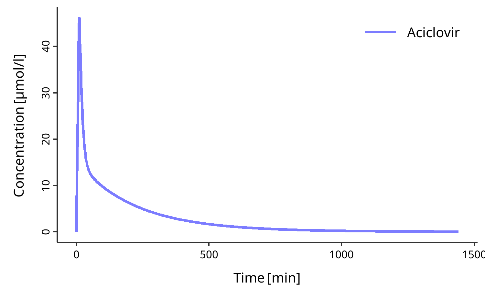

<!-- README.md is generated from README.Rmd. Please edit that file -->

# esqlabsR <a href="https://esqlabs.github.io/esqlabsR/"></a>

<!-- badges: start -->

[](https://github.com/esqlabs/esqlabsR/actions/workflows/main-workflow.yaml)
[](https://app.codecov.io/gh/esqlabs/esqlabsR?branch=main)
<!-- badges: end -->

The `{esqlabsR}` package facilitates and standardizes the modeling and
simulation of physiologically based kinetic (PBK) and quantitative
systems pharmacology/toxicology (QSP/T) models implemented in the [Open
Systems Pharmacology
Software](https://www.open-systems-pharmacology.org/) (OSPS).

The `{esqlabsR}` package is designed for PBK modelers who use the OSPS
suite. By using this package, you can streamline your modeling and
simulation (M&S) workflow and ensure standardized and reproducible
practices.

The package provides functions to:

- Design, import and run Simulations,
- Generate standardized plots and other reporting materials,
- Interact with the OSPS features using simple Excel files.

To get started with the esqlabsR package, please follow the [Get Started
tutorial](articles/esqlabsR.html).

## Installation

### Pre-requisites

<!-- As `{esqlabsR}` relies indirectly on  `{rSharp}`, it requires its its external dependencies (Visual C++ Redistributable and .NET 8). Install them by following these instructions: -->

- [For
  Windows](https://github.com/Open-Systems-Pharmacology/rSharp?tab=readme-ov-file#prerequisites)
- [For
  Linux](https://github.com/Open-Systems-Pharmacology/rSharp?tab=readme-ov-file#ubuntu)

### Install the package

You can install the package by running:

``` r
install.packages("pak")
pak::pak("esqLABS/esqlabsR@*release")
```

Get the latest development version with:

``` r
pak::pak("esqLABS/esqlabsR")
```

Note: For projects created for version 3 of `esqlabsR` package, install
[`esqlabsRLegacy`](https://github.com/esqLABS/esqlabsRLegacy).

## Usage

You can start with the “Get Started” vignette: `vignette("esqlabsR")`.
Below is a simple example of how to work with the package:

``` r
# load esqlabsR
library(esqlabsR)

# Load excel-based configuration
my_project_configuration <-
  createProjectConfiguration(example_ProjectConfiguration())


# Setup simulation scenarios
my_scenarios <-
  createScenarios(
    readScenarioConfigurationFromExcel( # Read scenarios from excel file
      scenarioNames = "TestScenario", # Import the scenario defined as "TestScenario"
      # in the excel file
      projectConfiguration = my_project_configuration
    )
  )

# Run simulations
my_simulation <- runScenarios(
  scenarios = my_scenarios
)

# Initialize a `DataCombined` object to store simulation results
my_datacombined <- DataCombined$new()

my_datacombined$addSimulationResults(my_simulation$TestScenario$results,
  names = "Simulated",
  groups = "Aciclovir"
)

# Plot simulation results
plotIndividualTimeProfile(my_datacombined)
```



## Learn More

You can find more information on specific topics in dedicated vignettes:

- Start with `vignette("esqlabsR-workflow-overview")` to learn about the
  esqlabsR’s streamlined workflow.
- `vignette("esqlabsR-project-structure")` details the structure and
  purpose of each component file and directory of an esqlabsR project.
- `vignette("esqlabsR-design-scenarios")` explains how you can design
  your own simulations only using excel files.
- `vignette("esqlabsR-run-simulations")` describes all you need to know
  to run your customized simulations.
- `vignette("esqlabsR-plot-results")` explains how to generate
  visualizations from simulations.

## Related Work

`{esqlabsR}` relies on the following Open Systems Pharmacology R
packages:

- [rSharp](https://github.com/Open-Systems-Pharmacology/rSharp/)
- [ospsuite.utils](https://github.com/Open-Systems-Pharmacology/OSPSuite.RUtils)
- [tlf](https://github.com/Open-Systems-Pharmacology/TLF-Library)
- [ospsuite](https://github.com/Open-Systems-Pharmacology/OSPSuite-R)

## Contributing

- Follow the OSPS-R [coding
  standards](https://dev.open-systems-pharmacology.org/r-development-resources/coding_standards_r).
- Our contribution guide can be found
  [here](https://dev.open-systems-pharmacology.org/r-development-resources/collaboration_guide).

## Code of Conduct

Please note that the esqlabsR project is released with a [Contributor
Code of
Conduct](https://contributor-covenant.org/version/2/0/CODE_OF_CONDUCT.html).
By contributing to this project, you agree to abide by its terms.
