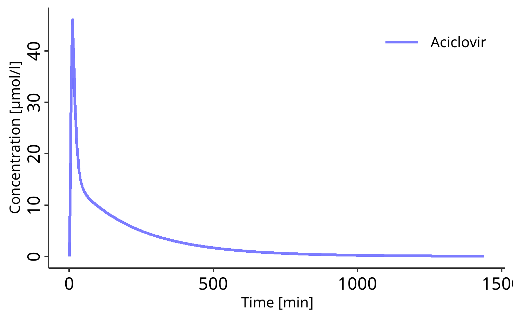

<!-- README.md is generated from README.Rmd. Please edit that file -->

# esqlabsR <a href="https://esqlabs.github.io/esqlabsR"></a>

<!-- badges: start -->

[](https://ci.appveyor.com/project/StephanSchaller/esqlabsr/branch/develop)
[](https://codecov.io/gh/esqlabs/esqlabsr)

<!-- badges: end -->

The `esqlabsR` package facilitates and standardizes the modeling and
simulation of physiologically based pharmacokinetic (PBPK) and
quantitative structure-property relationship (QSP) models implemented in
the [Open Systems Pharmacology
Software](https://www.open-systems-pharmacology.org/).

The package provides functions to:

- Read and run scenarios, workflows, and simulations,
- Generate standardized plots and other reporting materials,
- Interact with the OSPS features based on Excel files templates

The esqlabsR package is designed for PBPK modelers using the OSPS suite.
By using the esqlabsR package, you can streamline your modeling and
simulation workflow and ensure standardized and reproducible practices.

To get started with the esqlabsR package, please read the
`vignette("esqlabsR")`.

## Installation

``` r
# {esqlabsR} and its Open Systems Pharmacology Suite's dependencies relies on
# {rClr} (https://github.com/Open-Systems-Pharmacology/rClr) which is not
# available on CRAN.
# Therefore, these must be installed from github using `{remotes}`.

install.packages("remotes")
install.packages("https://github.com/Open-Systems-Pharmacology/rClr/releases/download/v0.9.2/rClr_0.9.2.zip",
                 repos = NULL,
                 type = "binary"
)

remotes::install_github("esqLABS/esqlabsR")
```

Note: For projects created for version 3 of `esqlabsR` package, install
[`esqlabsRLegacy`](https://github.com/esqLABS/esqlabsRLegacy).

## Usage

``` r
# load esqlabsR
library(esqlabsR)

# Load excel-based configuration
my_project_configuration <- 
  createDefaultProjectConfiguration(example_ProjectConfiguration())


# Setup simulation scenarios
my_scenarios <- 
  createScenarios(
    readScenarioConfigurationFromExcel( # Read scenarios from excel file
      scenarioNames = "TestScenario", # Import the scenario defined as "TestScenario" 
                                      # in the excel file
      projectConfiguration = my_project_configuration
    )
  )

# Run simulations
my_simulation <- runScenarios(
  scenarios = my_scenarios
)

# Initialize a datacombine object to store simulation results
my_datacombined <- DataCombined$new()

my_datacombined$addSimulationResults(my_simulation$TestScenario$results,
                                     names = "Simulated",
                                     groups = "Aciclovir")

# Plot simulation results
plotIndividualTimeProfile(my_datacombined)
```



## Learn More

To get started, first read `vignette("esqlabsR")`. Then read more about
the specific topics:

- Start with `vignette("esqlabsR-workflow")` to learn how to work with
  esqlabsR from A to Z.
- `vignettes("esqlabsR-project-structure")` details the structure and
  purpose of each component of an esqlabsR project.
- `vignette("esqlabsR-plotting")` describes how to generate
  visualizations from simulations.
- `vignette("esqlabsR-sensitivity")` explains how to perform sensitivity
  analysis.
- `vignette("esqlabsR-shiny")` introduces the several shiny applications
  available in the package.
- `vignette("esqlabsR-advanced")` is available to dig deeper in the
  advanced concepts of the package.

## Related Work

`esqlabsR` relies on the following Open Systems Pharmacology R packages:

- [rClr](https://github.com/Open-Systems-Pharmacology/rClr/)
- [ospsuite.utils](https://github.com/Open-Systems-Pharmacology/OSPSuite.RUtils)
- [tlf](https://github.com/Open-Systems-Pharmacology/TLF-Library)
- [ospsuite](https://github.com/Open-Systems-Pharmacology/OSPSuite-R)
- [ospsuite.parameteridentification](https://github.com/Open-Systems-Pharmacology/OSPSuite.ParameterIdentification)

## Contributing

- Follow the OSPS-R [coding
  standards](https://github.com/Open-Systems-Pharmacology/Suite/blob/develop/CODING_STANDARDS_R.md).
- Some additional useful information can be found
  [here](https://github.com/Open-Systems-Pharmacology/OSPSuite-R/wiki/Developer-How-To's).

## Code of Conduct

Please note that the esqlabsR project is released with a [Contributor
Code of
Conduct](https://contributor-covenant.org/version/2/0/CODE_OF_CONDUCT.html).
By contributing to this project, you agree to abide by its terms.
