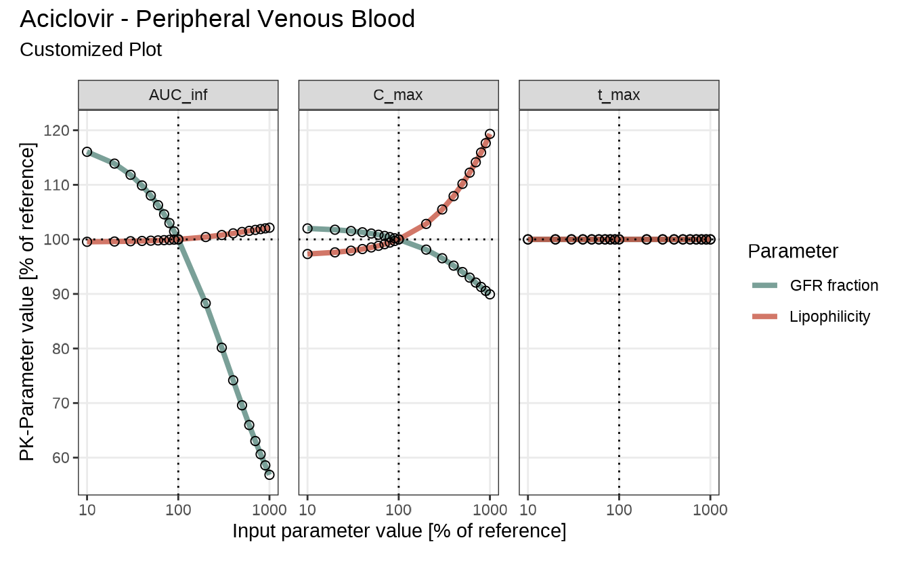
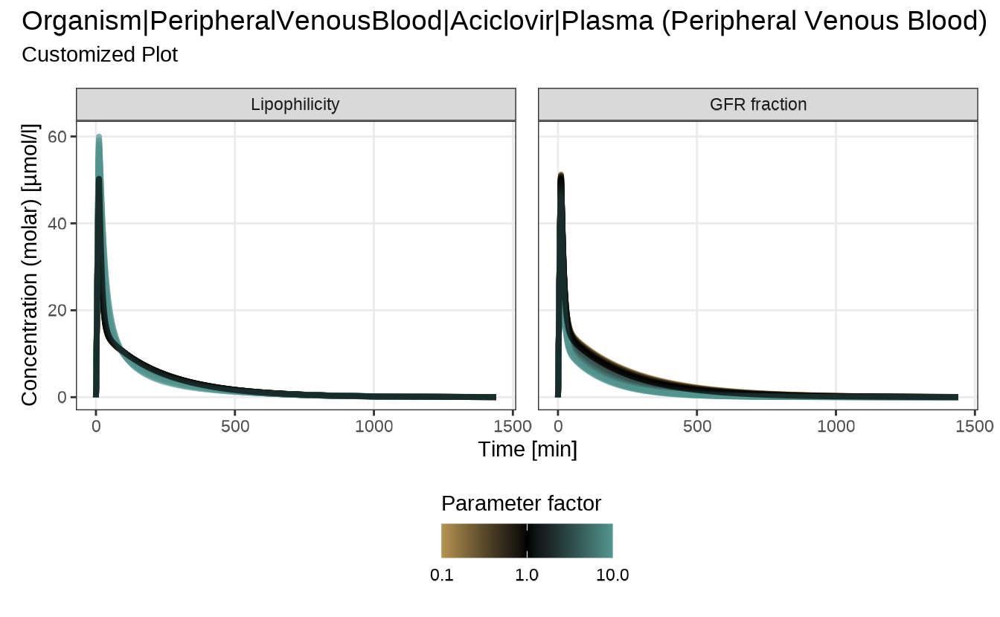
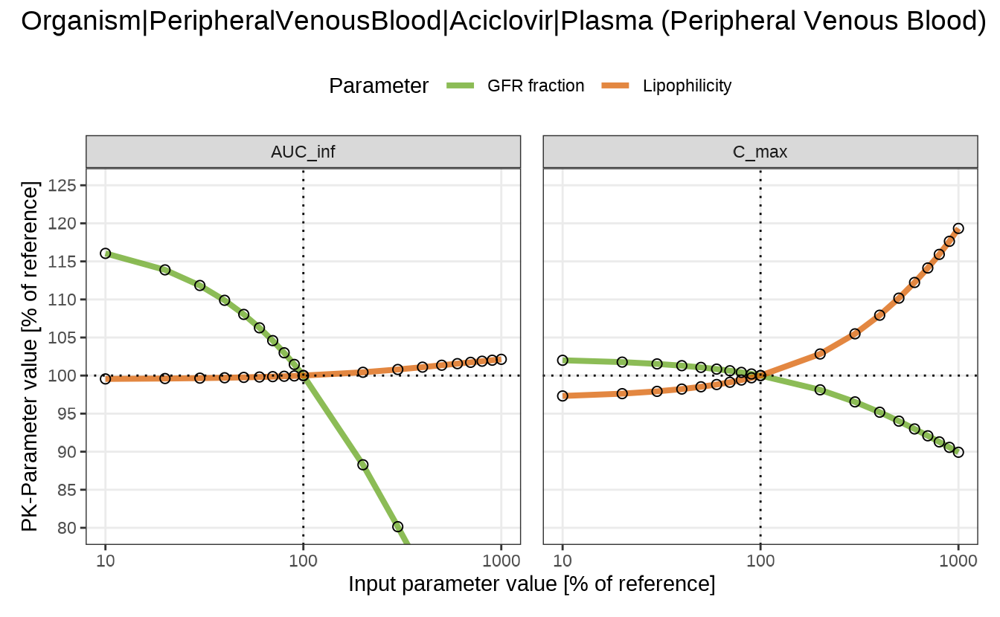

# Sensitivity Analysis – Plot Customization

## Customizing Sensitivity Analysis Plots

### Introduction

This vignette builds on the **aciclovir** example presented in the
[Sensitivity
Analysis](https://esqlabs.github.io/esqlabsR/articles/esqlabsR-sensitivity.md)
vignette, which demonstrated the standard workflow and default plotting
functions available in [esqlabsR](https://github.com/esqLABS/esqlabsR).

Here, the focus shifts to **customizing plot appearance**, using the
`defaultPlotConfiguration` object. This allows you to adjust plot
aesthetics such as titles, axis scaling, colors, and more—without
modifying the core plotting functions.

In cases where the default options are insufficient or do not meet your
specific needs, we also show how to further customize the output using
standard [ggplot2](https://ggplot2.tidyverse.org) or
[patchwork](https://patchwork.data-imaginist.com) operations.

### Setup and Running the Sensitivity Analysis

Before applying this configuration, let’s first run a sensitivity
analysis using the aciclovir example:

``` r
library(esqlabsR)

simulationFilePath <- system.file(
  "extdata/examples/TestProject/Models/Simulations/Aciclovir.pkml",
  package = "esqlabsR"
)

simulation <- loadSimulation(simulationFilePath)
outputPaths <- c(
  Aciclovir_PVB = "Organism|PeripheralVenousBlood|Aciclovir|Plasma (Peripheral Venous Blood)"
)

# Use named parameter paths to customize facet labels
namedParameterPaths <- c(
  "Lipophilicity" = "Aciclovir|Lipophilicity",
  "GFR fraction" = "Neighborhoods|Kidney_pls_Kidney_ur|Aciclovir|Glomerular Filtration-GFR|GFR fraction"
)

analysis <- sensitivityCalculation(
  simulation, 
  outputPaths, 
  namedParameterPaths
)
```

### Available Plot Types

The [esqlabsR](https://github.com/esqLABS/esqlabsR) package provides
three plotting functions to visualize sensitivity analysis results:

- **[`sensitivitySpiderPlot()`](https://esqlabs.github.io/esqlabsR/reference/sensitivitySpiderPlot.md)**:
  Creates spider plots for sensitivity calculation. Each plot shows how
  a set of PK parameters for a given output responds to changes in model
  parameters. The x-axis represents the parameter values (absolute or
  relative), and the y-axis shows the resulting PK changes.

- **[`sensitivityTimeProfiles()`](https://esqlabs.github.io/esqlabsR/reference/sensitivityTimeProfiles.md)**:
  Creates time profiles for selected outputs generated in a sensitivity
  analysis. Each plot illustrates the dynamic response of model outputs
  over time in reaction to parameter variations.

- **[`sensitivityTornadoPlot()`](https://esqlabs.github.io/esqlabsR/reference/sensitivityTornadoPlot.md)**:
  Generates tornado plots to visualize the effect of modifying
  parameters by a specific scaling factor and its reciprocal. Each plot
  highlights the impact of parameter changes on PK results for a
  selected output.

More detailed information on function signatures and examples can be
found in:

- [`sensitivitySpiderPlot()`](https://esqlabs.github.io/esqlabsR/reference/sensitivitySpiderPlot.html)
- [`sensitivityTimeProfiles()`](https://esqlabs.github.io/esqlabsR/reference/sensitivityTimeProfiles.html)
- [`sensitivityTornadoPlot()`](https://esqlabs.github.io/esqlabsR/reference/sensitivityTornadoPlot.html)

### Customizing Plots with `defaultPlotConfiguration`

The `defaultPlotConfiguration` object provides a centralized way to
control the appearance of sensitivity analysis plots. If no
configuration is provided (`NULL`), each plotting function will
automatically create one using
[`createEsqlabsPlotConfiguration()`](https://esqlabs.github.io/esqlabsR/reference/createEsqlabsPlotConfiguration.md)
with default settings.

These defaults ensure a consistent and clean appearance across plot
types, but they can be fully customized to match specific presentation
or publication requirements. Each plotting function recognizes only a
subset of options depending on the visual structure of the plot.

The table below summarizes which configuration options are supported by
each plot type:

| Configuration Option | Spider Plot | Time Profiles | Tornado Plot | Description                          |
|----------------------|-------------|---------------|--------------|--------------------------------------|
| `legendPosition`     | ✔️          | ✔️            | ✔️           | Position of the legend on the plot   |
| `legendTitle`        | ✔️          | ✔️            | ✔️           | Title displayed for the legend       |
| `linesAlpha`         | ✔️          | ✔️            |              | Transparency of line elements        |
| `linesColor`         | ✔️          | ✔️            | ✔️           | Color of lines (or bars for tornado) |
| `linesSize`          | ✔️          | ✔️            |              | Thickness of line elements           |
| `pointsShape`        | ✔️          | ✔️            |              | Shape of data points                 |
| `pointsSize`         | ✔️          |               |              | Size of data points                  |
| `title`              | ✔️          | ✔️            | ✔️           | Main title of the plot               |
| `titleSize`          | ✔️          | ✔️            | ✔️           | Font size of the title               |
| `subtitle`           | ✔️          |               | ✔️           | Subtitle text below the title        |
| `xAxisScale`         | ✔️          | ✔️            |              | X-axis scale type (“log”, “lin”)     |
| `xLabel`             | ✔️          | ✔️            | ✔️           | Label for the x-axis                 |
| `xValuesLimits`      | ✔️          |               |              | Limits for x-values                  |
| `yAxisScale`         | ✔️          | ✔️            |              | Y-axis scale type (“log”, “lin”)     |
| `yAxisTicks`         | ✔️          |               |              | Number of ticks on y-axis            |
| `yAxisLimits`        | ✔️          |               |              | Y-axis limits                        |
| `yValuesLimits`      | ✔️          |               |              | Limits for y-values                  |
| `yLabel`             | ✔️          | ✔️            | ✔️           | Label for the y-axis                 |

**Note:** `defaultPlotConfiguration` follows ggplot2-style aesthetics
(e.g., `legendPosition`, `linesColor`, `pointsShape`). The sensitivity
plotting functions apply the fields shown in this vignette; other fields
have no effect here. For a broader catalog and default values, see the
`PlotConfiguration`
[reference](https://www.open-systems-pharmacology.org/TLF-Library/reference/PlotConfiguration.html)
and the
[vignette](https://www.open-systems-pharmacology.org/TLF-Library/articles/plot-configuration.html).

#### Example - create and apply configuration

To explicitly control the appearance of your plots, create and modify a
configuration object as shown below:

``` r
myConfiguration <- createEsqlabsPlotConfiguration()

myConfiguration$linesColor <- c("#4D8076", "#C34A36")
myConfiguration$title <- "Aciclovir - Peripheral Venous Blood"
myConfiguration$subtitle <- "Customized Plot"
myConfiguration$legendPosition <- "right"
```

You can then pass this object to any sensitivity plotting function:

``` r
sensitivitySpiderPlot(
  sensitivityCalculation = analysis, 
  defaultPlotConfiguration = myConfiguration
)
#> $`Organism|PeripheralVenousBlood|Aciclovir|Plasma (Peripheral Venous Blood)`
```



Note that when a named vector is used for `parameterPaths`, those names
will also be used as labels in the plots.

#### Direct Arguments vs. Configuration Object

Some plot-specific settings—such as axis scaling—are available as direct
arguments to the plotting functions. These options control core aspects
of the plot’s structure and behavior and are therefore exposed
explicitly.

Examples include:

- `xAxisScale` and `yAxisScale` in
  [`sensitivityTimeProfiles()`](https://esqlabs.github.io/esqlabsR/reference/sensitivityTimeProfiles.md)  
- `xAxisType` and `yAxisType` in
  [`sensitivitySpiderPlot()`](https://esqlabs.github.io/esqlabsR/reference/sensitivitySpiderPlot.md)

When specified, these arguments **override** the corresponding values in
the `defaultPlotConfiguration` object. This provides a convenient way to
apply one-off changes without modifying the configuration globally.

The example below demonstrates this behavior: although the configuration
sets the y-axis to a logarithmic scale, passing `yAxisScale = "lin"`
directly to the function takes precedence and applies a linear scale
instead.

``` r
myConfiguration <- createEsqlabsPlotConfiguration()

myConfiguration$linesColor <- c("#d8b365", "#5ab4ac")
myConfiguration$subtitle <- "Customized Plot"

myConfiguration$yAxisScale <- "log" 

sensitivityTimeProfiles(
  sensitivityCalculation = analysis, 
  yAxisScale = "lin", 
  defaultPlotConfiguration = myConfiguration
)
#> $`Organism|PeripheralVenousBlood|Aciclovir|Plasma (Peripheral Venous Blood)`
```



#### Modifying plots after creation

The sensitivity plotting functions in
[esqlabsR](https://github.com/esqLABS/esqlabsR) are designed to generate
clean, publication-ready visuals by default. However, when additional
customization is needed—beyond what is offered through
`defaultPlotConfiguration` you can manually modify the output using
standard [ggplot2](https://ggplot2.tidyverse.org) and
[patchwork](https://patchwork.data-imaginist.com) tools.

Each plotting function returns a **list of `patchwork` objects**, with
one entry per output path. A `patchwork` object is a composite layout of
individual `ggplot2` plots, allowing you to:

- Apply global changes to all subplots using the `&` operator
- Access and modify individual subplots

This flexibility makes post-processing straightforward. For example,
modifying a spider plot after creation:

``` r
library(ggplot2)
library(patchwork)

spiderPlots <- sensitivitySpiderPlot(
  sensitivityCalculation = analysis, 
  pkParameters = c("AUC_inf", "C_max")
)

# Extract the plot for a specific output path
spiderPlot <- spiderPlots[[outputPaths["Aciclovir_PVB"]]]

# Modify plot using `patchwork` and `ggplot2` functions
spiderPlot & 
  theme(legend.position = "top") &                      # Place legend above the plot
  guides(col = guide_legend(ncol = 2)) &                # Display legend entries in two columns
  scale_color_manual(values = c("#66a61e", "#d95f02")) &# Use custom colors for lines
  coord_cartesian(ylim = c(80, 125))                    # Zoom in on the y-axis range
```



### Summary and Best Practices

This vignette demonstrated how to customize and refine sensitivity
analysis plots in [esqlabsR](https://github.com/esqLABS/esqlabsR) using
the Aciclovir example.

Key takeaways:

- Use
  [`createEsqlabsPlotConfiguration()`](https://esqlabs.github.io/esqlabsR/reference/createEsqlabsPlotConfiguration.md)
  to define and reuse plot styling across spider, tornado, and time
  profile plots.
- Apply direct function arguments (e.g., `yAxisScale`) to override
  configuration values for one-off adjustments.
- Access and post-process plots using standard
  [ggplot2](https://ggplot2.tidyverse.org) and
  [patchwork](https://patchwork.data-imaginist.com) methods for full
  flexibility.
- Named `parameterPaths` automatically control facet labels in plots,
  improving clarity.

For consistent, high-quality plots: - Keep a reusable
`defaultPlotConfiguration` object with your preferred style. - Use
`patchwork::&` to apply global tweaks (e.g., layout, limits, themes). -
Extract and modify subplots as needed for custom presentations or
publications.

With these tools, you can quickly move from simulation to high-quality
visualizations tailored to your specific audience and goals.
