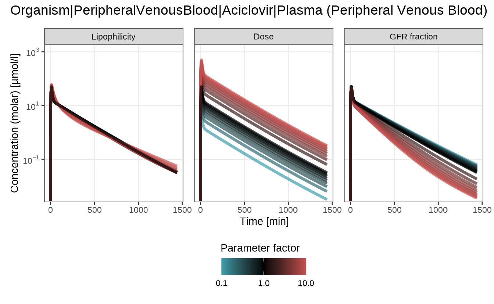
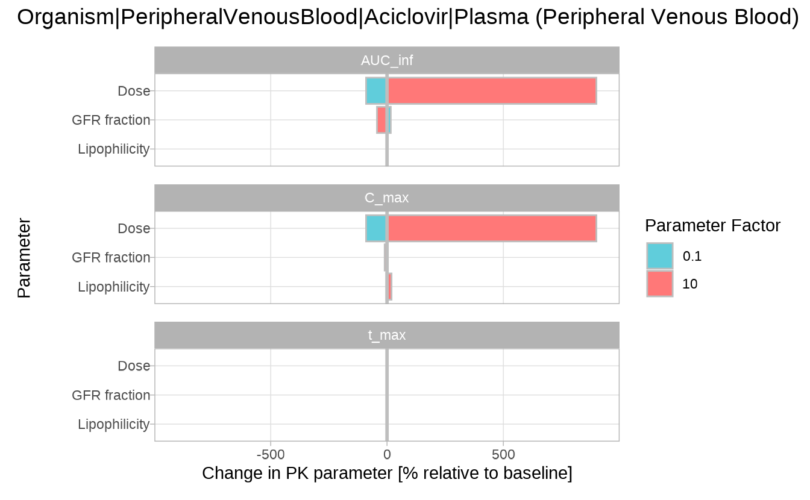
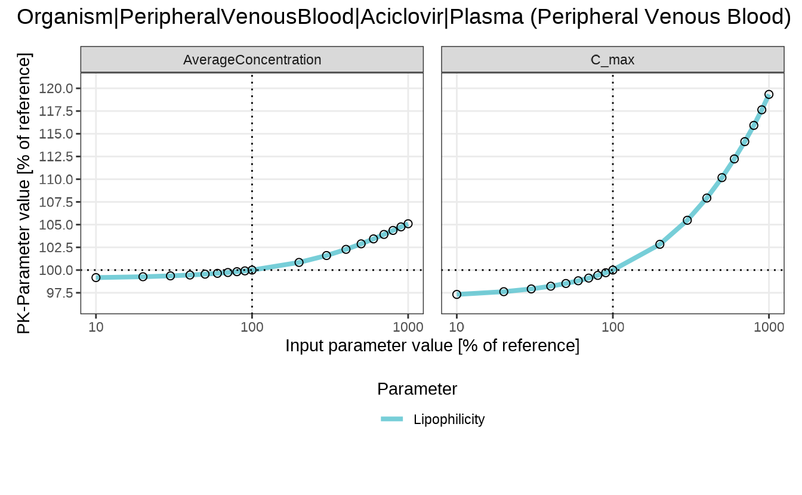

# Sensitivity Analysis

### Overview

Sensitivity analysis helps to understand how variations in key
simulation parameters affect pharmacokinetic (PK) outcomes. It is a
critical step in evaluating model robustness, particularly when
parameter values are uncertain. For details on sensitivity analysis and
its mathematical background, see the OSPS documentation on [Sensitivity
Analysis](https://docs.open-systems-pharmacology.org/shared-tools-and-example-workflows/sensitivity-analysis).

This vignette demonstrates a complete sensitivity analysis workflow in
[esqlabsR](https://github.com/esqLABS/esqlabsR) using **aciclovir** as
an example. We run a base simulation, define and vary selected
parameters, calculate sensitivities, and visualize the impact on PK
metrics.

### Running the sensitivity analysis

We begin by loading a simulation of aciclovir from the package example
data:

``` r
library(esqlabsR)

simulationFilePath <- system.file(
  "extdata/examples/TestProject/Models/Simulations/Aciclovir.pkml",
  package = "esqlabsR"
)

simulation <- loadSimulation(simulationFilePath)
```

The
[`sensitivityCalculation()`](https://esqlabs.github.io/esqlabsR/reference/sensitivityCalculation.md)
function in [esqlabsR](https://github.com/esqLABS/esqlabsR) automates
the analysis process by re-running the simulation with scaled input
parameters. By default, each parameter is varied from 0.1× to 10× its
original value, which can be customized using the `variationRange`
argument.

The function returns a structured list containing the varied parameters,
simulation results, and a data frame of calculated PK metrics for each
variation.

In the following example, we analyze how changes in *lipophilicity*,
*dose*, and *glomerular filtration rate (GFR fraction)* affect the
pharmacokinetics of aciclovir:

``` r
outputPaths <- c(
  Aciclovir_PVB = "Organism|PeripheralVenousBlood|Aciclovir|Plasma (Peripheral Venous Blood)"
)
parameterPaths <- c(
  "Lipophilicity" = "Aciclovir|Lipophilicity",
  "Dose" = "Applications|IV 250mg 10min|Application_1|ProtocolSchemaItem|Dose",
  "GFR fraction" = "Neighborhoods|Kidney_pls_Kidney_ur|Aciclovir|Glomerular Filtration-GFR|GFR fraction"
)

analysis <- sensitivityCalculation(simulation, outputPaths, parameterPaths)
head(analysis$pkData)
#> # A tibble: 6 × 11
#>   OutputPath          ParameterPath ParameterFactor ParameterValue ParameterUnit
#>   <chr>               <chr>                   <dbl>          <dbl> <chr>        
#> 1 Organism|Periphera… Aciclovir|Li…             0.1        -0.0097 Log Units    
#> 2 Organism|Periphera… Aciclovir|Li…             0.2        -0.0194 Log Units    
#> 3 Organism|Periphera… Aciclovir|Li…             0.3        -0.0291 Log Units    
#> 4 Organism|Periphera… Aciclovir|Li…             0.4        -0.0388 Log Units    
#> 5 Organism|Periphera… Aciclovir|Li…             0.5        -0.0485 Log Units    
#> 6 Organism|Periphera… Aciclovir|Li…             0.6        -0.0582 Log Units    
#> # ℹ 6 more variables: ParameterPathUserName <chr>, PKParameter <chr>,
#> #   PKParameterValue <dbl>, PKPercentChange <dbl>, Unit <chr>,
#> #   SensitivityPKParameter <dbl>
```

To illustrate interpretation we will focus on *lipophilicity* only.

``` r
analysis$pkData |>
  dplyr::filter(
    ParameterPath == "Aciclovir|Lipophilicity",
    PKParameter == "AUC_inf",
    ParameterFactor %in% c(0.1, 1, 10)
  ) |>
  dplyr::select(
    ParameterFactor, PKParameterValue,
    PKPercentChange, SensitivityPKParameter
  ) |>
  dplyr::mutate(
    PKPercentChange = round(PKPercentChange, 2),
    SensitivityPKParameter = round(SensitivityPKParameter, 4)
  )
#> # A tibble: 3 × 4
#>   ParameterFactor PKParameterValue PKPercentChange SensitivityPKParameter
#>             <dbl>            <dbl>           <dbl>                  <dbl>
#> 1             0.1            4055.           -0.44                 0.0049
#> 2             1              4073.            0                  NaN     
#> 3            10              4160.            2.13                 0.0024
```

In our example the default lipophilicity (−0.097 log units) yields an
AUC of 4072.6 µmol·min/L. Ten-fold higher (−0.0097) reduces AUC by 0.44
%, whereas ten-fold lower (−0.97) increases it by 2.13 %. The
sensitivity of AUC to a 10-fold increase in lipophilicity is calculated
as:
$$\text{Sensitivity} = \frac{\Delta\text{AUC}}{\Delta\text{lipophilicity}} \times \frac{\text{lipophilicity}}{\text{AUC}} = \frac{4159.5 - 4072.6}{- 0.97 - - 0.097} \times \frac{- 0.097}{4072.6} = 0.0028$$

### Saving and Loading Sensitivity Results

The results of a sensitivity analysis can be saved using
[`saveSensitivityCalculation()`](https://esqlabs.github.io/esqlabsR/reference/saveSensitivityCalculation.md)
and restored with
[`loadSensitivityCalculation()`](https://esqlabs.github.io/esqlabsR/reference/loadSensitivityCalculation.md).
The `simulation` argument in
[`loadSensitivityCalculation()`](https://esqlabs.github.io/esqlabsR/reference/loadSensitivityCalculation.md)
is optional. If the original `Simulation` object is provided, reloading
from disk is avoided. Otherwise, the function attempts to load the
`.pkml` file from the path recorded during the original analysis, which
must still be accessible.

``` r
# Save to disk
outputDir <- file.path(tempdir(), "sensitivity-results")
saveSensitivityCalculation(analysis, outputDir)

# Reload from disk
analysis <- loadSensitivityCalculation(outputDir, simulation)
```

### Visualizing Sensitivity Results

The results of the sensitivity analysis can be visualized using the
following functions:

#### Sensitivity Spider Plot

[`sensitivitySpiderPlot()`](https://esqlabs.github.io/esqlabsR/reference/sensitivitySpiderPlot.md)
visualizes how PK parameters respond as model input parameters are
scaled. Each panel represents one PK metric (default: `C_max`, `t_max`,
`AUC_inf`), making it easy to identify nonlinear trends and compare the
direction and magnitude of effects.

By default, the plot includes all PK parameters in `analysis$pkData`. To
restrict the output, use the `pkParameters` argument.

``` r
sensitivitySpiderPlot(analysis)
#> $`Organism|PeripheralVenousBlood|Aciclovir|Plasma (Peripheral Venous Blood)`
```


In this example, *Dose* shows a strong and nonlinear effect on both
`C_max` and `AUC_inf`, while `t_max` remains relatively stable. *GFR
fraction* and *lipophilicity* have more modest but still visible
effects.

#### Sensitivity time profiles

The
[`sensitivityTimeProfiles()`](https://esqlabs.github.io/esqlabsR/reference/sensitivityTimeProfiles.md)
function displays full concentration–time curves for each input
parameter variation. This plot is ideal for understanding how parameter
changes affect the shape and timing of the drug profile, rather than
summary PK metrics.

Each panel corresponds to one input parameter, with a color gradient
representing the scaling factor: 0.1 = blue, 1.0 = black, 10 = red.

``` r
sensitivityTimeProfiles(analysis)
#> $`Organism|PeripheralVenousBlood|Aciclovir|Plasma (Peripheral Venous Blood)`
```



Here, increasing the *Dose* uniformly raises the profile, while changes
in *GFR fraction* affect the rate of decline, indicating faster or
slower elimination. *Lipophilicity* causes only minor shifts in the
curve.

#### Sensitivity tornado plot

The
[`sensitivityTornadoPlot()`](https://esqlabs.github.io/esqlabsR/reference/sensitivityTornadoPlot.md)
function provides a compact, side-by-side comparison of how each input
parameter influences different PK outputs at a fixed scaling factor. The
plot is best used to **rank parameters by influence** and identify those
with the strongest impact.

By default, the plot compares the results at 0.1× and 10× the original
parameter value. Other scaling factors can also be used, but they must
be included in the `variationRange` passed to
[`sensitivityCalculation()`](https://esqlabs.github.io/esqlabsR/reference/sensitivityCalculation.md).

``` r
sensitivityTornadoPlot(analysis)
#> $`Organism|PeripheralVenousBlood|Aciclovir|Plasma (Peripheral Venous Blood)`
```



The tornado plot confirms the trends seen in previous plots, but makes
it easier to compare the relative impact of each parameter across PK
metrics.

### Sensitivity calculation for user-defined (non-PK parameters) outputs

Though the typical workflows for sensitivity analysis are focused on PK
parameters, it is also possible to calculate the sensitivities for any
numerical model outputs using user-defined functions. As for the PK
parameters, the provided function(s) will be applied to each output
defined in the argument `outputPaths` of the
[`sensitivityCalculation()`](https://esqlabs.github.io/esqlabsR/reference/sensitivityCalculation.md)
function.

The custom functions are provided as a named list of functions in the
`customOutputFunctions` argument. Each function must have the arguments
`x` and `y`, through which it accesses the simulated time values (`x`)
or the output values (`y`). The function should return a single numeric
value.

In the following example, we calculate the sensitivity of the average
concentration of aciclovir in the peripheral venous blood to the
lipophilicity of aciclovir.

We first define a function that calculates the mean of a given numerical
vector:

``` r
meanFunction <- function(x, y) {
  mean(y)
}
```

Next, we run the sensitivity analysis for the average concentration of
aciclovir in the peripheral venous blood:

To define custom labels for the parameters in the resulting plots, you
can pass a *named vector* to the `parameterPaths` argument, where the
names will be used as labels instead of full paths.

``` r
simulation <- loadSimulation(simulationFilePath)
customOutputPaths <- c(
  Aciclovir_PVB = "Organism|PeripheralVenousBlood|Aciclovir|Plasma (Peripheral Venous Blood)"
)
customParameterPaths <- c("Lipophilicity" = "Aciclovir|Lipophilicity")

customAnalysis <- sensitivityCalculation(
  simulation,
  customOutputPaths,
  pkParameters = c("C_max"),
  parameterPaths = customParameterPaths,
  customOutputFunctions = list(AverageConcentration = meanFunction)
)
head(customAnalysis$pkData)
#> # A tibble: 6 × 11
#>   OutputPath          ParameterPath ParameterFactor ParameterValue ParameterUnit
#>   <chr>               <chr>                   <dbl>          <dbl> <chr>        
#> 1 Organism|Periphera… Aciclovir|Li…             0.1        -0.0097 Log Units    
#> 2 Organism|Periphera… Aciclovir|Li…             0.2        -0.0194 Log Units    
#> 3 Organism|Periphera… Aciclovir|Li…             0.3        -0.0291 Log Units    
#> 4 Organism|Periphera… Aciclovir|Li…             0.4        -0.0388 Log Units    
#> 5 Organism|Periphera… Aciclovir|Li…             0.5        -0.0485 Log Units    
#> 6 Organism|Periphera… Aciclovir|Li…             0.6        -0.0582 Log Units    
#> # ℹ 6 more variables: ParameterPathUserName <chr>, PKParameter <chr>,
#> #   PKParameterValue <dbl>, PKPercentChange <dbl>, Unit <chr>,
#> #   SensitivityPKParameter <dbl>
```

***Note***: If we want to calculate the sensitivity of the custom
function only without the default PK-parameters, we need to set the
`pkParameters` value to an empty list.

Finally, we plot the sensitivity of the average concentration of
aciclovir in the peripheral venous blood to the lipophilicity of
aciclovir.

``` r
sensitivitySpiderPlot(customAnalysis)
#> $`Organism|PeripheralVenousBlood|Aciclovir|Plasma (Peripheral Venous Blood)`
```



### Troubleshooting

- The `SensitivityPKParameter` column in the output of `analysis$pkData`
  will be `NA` in the rows corresponding to the initial parameter values
  (i.e., where the multiplication factor is 1).

More detailed information on function signatures can be found in:

- `esqlabsR` documentation on:
  - [sensitivityCalculation()](https://esqlabs.github.io/esqlabsR/reference/sensitivityCalculation.html)
  - [sensitivitySpiderPlot()](https://esqlabs.github.io/esqlabsR/reference/sensitivitySpiderPlot.html)
  - [sensitivityTimeProfiles()](https://esqlabs.github.io/esqlabsR/reference/sensitivityTimeProfiles.html)
  - [sensitivityTornadoPlot()](https://esqlabs.github.io/esqlabsR/reference/sensitivityTornadoPlot.html)
