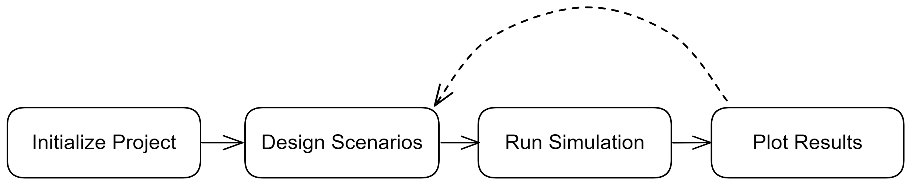

# Overview

esqlabsR’s projects are set up in a four steps process:

1.  Initialize Project
2.  Design Scenarios
3.  Run Simulations
4.  Plot Results

While step 1 need to be done just once, you will be able to iterate
easily as you fine tune your simulation and plots using simple code and
excel files.

esqlabsR Workflow

## 1. Project initialization

This first step is to initialize the specific directories and file
structure required for the workflows.

The output is a `ProjectConfiguration` object that will be used in many
steps during the rest of the process.

**Version Control**: You can create JSON snapshots of your project
configuration for team collaboration and version control using
[`snapshotProjectConfiguration()`](https://esqlabs.github.io/esqlabsR/reference/snapshotProjectConfiguration.md)
and
[`restoreProjectConfiguration()`](https://esqlabs.github.io/esqlabsR/reference/restoreProjectConfiguration.md).

Learn more in
[`vignette("project-structure")`](https://esqlabs.github.io/esqlabsR/articles/project-structure.md).

## 2. Design Scenarios

In esqlabsR, simulations are defined as *scenarios*, which are set up
during this step.

Learn more in
[`vignette("design-scenarios")`](https://esqlabs.github.io/esqlabsR/articles/design-scenarios.md).

## 3. Run Simulations

After scenarios have been set up, the simulations are run, and the
results are returned.

Learn more in
[`vignette("run-simulations")`](https://esqlabs.github.io/esqlabsR/articles/run-simulations.md).

## 4. Plot Results

`esqlabsR` implements convenient and automated ways to generate various
plots for visual representation of simulation results.

Learn more in
[`vignette("plot-results")`](https://esqlabs.github.io/esqlabsR/articles/plot-results.md).
