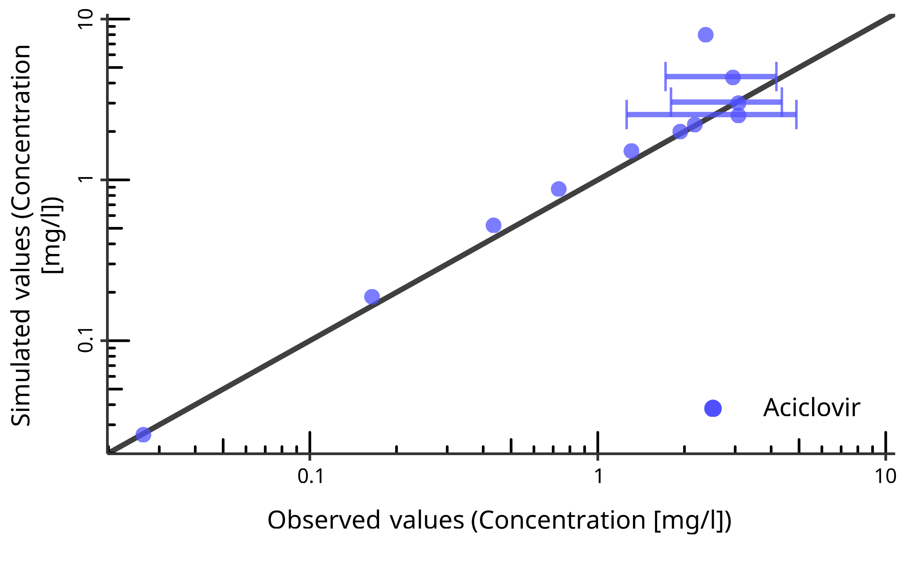

# Get started

`esqlabsR` builds modeling and simulation workflows on top of the Open
Systems Pharmacology Suite (OSPS). It organizes everything a PBPK or QSP
analysis needs (the model, the subjects you simulate, the dosing, the
parameters you apply, the outputs you record, the observed data you
compare against, and the figures you produce) into a single **Project**.
You load a Project once, then run scenarios and plot results from it.

This article walks the workflow end to end against a writable copy of
the bundled example: you inspect a loaded project, author a scenario and
a figure, then run and plot them. Each step links onward to the article
that covers it in depth.

## Install and load

`esqlabsR` depends on the OSPS R packages. Install those via the Open
Systems Pharmacology setup instructions, then install and load
`esqlabsR`:

``` r

library(esqlabsR)
```

## Load a project

The package bundles a complete example Project. So that
[`saveProject()`](https://esqlabs.github.io/esqlabsR/dev/reference/saveProject.md)
never touches the read-only example inside the installed package, you
work against a writable copy:
[`initProject()`](https://esqlabs.github.io/esqlabsR/dev/reference/initProject.md)
scaffolds a copy into a temporary directory, and
[`loadProject()`](https://esqlabs.github.io/esqlabsR/dev/reference/loadProject.md)
reads it into an in-memory `Project` object.
([`initProject()`](https://esqlabs.github.io/esqlabsR/dev/reference/initProject.md)
returns the directory it scaffolds;
[`loadProject()`](https://esqlabs.github.io/esqlabsR/dev/reference/loadProject.md)
wants the `Project.json` path inside it.)

``` r

project_dir <- withr::local_tempdir()
initProject(destination = project_dir, type = "example", createExcel = FALSE)
project <- loadProject(file.path(project_dir, "Project.json"))
```

Printing the Project gives you a quick map of its name, location, and
definition counts.

``` r

print(project)
#> <Project>
#>   • Name: Example
#>   • Description: Aciclovir IV PK example project
#>   • Schema Version: 2.0
#>   • esqlabsR Version: 6.0.0
#>   • JSON File: Project.json
#> 
#> ── Paths ───────────────────────────────────────────────────────────────────────
#>   • Simulations Folder: Models/Simulations
#>   • Data Folder: Data
#>   • Populations Folder: Populations
#>   • Output Folder: Results
#>   • Definitions Folder: definitions
#> 
#> ── Definitions ─────────────────────────────────────────────────────────────────
#>   • Scenarios: 3
#>   • Individuals: 1
#>   • Populations: 1
#>   • Parameter Sets: 4
#>   • Initial Conditions: 1
#>   • Applications: 1
#>   • Output Paths: 2
#>   • Observed Data: 1
#>   • Data Combined: 1
#>   • Plots: 1
#>   • Plot Grids: 1
#>   • Parameter Identification: 1
#> 
#> ── Excel ───────────────────────────────────────────────────────────────────────
#>   • Configurations Folder: Configurations/
#>   • Model Parameters File: ModelParameters.xlsx
#>   • Individuals File: Individuals.xlsx
#>   • Populations File: Populations.xlsx
#>   • Scenarios File: Scenarios.xlsx
#>   • Applications File: Applications.xlsx
#>   • Plots File: Plots.xlsx
```

## How a project is stored: the `definitions/` folder

On disk a project is a directory with two parts:

- the `Project.json` file, holding metadata and file paths;
- a `definitions/` folder, holding the authored content.

A **definition** is one named piece of the project (a scenario, an
individual, a population, and so on). Each kind lives in its own
subfolder under `definitions/` (`definitions/scenarios/`,
`definitions/individuals/`, …), one JSON file per definition, named
after the definition’s id.
[`vignette("projects")`](https://esqlabs.github.io/esqlabsR/dev/articles/projects.md)
covers the full taxonomy.

Each section is reachable as a named list on the project, keyed by id.
Printing one shows a count and the ids it holds, for example the
individuals the example already defines:

``` r

project$definitions$individuals
#> <DefinitionList>
#> individuals (1 definition):
#>   • adult_male
```

A single definition prints its configured fields, so you can inspect one
without digging into the raw file:

``` r

project$definitions$individuals$adult_male
#> <Individual>
#>   • Species: Human
#>   • Population: European_ICRP_2002
#>   • Gender: MALE
#>   • Weight: 73
#>   • Height: 176
#>   • Age: 30
#>   • Parameter Sets: adult_male_default
```

Editing follows an **explicit-save** model: when you add or edit a
definition with one of the `add*` / `set*` / `remove*` functions, the
change is made in memory, and `saveProject(project)` reconciles it to
the `definitions/` tree on disk. That save is why you work against a
writable copy rather than the installed example.

## Define: author a scenario and a figure

The authoring API is uniform: every function takes the `project` first,
then the definition’s `id`, then its fields. The example only defines an
adult male; we add an adult female, run aciclovir in her, and plot the
result.

Start with a new **Individual** (the subject a scenario simulates): its
species, sex, and biometrics.

``` r

addIndividual(
  project,
  id = "adult_female",
  species = "Human",
  population = "European_ICRP_2002",
  gender = "FEMALE",
  weight = 60,
  height = 165,
  age = 30
)
```

The new definition is staged in memory; it lands in
`definitions/individuals/adult_female.json` once you call
`saveProject(project)`.

With the individual in place, add a **Scenario** that simulates
aciclovir in her. A Scenario pins a model to a subject, dosing,
parameters, a time grid, and the outputs to record; the `id` comes first
and `modelFile` is the only other required field, with everything else
an optional reference into the project’s other definitions. References
are checked as the scenario is added, so a typo in an id is caught here
rather than at run time. See
[`vignette("design-scenarios")`](https://esqlabs.github.io/esqlabsR/dev/articles/design-scenarios.md)
for the full set of fields.

``` r

addScenario(
  project,
  id = "aciclovir_iv_female",
  modelFile = "Aciclovir.pkml",
  individual = "adult_female",
  application = "aciclovir_iv_250mg",
  parameterSets = c("global", "aciclovir"),
  outputPaths = "aciclovir_pvb",
  simulationTime = "0, 24, 60",
  simulationTimeUnit = "h"
)
```

Finally, describe a figure for the scenario you just built. A
**DataCombined** pairs the curves a figure draws (here, one simulated
curve: the plasma concentration from the new scenario), and a **Plot**
draws one chart from a DataCombined. To compose several plots into one
multi-panel figure you would add a **Plot Grid**, but a single plot
needs none;
[`vignette("plot-results")`](https://esqlabs.github.io/esqlabsR/dev/articles/plot-results.md)
covers the full plotting model. Add a DataCombined that references the
new scenario, then a plot from it:

``` r

addDataCombined(
  project,
  id = "aciclovir_female_combined",
  simulated = list(
    list(
      label = "Aciclovir (female)",
      scenario = "aciclovir_iv_female",
      path = "Organism|PeripheralVenousBlood|Aciclovir|Plasma (Peripheral Venous Blood)"
    )
  )
)

addPlot(
  project,
  id = "aciclovir_female_profile",
  dataCombined = "aciclovir_female_combined",
  plotType = "individual",
  title = "Aciclovir plasma profile (adult female)"
)
```

Everything so far has edited the project in memory. Persist the new
individual, scenario, DataCombined, and plot to the `definitions/` tree
with
[`saveProject()`](https://esqlabs.github.io/esqlabsR/dev/reference/saveProject.md):

``` r

saveProject(project)
```

## Run the scenario

With the scenario defined, run it.
[`runScenarios()`](https://esqlabs.github.io/esqlabsR/dev/reference/runScenarios.md)
runs one or more scenarios from the Project and returns a named list
keyed by scenario name. We pass the single scenario we just built; the
first run of a session initializes PK-Sim and takes a few seconds, so a
one-scenario example keeps things quick.

``` r

res <- runScenarios(project, scenarios = "aciclovir_iv_female")
```

Each entry of the returned list is a **Scenario Result**, the record
[`createPlots()`](https://esqlabs.github.io/esqlabsR/dev/reference/createPlots.md)
reads from. It bundles the simulation and its outputs (not the raw OSPS
`SimulationResults`);
[`vignette("run-simulations")`](https://esqlabs.github.io/esqlabsR/dev/articles/run-simulations.md)
describes its structure.

## Plot the result

[`createPlots()`](https://esqlabs.github.io/esqlabsR/dev/reference/createPlots.md)
reads the plot definitions stored in the Project and draws them against
the scenario results you pass in. Ask for the plot you just authored by
its id; it returns a named list keyed by that id, each entry a `ggplot`
object.

``` r

plots <- createPlots(
  project,
  plots = "aciclovir_female_profile",
  scenarioResults = res
)
```

Each entry is a regular `ggplot` object, so you display it by printing
it:

``` r

plots$aciclovir_female_profile
```



That is the whole loop: you authored a scenario and a figure, ran the
scenario, and plotted its result, all against one project.

## Where to go next

Each step has a dedicated article that goes deeper:

- [`vignette("projects")`](https://esqlabs.github.io/esqlabsR/dev/articles/projects.md)
  explains what a Project is on disk and in memory, how to scaffold and
  load one, and how to share it as a single file.
- [`vignette("design-scenarios")`](https://esqlabs.github.io/esqlabsR/dev/articles/design-scenarios.md)
  covers the full authoring API: every supporting definition, editing in
  place with the `set*` family, vectorized authoring (adding several
  definitions in one call), and seeding scenarios from model files.
- [`vignette("validate-project")`](https://esqlabs.github.io/esqlabsR/dev/articles/validate-project.md)
  shows how to check that everything hangs together before you run it.
- [`vignette("run-simulations")`](https://esqlabs.github.io/esqlabsR/dev/articles/run-simulations.md)
  covers running several scenarios at once, populations, steady-state,
  and saving and reloading results.
- [`vignette("plot-results")`](https://esqlabs.github.io/esqlabsR/dev/articles/plot-results.md)
  covers richer figures, attaching observed data, and the esqLABS house
  style.
- [`vignette("observed-data")`](https://esqlabs.github.io/esqlabsR/dev/articles/observed-data.md)
  covers the ways measured data enters a project.
