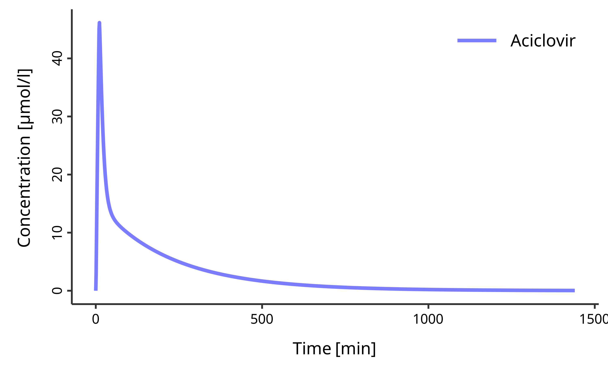

# Get Started

## Introduction

[esqlabsR](https://github.com/esqLABS/esqlabsR) is designed to make life
easier for OSPS users. The workflows implemented in this package rely on
simple concepts:

- a predefined project folder structure,
- Excel files for definition of simulation scenarios out outputs.

## Initialize Project

[esqlabsR](https://github.com/esqLABS/esqlabsR) facilitates modeling and
simulation workflows with OSPS relying on a well defined project
structure based on Excel files. These files are organized in different
folders and their structure must not be altered.

A new project folder can be initialized with the
[`initProject()`](https://esqlabs.github.io/esqlabsR/dev/reference/initProject.md)
function.

``` r
library(esqlabsR)

initProject()
```

It will create the expected simulation project’s folder structure, which
is described in details in
[`vignette("project-structure")`](https://esqlabs.github.io/esqlabsR/dev/articles/project-structure.md).

Each one of these folders contains a series of `.xlsx` files with
specific purpose. They are all linked to the project through the
`ProjectConfiguration.xlsx` file located in the root of the project
folder.

This file defines *where* all the necessary files are stored in the
project folder. This file is already preconfigured and should not be
changed in most cases. However, if target files would come to change
location, `ProjectConfiguration.xlsx` should reflect that. All the path
specified in the `Value` column should be *relative* to the
`ProjectConfiguration.xlsx` location.

Loading the project configuration is the first step in any workflow
using [esqlabsR](https://github.com/esqLABS/esqlabsR).

``` r
my_project_configuration <- createProjectConfiguration(path = "path/to/ProjectConfiguration.xlsx")
```

    ProjectConfiguration: 
       ...
       Model folder: Models/Simulations 
       Configurations folder: Configurations 
       Model Parameters: Configurations/ModelParameters.xlsx 
       Individuals: Configurations/Individuals.xlsx 
       Populations: Configurations/Populations.xlsx 
       Populations Folder: Configurations/PopulationsCSV 
       Scenarios: Configurations/Scenarios.xlsx 
    ...

Note that the `ProjectConfiguration` stores paths to other files that
are used in the project.

To create an example `ProjectConfiguration` and execute the rest of this
tutorial, run the following:

``` r
my_project_configuration <- createProjectConfiguration(path = exampleProjectConfigurationPath())
```

## Version Control and Project Sharing

`esqlabsR` provides powerful version control capabilities through
project configuration snapshots. This allows you to:

- **Track changes** to your project configuration in version control
  systems like Git
- **Share projects** with team members easily  
- **Create backups** before making significant changes
- **Ensure reproducibility** across different environments

``` r
# Create a JSON snapshot of your project configuration
snapshotProjectConfiguration(my_project_configuration)

# Share the JSON file with team members or commit to version control
# Later, restore the project configuration from the snapshot
restored_config <- restoreProjectConfiguration("ProjectConfiguration.json")
```

For comprehensive information about version control features, workflows,
and best practices, see the “Version Control and Project Sharing”
section in
[`vignette("project-structure")`](https://esqlabs.github.io/esqlabsR/dev/articles/project-structure.md).

## Design Scenarios

Now that the project’s file structure is ready, the next step is to run
simulations. In [esqlabsR](https://github.com/esqLABS/esqlabsR),
simulation are run by defining and executing multiple **scenarios**.

To modify, add or delete a scenario, edit the
`Parameters/Scenarios.xslx` file. Each row of this file defines a
simulation scenario.

The main properties that can be defined for a scenario are:

- `ModelFile` is the name of the `.pkml` file that can be found in the
  `Models/` directory.
- `ModelParameterSheets` are the names of the *sheets* in
  `Parameters/ModelParameters.xlsx` that contain the parameters to apply
  to the model,
- `ApplicationProtocol` is the name of the *sheet* in
  `Parameters/ApplicationParameters.xlsx` that specify the simulated
  administration protocol,
- `SimulationTime` and `SimulationTimeUnit` define the time range to
  simulate, it should be three numbers for `{start, end, resolution}`
- `Individuald`: the id of the individual to simulate. The id and
  settings for individuals are defined in `Parameters/Individuals.xlsx`,
- `PopulationId`: the id of the *population* to simulate. The id and
  settings for populations are defined in
  `Parameters/PopulationParameters.xlsx`.

Note that multiple aspects of a simulation scenario are defined in other
excel files, and the `Scenarios.xslx` file links to the specific sheets
or other information stored in those files.


For example, if we want to change the characteristic of the individual
used in the simulation, we must add a new row with a different
`IndividualId` in the `IndividualBiometrics` sheet of
the`Individuals.xlsx` file and/or specify a parameter sheet with this
`IndividualId` in the same file.

For more information on all the scenario parameters that can be setup,
read
[`vignette("design-scenarios")`](https://esqlabs.github.io/esqlabsR/dev/articles/design-scenarios.md).

## Run Scenarios

Once all the scenario properties are set up in the excel files, we can
import `ScenarioConfiguration` using
[`readScenarioConfigurationFromExcel()`](https://esqlabs.github.io/esqlabsR/dev/reference/readScenarioConfigurationFromExcel.md)
and create `Scenario` objects with
[`createScenarios()`](https://esqlabs.github.io/esqlabsR/dev/reference/createScenarios.md):

``` r
my_scenarios <- createScenarios(
  readScenarioConfigurationFromExcel(
    scenarioNames = "TestScenario",
    projectConfiguration = my_project_configuration
  )
)
```

    #> <ScenarioConfiguration>
    #> 
    #> ── Scenario configuration ──────────────────────────────────────────────────────
    #>   • Scenario name: TestScenario
    #>   • Model file name: Aciclovir.pkml
    #>   • Application protocol: Aciclovir_iv_250mg
    #>   • Simulation type: Individual
    #>   • Individual Id: Indiv1
    #>   • Population Id: NULL
    #>   • Read population from csv file: FALSE
    #>   • Parameters sheets: Global
    #>   • Simulate steady-state: FALSE
    #>   • Steady-state time: 1000
    #> 
    #> ── Simulation time intervals ──
    #> 
    #> Interval 1:
    #>   • Start: 0
    #>   • End: 24
    #>   • Resolution: 60
    #>   • Simulation time intervals unit: h

Then, we run the simulations by passing the scenarios we defined:

``` r
myScenarioResults <- runScenarios(my_scenarios)
```

Simulation results can be saved for later use:
[`saveScenarioResults()`](https://esqlabs.github.io/esqlabsR/dev/reference/saveScenarioResults.md)
and
[`loadScenarioResults()`](https://esqlabs.github.io/esqlabsR/dev/reference/loadScenarioResults.md).

``` r
saveScenarioResults(myScenarioResults,
  projectConfiguration = my_project_configuration,
  outputFolder = my_project_configuration$outputFolder
)

myScenarioResults <- loadScenarioResults(
  scenarioNames = "TestScenario",
  resultsFolder = my_project_configuration$outputFolder
)
```

Learn more on how to run simulations in
[`vignette("run-simulations")`](https://esqlabs.github.io/esqlabsR/dev/articles/run-simulations.md).

## Plot Results

The simulation results can now be plotted. For this, the package relies
on on the concept of combining multiple simulation results and observed
data using the `DataCombined` class and creating figures using functions
implemented in the
[ospsuite](https://github.com/open-systems-pharmacology/ospsuite-r)
package.

First, a `DataCombined` object is initialized:

``` r
my_datacombined <- DataCombined$new()
```

Then, simulation result are added to the dataCombined object:

``` r
my_datacombined$addSimulationResults(myScenarioResults$TestScenario$results,
  names = "Simulated",
  groups = "Aciclovir"
)
```

Finally, the plot is generated:

``` r
plotIndividualTimeProfile(my_datacombined)
```



In some cases, we also want to plot the observed experimental data
(stored in `Data/`). `DataCombined` also has the ability to store
observed data for them to be plotted.

``` r
observed_data <- loadObservedData(
  projectConfiguration = my_project_configuration,
  sheets = "Laskin 1982.Group A"
)

my_datacombined$addDataSets(observed_data, names = "Observed", groups = "Aciclovir")

plotObservedVsSimulated(my_datacombined)
```


Many other plot types are available in
[esqlabsR](https://github.com/esqLABS/esqlabsR), read
[`vignette("plot-results")`](https://esqlabs.github.io/esqlabsR/dev/articles/plot-results.md)
to learn more.
