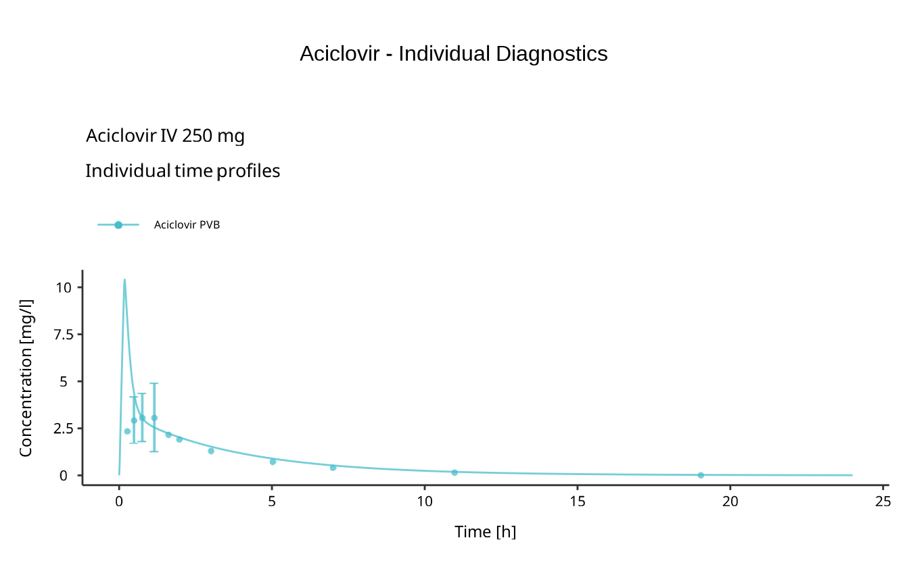
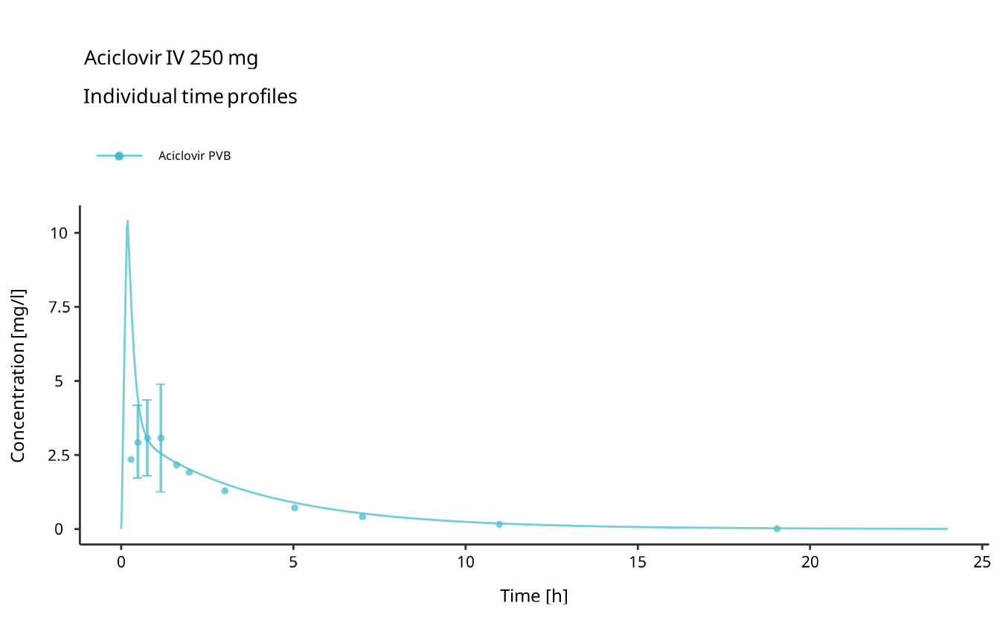
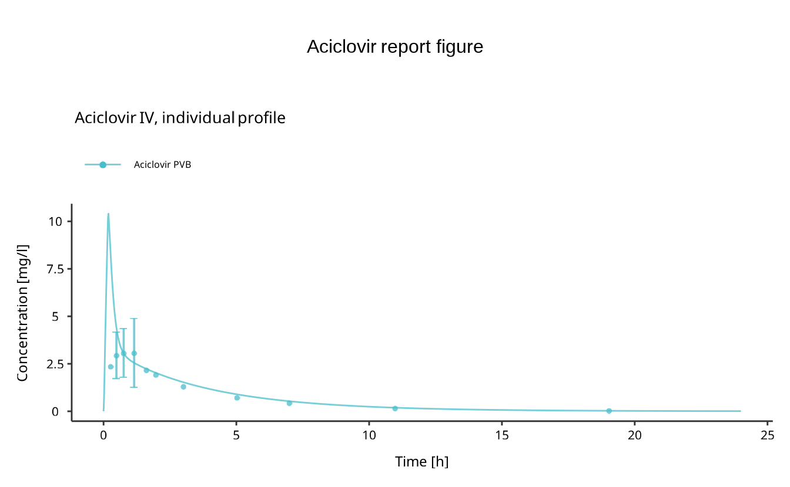

# Plot results

Clear, consistent figures are a core part of model diagnostics and of
any client-facing report. This article shows how to turn scenario
results into figures with
[esqlabsR](https://github.com/esqLABS/esqlabsR): first the plots a
project already defines, then how to author your own, attach observed
data, apply the esqLABS house style, and export to a file.

Every figure below runs against the example project bundled with the
package; loading it and running one scenario produces them all.

## The plotting model

[esqlabsR](https://github.com/esqLABS/esqlabsR) describes figures with
three building blocks that recur throughout this article.

- A **DataCombined** pairs one or more simulated curves with optional
  observed data. It is the data input for a chart: it says *which*
  scenario output and *which* observed data belong together, and it can
  carry per-curve transformations (offsets, scale factors).
- A **Plot** describes a single chart: its **Plot Type**, the
  **DataCombined** it draws from, and its axis, aggregation, and styling
  settings.
- A **Plot Grid** composes one or more **Plots** into one laid-out
  figure (a multi-panel arrangement). A **Plot** is usually rendered as
  a panel inside a **Plot Grid**, but can also be rendered on its own
  (see below).

A project stores all three as definitions under
`definitions/data-combined/`, `definitions/plots/`, and
`definitions/plot-grids/`, so the figures travel with the project. You
can also assemble them yourself in R, which is covered below.

## Load the example and run a scenario

Every figure in this article is built from the results of one simulated
scenario. Author against a writable copy of the example so the figures
you add later do not change the installed package:
[`initProject()`](https://esqlabs.github.io/esqlabsR/dev/reference/initProject.md)
scaffolds a fresh copy in a temporary directory, which you load and run
the `aciclovir_iv` scenario against.

``` r

project_dir <- withr::local_tempdir()
initProject(destination = project_dir, type = "example", createExcel = FALSE)
project <- loadProject(file.path(project_dir, "Project.json"))

scenarioResults <- runScenarios(
  project,
  scenarios = "aciclovir_iv"
)
```

The first
[`runScenarios()`](https://esqlabs.github.io/esqlabsR/dev/reference/runScenarios.md)
call in a session initializes PK-Sim and is slow; later runs are fast.
`scenarioResults` is keyed by scenario name; pass it to any plotting
function below.

## Generate a project’s predefined plots

The example project already defines a **DataCombined**
(`aciclovir_individual`), a **Plot** (`p1`, of type `individual`), and a
**Plot Grid** (`individual_diagnostics`).
[`createPlots()`](https://esqlabs.github.io/esqlabsR/dev/reference/createPlots.md)
reads those definitions and builds the figures, resolving each
**DataCombined** against the scenario results you pass in.

``` r

plotGrids <- createPlots(project, scenarioResults = scenarioResults)
```

Despite its name,
[`createPlots()`](https://esqlabs.github.io/esqlabsR/dev/reference/createPlots.md)
returns **Plot Grids**, not single **Plots**: the returned list is keyed
by the project’s **Plot Grid** names.

``` r

plotGrids$individual_diagnostics
```



To build only a subset of the project’s grids, pass their names to
`plotGrids`.

``` r

someGrids <- createPlots(
  project,
  plotGrids = "individual_diagnostics",
  scenarioResults = scenarioResults
)
```

To render a single **Plot** on its own, without wrapping it in a grid,
pass its id to `plots`. The result is keyed by the plot’s id, and the
entry is a single `ggplot` object rather than a `patchwork` grid.

``` r

single <- createPlots(
  project,
  plots = "p1",
  scenarioResults = scenarioResults
)

single$p1
```



`plotGrids` and `plots` are independent selectors, so you can request
grids and standalone plots in the same call.

## Attach observed data

Comparing simulated curves against measurements is what makes a
diagnostic figure useful. A project declares its observed data and
resolves it on demand; how observed data enters a project (the four
source types, the source definitions, and
[`loadObservedData()`](https://esqlabs.github.io/esqlabsR/dev/reference/loadObservedData.md))
is covered in
[`vignette("observed-data")`](https://esqlabs.github.io/esqlabsR/dev/articles/observed-data.md).
For plotting, you need just one handle: the **DataSet name** a
**DataCombined** references, which
[`getObservedDataNames()`](https://esqlabs.github.io/esqlabsR/dev/reference/getObservedDataNames.md)
lists.

``` r

getObservedDataNames(project)
#> [1] "Laskin 1982.Group A_Aciclovir_1_Human_MALE_PeripheralVenousBlood_Plasma_2.5 mg/kg_iv_"
```

Read this name from
[`getObservedDataNames()`](https://esqlabs.github.io/esqlabsR/dev/reference/getObservedDataNames.md)
rather than typing the long, fully qualified Excel name by hand. The
predefined `aciclovir_individual` **DataCombined** already pairs the
simulated curve with it, which is why the figure above overlays
measurements on the prediction. Reference the same name when you author
your own **DataCombined**.

## Author your own figures

Beyond a project’s predefined figures, you can describe new ones in R
with
[`addDataCombined()`](https://esqlabs.github.io/esqlabsR/dev/reference/addDataCombined.md),
[`addPlot()`](https://esqlabs.github.io/esqlabsR/dev/reference/addPlot.md),
and
[`addPlotGrid()`](https://esqlabs.github.io/esqlabsR/dev/reference/addPlotGrid.md).
Like every authoring function, these edit the project in memory;
[`saveProject()`](https://esqlabs.github.io/esqlabsR/dev/reference/saveProject.md)
then writes each definition to the project’s
`definitions/data-combined/`, `definitions/plots/`, or
`definitions/plot-grids/` folder. Because you scaffolded a writable copy
above, a save lands in the temporary project, not the installed package.

First, define a **DataCombined** that pairs the simulated
peripheral-venous-blood curve with the observed data. Curves that share
a `group` are plotted together.

``` r

observedName <- getObservedDataNames(project)[1]

addDataCombined(
  project,
  id = "aciclovir_report",
  simulated = list(list(
    label = "Aciclovir simulated",
    scenario = "aciclovir_iv",
    path = "Organism|PeripheralVenousBlood|Aciclovir|Plasma (Peripheral Venous Blood)",
    group = "Aciclovir PVB"
  )),
  observed = list(list(
    label = "Aciclovir observed",
    dataSet = observedName,
    group = "Aciclovir PVB"
  ))
)
```

Next, describe a **Plot** that draws from this **DataCombined**. The
`plotType` selects the kind of chart:

- `individual` plots a time profile for an individual scenario.
- `population` plots a time profile for a population scenario; its
  `quantiles` field (which applies only to population plots) controls
  the displayed percentile bands.
- `observedVsSimulated` plots simulated against observed values.
- `residualsVsSimulated` plots residuals against simulated values.
- `residualsVsTime` plots residuals against time.

Any field accepted by a plot configuration can be passed through `...`,
for example a `title` or an axis unit.

``` r

addPlot(
  project,
  id = "aciclovir_profile",
  dataCombined = "aciclovir_report",
  plotType = "individual",
  title = "Aciclovir IV, individual profile",
  xUnit = "h"
)
```

Finally, compose the **Plot** into a **Plot Grid**. A grid can hold a
single plot or several; list every plot id you want in the figure.

``` r

addPlotGrid(
  project,
  id = "report_figure",
  plots = "aciclovir_profile",
  title = "Aciclovir report figure"
)
```

Build the authored grid the same way as the predefined ones.

``` r

reportGrids <- createPlots(
  project,
  plotGrids = "report_figure",
  scenarioResults = scenarioResults
)

reportGrids$report_figure
```



## Apply the esqLABS house style

[`createPlots()`](https://esqlabs.github.io/esqlabsR/dev/reference/createPlots.md)
already styles figures with the esqLABS look, so the figures above are
house-styled out of the box. When you build plots more directly, two
helpers give you the same configurations to start from:

- [`createEsqlabsPlotConfiguration()`](https://esqlabs.github.io/esqlabsR/dev/reference/createEsqlabsPlotConfiguration.md)
  returns a plot configuration carrying the esqLABS defaults for fonts,
  sizes, legend placement, and colors.
- [`createEsqlabsPlotGridConfiguration()`](https://esqlabs.github.io/esqlabsR/dev/reference/createEsqlabsPlotGridConfiguration.md)
  returns the matching grid configuration (panel tags, title sizing,
  alignment).

``` r

plotConfig <- createEsqlabsPlotConfiguration()
gridConfig <- createEsqlabsPlotGridConfiguration()
```

The palette behind that look is
[`esqlabsColors()`](https://esqlabs.github.io/esqlabsR/dev/reference/esqlabsColors.md),
which extrapolates between the esqLABS blue, red, and green for any
number of curves. Use it whenever you need house colors outside the
plotting helpers.

``` r

esqlabsColors(3)
#> [1] "#4ABDCB" "#EA5E5E" "#76BB60"
```

## Export a finished figure

A **Plot Grid** is a standard `ggplot`/`patchwork` object, so save it
with
[`ggplot2::ggsave()`](https://ggplot2.tidyverse.org/reference/ggsave.html).
Choose the file extension to pick the format (`.png`, `.pdf`, `.svg`,
and so on) and set the size and resolution to suit your report.

``` r

outputDir <- withr::local_tempdir()

ggplot2::ggsave(
  filename = file.path(outputDir, "aciclovir_report.png"),
  plot = reportGrids$report_figure,
  width = 7,
  height = 5,
  dpi = 300
)
```

To export several figures, loop over the named list that
[`createPlots()`](https://esqlabs.github.io/esqlabsR/dev/reference/createPlots.md)
returns and write each grid to its own file, deriving the file name from
the grid name.

``` r

for (name in names(reportGrids)) {
  ggplot2::ggsave(
    filename = file.path(outputDir, paste0(name, ".png")),
    plot = reportGrids[[name]]
  )
}
```

## Where to go next

The **Plot Type** charts shown here are produced by
[ospsuite](https://github.com/open-systems-pharmacology/ospsuite-r)’s
plotting engine; its DataCombined articles cover the chart types and
their customization in depth, and the OSPSuite-R observed-data article
covers loading measurements from Excel or PKML. For building and running
the scenarios that feed these figures, see
[`vignette("esqlabsR")`](https://esqlabs.github.io/esqlabsR/dev/articles/esqlabsR.md)
and
[`vignette("run-simulations")`](https://esqlabs.github.io/esqlabsR/dev/articles/run-simulations.md).
