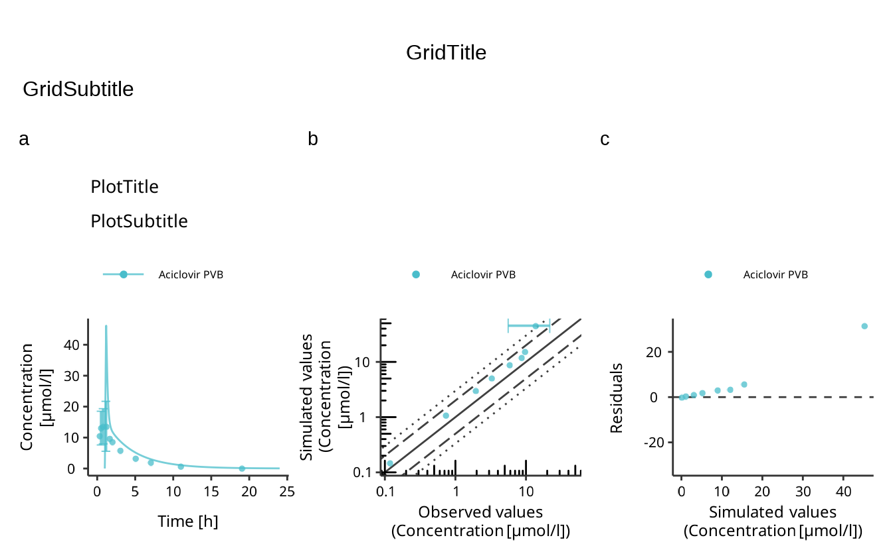
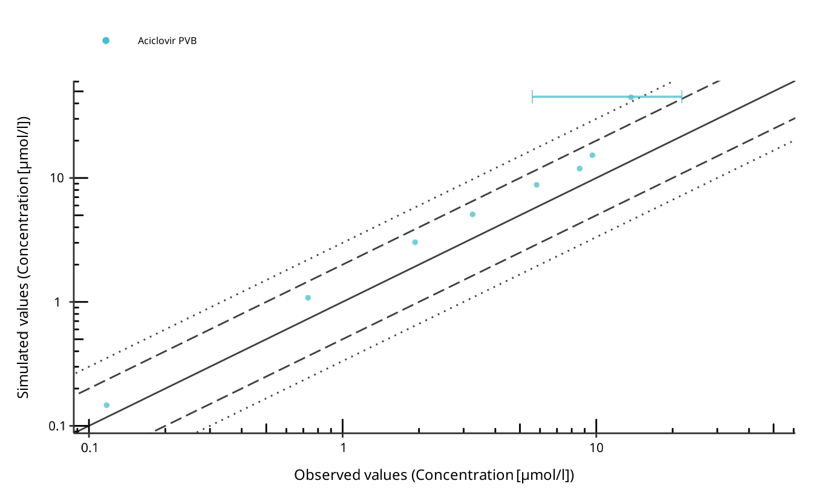

# 4. Plot Results

Plotting the simulation results is an integral part of model diagnostics
and quality control. [esqlabsR](https://github.com/esqLABS/esqlabsR)
implements an excel-based [Plotting Workflow](#plotting-workflow) for
figure creation directly from simulated scenarios. It is also possible
to use [esqlabsR](https://github.com/esqLABS/esqlabsR)’s functions to
[plot using R code](#plotting-with-code).

## Plotting Workflow

This process relies on filling a **`Plots.xlsx`** file in order to
specify all the figures that need to be created. Then,
[`createPlotsFromExcel()`](https://esqlabs.github.io/esqlabsR/dev/reference/createPlotsFromExcel.md)
will translate the information in the excel file into plots !

First, `DataCombined` are defined with simulation results coming from
simulated scenarios and observed data sets in the **DataCombined**
sheet. More information in the [Create a
Datacombined](#specify-a-datacombined) section.

From each `DataCombined`, multiple plots of different types can be
defined using the **plotConfiguration** sheet. More information in the
[Customizing Plots](#customizing-plots) section.

Each plot to draw is defined in a **plotGrid** which is specified in the
**plotGrids** sheet. A **plotGrid** can contain one or several plots
defined in the plotConfiguration sheet and has many options to customize
the layout of the plots. More information in the [Drawing
Plots](#drawing-plots) section.

plotGrids export options like size, quality, file type etc… are
available in the **exportConfiguration** sheet. More information in the
[Export Plot](#export-plots) section.

Once all the excel sheets are setup, just call the
[`createPlotsFromExcel()`](https://esqlabs.github.io/esqlabsR/dev/reference/createPlotsFromExcel.md)
function to generate and export the plots.


### Specify a `DataCombined`

A `DataCombined` is where the data to plot is stored. It can contain
simulated results and/or observed data and links them together.

First, the user needs to define the name of the dataCombined. The name
need to be stored in the `DataCombinedName`. Then, for each
`DataCombinedName`, the user can attach simulated results (set dataType
to `simulated`) and observed data (set dataType to `observed`) and give
them labels. For Simulated results, the user needs to specify the name
of the scenario and the output path of the simulation. For observed
data, the user needs to specify the name of the dataset to use. Finally,
both type of data can be linked together if they share the same value in
the `groups` column.

Other columns available in this sheet are relative to the data
transformations that can be performed by `dataCombined`. For more
information on this, please refer to the
[ospsuite](https://github.com/open-systems-pharmacology/ospsuite-r)
documentation about it
[here](https://www.open-systems-pharmacology.org/OSPSuite-R/articles/data-combined.html#transformations).

### Customizing Plots

The default `Plot.xlsx` file already contains the most common columns
required to customize plots. However, the user can add all the necessary
columns that are needed to reach the desired result. The list of
available variables can be explored in a `defaultPlotConfiguration`
object.

Here is a sample of the available plot settings:

    #>  [1] "foldLinesLegendDiagonal" "foldLinesLegend"        
    #>  [3] "lloqDirection"           "displayLLOQ"            
    #>  [5] "errorbarsAlpha"          "errorbarsLinetype"      
    #>  [7] "errorbarsCapSize"        "errorbarsSize"          
    #>  [9] "ribbonsAlpha"            "ribbonsLinetype"        
    #> [11] "ribbonsSize"             "ribbonsFill"            
    #> [13] "pointsAlpha"             "pointsSize"             
    #> [15] "pointsShape"

You can access the full list by running `DefaultPlotConfiguration$new()`

For instance, if the subtitle needs to be changed, the user can add a
column named `subtitle` and fill it with the desired value for each
plot.

Leaving a cell empty will result in the default value being used.

For properties that accept a list of values (e.g. `xAxisLimits`), the
values should be separated by a `,`. If an entry itself contains a `,`,
enclose it between parenthesis.

### Drawing Plots

`plotGrids` are the objects that will be used to draw the plots. They
are defined in the **plotGrids** sheet. The user needs to define a name
for each plotGrid. For single panel plot, only one plot must be listed
in the plotIDs column. [esqlabsR](https://github.com/esqLABS/esqlabsR)
also provide a simple way to combined several plots in a multi-panel
figure, in this case, the user needs to list all the plotIDs to combine
in the plotIDs column, separated by a `,`.

To customize the plotGrid, the user can add all the necessary columns
that are defined in the `PlotGridConfiguration` class. Here is a sample
of the available:

    #>  [1] "tagMargin"                  "tagLineHeight"             
    #>  [3] "tagAngle"                   "tagVerticalJustification"  
    #>  [5] "tagHorizontalJustification" "tagFontFamily"             
    #>  [7] "tagFontFace"                "tagSize"                   
    #>  [9] "tagColor"                   "tagPosition"               
    #> [11] "tagSeparator"               "tagSuffix"                 
    #> [13] "tagPrefix"                  "tagLevels"                 
    #> [15] "design"

### Export Plots

In order to export plots to image files, the user can use the
**exportConfiguration** sheet. The plotGrids to export must be added in
the plotGridName column. Then, the output file name must be specified in
the outputName column. The output format can be customize using the
properties listed in the `ExportConfiguration` class. Here is a sample
of the available:

    #> [1] "heightPerRow" "dpi"          "units"        "height"       "width"

### Plotting Workflow Example

#### Example Scenario

For the following examples, we will simulate an example scenario as
described in
[`vignette("esqlabsR")`](https://esqlabs.github.io/esqlabsR/dev/articles/esqlabsR.md)
and load the corresponding observed data.

``` r
library(esqlabsR)
# Create a project configuration
projectConfiguration <- createProjectConfiguration(exampleProjectConfigurationPath())
# Create `ScenarioConfiguration` objects from excel files
scenarioConfigurations <- readScenarioConfigurationFromExcel(
  scenarioNames = "TestScenario",
  projectConfiguration = projectConfiguration
)
# Run scenario configuration
scenarios <- createScenarios(scenarioConfigurations = scenarioConfigurations)
simulatedScenarios <- runScenarios(
  scenarios = scenarios
)

# Load observed data
dataSheets <- "Laskin 1982.Group A"
observedData <- loadObservedData(projectConfiguration = projectConfiguration, sheets = dataSheets)
```

#### Setup the `Plot.xlsx` file

Then, the `Plot.xlsx` file is setup to define the `DataCombined`,
customize plots, specify plotGrids and export options. The `Plot.xlsx`
file used in this example can be found
[here](https://github.com/esqLABS/esqlabsR/raw/main/inst/extdata/examples/TestProject/Configurations/Plots.xlsx).

#### Use `createPlotsFromExcel()`

In the next step, the user calls the function
[`createPlotsFromExcel()`](https://esqlabs.github.io/esqlabsR/dev/reference/createPlotsFromExcel.md),
passing the generated data:

``` r
plots <- createPlotsFromExcel(
  simulatedScenarios = simulatedScenarios,
  observedData = observedData,
  plotGridNames = c("Aciclovir", "Aciclovir2"),
  projectConfiguration = projectConfiguration
)
```

The function returns a named list of `ggplot2` objects, with names being
the names of the plot grids:

``` r
names(plots)
#> [1] "Aciclovir"  "Aciclovir2"
```

``` r
plots$Aciclovir
```



``` r
plots$Aciclovir2
```



Also, calling this function will export the plots as image files if the
exportConfiguration sheet is setup correctly.

By default, the function will try to create all plots defined in the
**plotGrids** sheet. If any of the simulation results or the observed
date required by these plots cannot be found, an error is thrown. To
override this behavior, e.g., to only plot the observed data without
having the results simulated, change the value of the argument
`stopIfNotFound` to `FALSE`. You can also specify which plots to create
with the `plotGridNames` argument.

#### Extract `DataCombined` required for plotting and calculate residuals

The
[`createPlotsFromExcel()`](https://esqlabs.github.io/esqlabsR/dev/reference/createPlotsFromExcel.md)
function automatically creates all `DataCombined` required for the
specified plots. In some cases it is usefull to get the `DataCombined`
objects before plotting. E.g., you could calculate the residuals between
all groups defined in the `DataCombined` (see [`{ospsuite}`
documentation](https://www.open-systems-pharmacology.org/OSPSuite-R/articles/data-combined.html#transformations)
for more details), or modify the `DataCombined` before using them for
plotting. To do so, you can use the
[`createDataCombinedFromExcel()`](https://esqlabs.github.io/esqlabsR/dev/reference/createDataCombinedFromExcel.md)
function:

``` r
# Create DataCombined used inthe plots "Aciclovir" and "Aciclovir2"
dataCombined <- createDataCombinedFromExcel(
  projectConfiguration = projectConfiguration,
  plotGridNames = c("Aciclovir", "Aciclovir2"),
  simulatedScenarios = simulatedScenarios,
  observedData = observedData
)

print(dataCombined)
#> $AciclovirPVB
#> <DataCombined>
#> 
#> ── Datasets and groupings: ─────────────────────────────────────────────────────
#> 
#> # A tibble: 2 × 3
#>   name                group         dataType 
#>   <chr>               <chr>         <chr>    
#> 1 Aciclovir simulated Aciclovir PVB simulated
#> 2 Aciclovri observed  Aciclovir PVB observed

# Calculate residuals. Residuals are returned for each observed data point
residuals <- calculateResiduals(
  dataCombined = dataCombined[[1]],
  scaling = "lin"
)

# Calculate the sum of residuals to convieniently quanity the quality of predictions
sumResiduals <- sum(residuals$residualValues)

print(paste0("The sum of linear residuals for is ", sumResiduals))
#> [1] "The sum of linear residuals for is 47.1769867367178"
```

You can modify the created `DataCombined`, e.g., by changing the
offsets, and pass them to the `createPlotsFromExcel` function:

``` r
# Change the offset of the first group
dataCombined[[1]]$setDataTransformations(xOffsets = 0)
# Create the plots using the modified DataCombined
plots <- createPlotsFromExcel(
  simulatedScenarios = simulatedScenarios,
  observedData = observedData,
  plotGridNames = c("Aciclovir", "Aciclovir2"),
  projectConfiguration = projectConfiguration,
  dataCombinedList = dataCombined
)
```

## Plotting With Code

In some situation, the user needs to quickly draw a plot from a
simulation result object using code while wanting to use the default
esqlabsR theme. In this situation, using the `Plots.xlsx` file is not
necessary. Instead, the user can directly use
[esqlabsR](https://github.com/esqLABS/esqlabsR)’s and
[ospsuite](https://github.com/open-systems-pharmacology/ospsuite-r)’s
plotting functions to create the desired plot while preserving the
[esqlabsR](https://github.com/esqLABS/esqlabsR) theme.

### Basics of figure creation with `{ospsuite}`

Simulated modeling scenarios can be passed to plotting functions from
the [ospsuite](https://github.com/open-systems-pharmacology/ospsuite-r)
package to create uniformly-looking plots. To get familiar with the
`DataCombined` class used to store matching observed and simulated data,
read the [Working with `DataCombined`
class](https://www.open-systems-pharmacology.org/OSPSuite-R/dev/articles/data-combined.html)
article. The article [Visualizations with
`DataCombined`](https://www.open-systems-pharmacology.org/OSPSuite-R/dev/articles/data-combined-plotting.html)
covers the basics of creating supported plot types and how to customize
them.

### Using esqlabsR

For the following examples, we will use the same scenario as described
in the [Example](#example) above.

``` r
library(esqlabsR)
# Create a project configuration
projectConfiguration <- createProjectConfiguration(exampleProjectConfigurationPath())
# Create `ScenarioConfiguration` objects from excel files
scenarioConfigurations <- readScenarioConfigurationFromExcel(
  scenarioNames = "TestScenario",
  projectConfiguration = projectConfiguration
)
# Run scenario configuration
scenarios <- createScenarios(scenarioConfigurations = scenarioConfigurations)
simulatedScenarios <- runScenarios(
  scenarios = scenarios
)

# Load observed data
dataSheets <- "Laskin 1982.Group A"
observedData <- loadObservedData(projectConfiguration = projectConfiguration, sheets = dataSheets)
```

For the following steps, no `Plots.xlsx` file is needed. Instead, we
will use the `DataCombined` class to store the simulated and observed
data, use the
[ospsuite](https://github.com/open-systems-pharmacology/ospsuite-r)’s
plotting functions to create the plots together with the
[esqlabsR](https://github.com/esqLABS/esqlabsR) functions to customize
the plots and their export.

#### Create a `DataCombined` object

The simulation results are stored in a list returned by the
[`runScenarios()`](https://esqlabs.github.io/esqlabsR/dev/reference/runScenarios.md)
function. Plotting and visualization are performed by storing these
results, matching observed data in a `DataCombined` object, and passing
it to plotting functions. Observed data in the form of `DataSet` objects
are added to a `DataCombined` object via the `addDataSets()` function,
and simulated results can be added by using the `addSimulationResults()`
function. Observed and simulated data can be linked by setting the
`groups` argument in both methods. Data sets of the same group will then
be plotted together when calling plotting functions on the
`DataCombined` object.

Let’s create a `DataCombined` object and populate it with data with the
following code:

``` r
dataCombined <- DataCombined$new()
dataCombined$addDataSets(observedData, names = "Observed", groups = "Aciclovir")
dataCombined$addSimulationResults(simulatedScenarios$TestScenario$results,
  names = "Simulated",
  groups = "Aciclovir"
)
```

You can also return the `DataCombined` objects defined in the
`DataCombined` sheet with the function
[`createDataCombinedFromExcel()`](https://esqlabs.github.io/esqlabsR/dev/reference/createDataCombinedFromExcel.md),
read (this section)\[#specify-a-datacombined\] for more information.

#### Customize and generate plots

Customization of the generated figures - specifying title, axes ranges,
axes units, the position of the legend, etc., are done through *plot
configurations*

- objects of the class
  [`DefaultPlotConfiguration`](https://www.open-systems-pharmacology.org/OSPSuite-R/dev/reference/DefaultPlotConfiguration.html).
  To combine multiple plots into a multi-panel figure, create a
  `PlotGridConfiguration` object, add plots to it, and plot with the
  [`plotGrid()`](https://rdrr.io/pkg/tlf/man/plotGrid.html) method.
  Finally, to export a plot to a file (e.g., `PNG` or `PDF`), use an
  `ExportConfiguration` object.

To use configurations with a similar look and feel in the different
`esqLABS` projects, create the configurations using the following
functions:

- [`createEsqlabsPlotConfiguration()`](https://esqlabs.github.io/esqlabsR/reference/createEsqlabsPlotConfiguration.html)
- [`createEsqlabsPlotGridConfiguration()`](https://esqlabs.github.io/esqlabsR/reference/createEsqlabsPlotGridConfiguration.html)
- [`createEsqlabsExportConfiguration(projectConfiguration)`](https://esqlabs.github.io/esqlabsR/reference/createEsqlabsExportConfiguration.html)

For the list of supported properties of the `PlotGirdConfiguration`,
refer to the
[reference](https://www.open-systems-pharmacology.org/TLF-Library/reference/ExportConfiguration.html)

The next example shows how to create a multi-panel figure using the
default configurations.

``` r
plotConfig <- createEsqlabsPlotConfiguration()
gridConfig <- createEsqlabsPlotGridConfiguration()

plotConfig$title <- "Time profile"
indivPlot <- plotIndividualTimeProfile(dataCombined, defaultPlotConfiguration = plotConfig)

plotConfig$title <- "Observed-vs-simulated"
obsVsSimPlot <- plotObservedVsSimulated(dataCombined, defaultPlotConfiguration = plotConfig)

plotConfig$title <- "Res-vs-time"
resVsTimePlot <- plotResidualsVsTime(dataCombined, defaultPlotConfiguration = plotConfig)

plotConfig$title <- "Res-vs-simulated"
resVsSimPlot <- plotResidualsVsSimulated(dataCombined, defaultPlotConfiguration = plotConfig)

gridConfig$addPlots(list(indivPlot, obsVsSimPlot, resVsTimePlot, resVsSimPlot))
gridConfig$title <- "All aciclovir plots"
gridPlot <- plotGrid(gridConfig)
gridPlot
```


#### Export Plots

To save the plot to a `PNG` file, use the
[`ExportConfiguration`](https://www.open-systems-pharmacology.org/TLF-Library/reference/ExportConfiguration.html).
Make sure that the `fileName` argument ends with `.png`:

``` r
exportConfig <- createEsqlabsExportConfiguration(projectConfiguration$outputFolder)
exportConfig$savePlot(gridPlot, fileName = "All plots.png")
```

By default, the height of the output figure is calculated from the
number of rows in the multi-panel plot and the height defined in
`ExportConfiguration$heightPerRow`. If you want to define a fixed height
with the parameter `ExportConfiguration$height`, set
`ExportConfiguration$heightPerRow = NULL`.

## Observed Data

Functionalities of `esqlabsR` require observed data to be present as
[`DataSet`](https://www.open-systems-pharmacology.org/OSPSuite-R/reference/DataSet.html)
objects. Please refer to the article [Observed
data](https://www.open-systems-pharmacology.org/OSPSuite-R/dev/articles/observed-data.html)
for information on loading data from Excel or `*.pkml` files.
[esqlabsR](https://github.com/esqLABS/esqlabsR) offers a convenience
function
[`loadObservedData()`](https://esqlabs.github.io/esqlabsR/dev/reference/loadObservedData.md)
that facilitates loading data in `esqLABS` projects. Assuming the
standard project folder structure is followed, and a valid
`ProjectConfiguration` (see [Standard
workflow](https://esqlabs.github.io/esqlabsR/dev/articles/standard-workflow.md))
and Excel files with observed data are present in the
`projectConfiguration$dataFolder` folder, the following code loads the
data:

``` r
projectConfiguration <- createProjectConfiguration(exampleProjectConfigurationPath())

dataSheets <- "Laskin 1982.Group A"

observedData <- loadObservedData(
  projectConfiguration = projectConfiguration,
  sheets = dataSheets
)

print(names(observedData))
#> [1] "Laskin 1982.Group A_Aciclovir_1_Human_MALE_PeripheralVenousBlood_Plasma_2.5 mg/kg_iv_"
```

The function loads the data from the file
`projectConfiguration$dataFile` from the folder
`projectConfiguration$dataFolder` and returns a list of
`DataSet`objects. The resulting object can be used to plot results to
compare simulated and observed data.

## Troubleshooting

- At any time, you can check the groups assigned to the datasets in the
  `DataCombined` object by calling the `DataCombined$groupMap` or by
  examining the output of `dataCombined$toDataFrame()`.

More detailed information on function signatures can be found in the
following:

- `ospsuite` documentation on:
  - [loadDataImporterConfiguration()](https://www.open-systems-pharmacology.org/OSPSuite-R/reference/loadDataImporterConfiguration.html)
  - [DataImporterConfiguration
    class](https://www.open-systems-pharmacology.org/OSPSuite-R/reference/DataImporterConfiguration.html)
  - [createImporterConfigurationForFile()](https://www.open-systems-pharmacology.org/OSPSuite-R/reference/createImporterConfigurationForFile.html)
  - [DataSet
    class](https://www.open-systems-pharmacology.org/OSPSuite-R/reference/DataSet.html)
  - [dataSetToDataFrame()](https://www.open-systems-pharmacology.org/OSPSuite-R/reference/dataSetToDataFrame.html)
  - [loadDataSetsFromExcel()](https://www.open-systems-pharmacology.org/OSPSuite-R/reference/loadDataSetsFromExcel.html)
  - [loadDataSetFromPKML()](https://www.open-systems-pharmacology.org/OSPSuite-R/reference/loadDataSetFromPKML.html)
  - [saveDataSetToPKML()](https://www.open-systems-pharmacology.org/OSPSuite-R/reference/saveDataSetToPKML.html)
  - [`DataCombined`
    class](https://www.open-systems-pharmacology.org/OSPSuite-R/reference/DataCombined.html)
  - [`plotIndividualTimeProfile()`](https://www.open-systems-pharmacology.org/OSPSuite-R/reference/plotIndividualTimeProfile.html)
  - [`plotObservedVsSimulated()`](https://www.open-systems-pharmacology.org/OSPSuite-R/reference/plotObservedVsSimulated.html)
  - [`plotResidualsVsSimulated()`](https://www.open-systems-pharmacology.org/OSPSuite-R/reference/plotResidualsVsSimulated.html)
  - [`plotResidualsVsTime()`](https://www.open-systems-pharmacology.org/OSPSuite-R/reference/plotResidualsVsTime.html)
- `tlf` documentation on:
  - [`PlotGridConfiguration`](https://www.open-systems-pharmacology.org/TLF-Library/reference/PlotGridConfiguration.html)
  - [`plotGrid()`](https://www.open-systems-pharmacology.org/TLF-Library/reference/plotGrid.html)
  - [`ExportConfiguration`](https://www.open-systems-pharmacology.org/TLF-Library/reference/ExportConfiguration.html)
