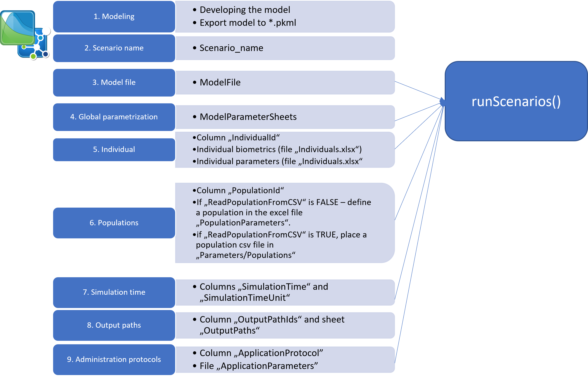
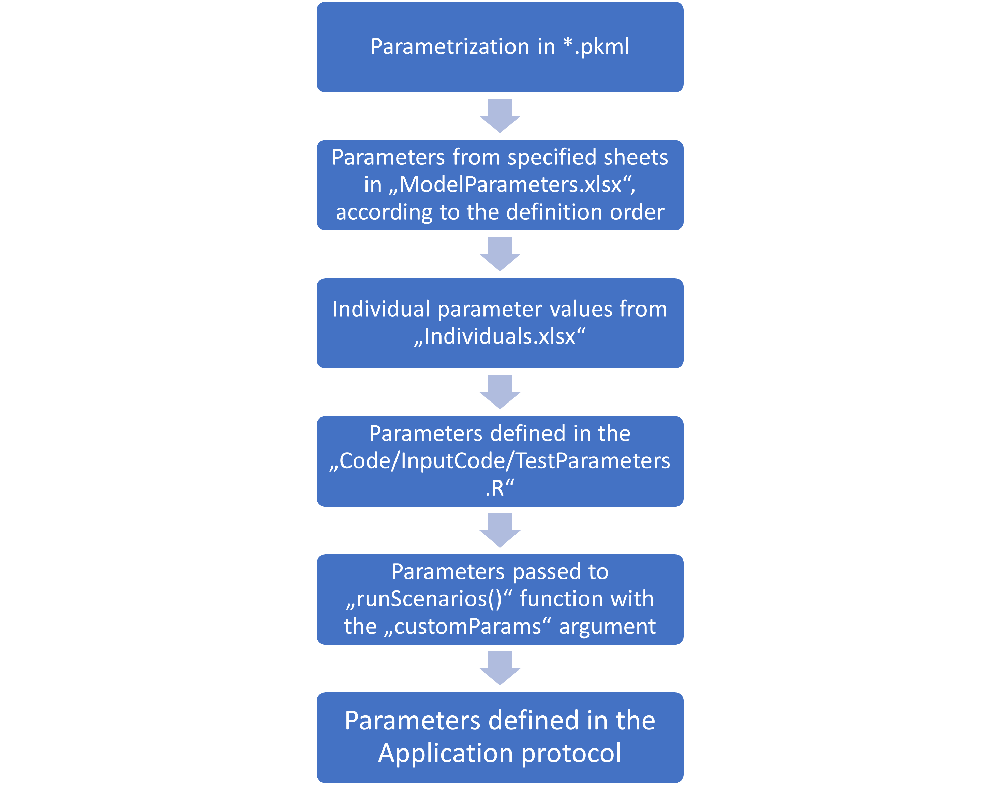

```{r, include = FALSE, warning =FALSE, message = FALSE}
knitr::opts_chunk$set(
  collapse = TRUE,
  comment = "#>",
  fig.showtext = TRUE
)

library(esqlabsR)
```

Within the `esqlabsR` framework, simulations are organized as named
*scenarios*. A scenario links together a simulation model (`.pkml`), a set
of model parameters, an individual or population, an application protocol,
and simulation-time settings.

All scenario information lives in the `scenarios` array of `Project.json`.
The accompanying Excel files (`Applications.xlsx`, `Individuals.xlsx`,
`ModelParameters.xlsx`, `Populations.xlsx`, `Scenarios.xlsx`) are an
**optional editing surface** that syncs to and from the JSON via
`importProjectFromExcel()` and `exportProjectToExcel()`. When both a JSON
and Excel copy of a project exist, the JSON file is authoritative.



## Add a new scenario

A scenario is one entry in the `scenarios` array of `Project.json`. A minimal
entry looks like this:

```json
{
  "name": "Aciclovir_iv",
  "modelFile": "Aciclovir.pkml",
  "individualId": "Adult_male",
  "modelParameterGroups": ["Global", "Aciclovir"],
  "applicationProtocol": "Aciclovir_iv_250mg",
  "simulationTime": "0, 24, 60",
  "simulationTimeUnit": "h",
  "outputPathIds": ["Aciclovir_PVB"]
}
```

Each field references entries defined elsewhere in the JSON:

| Field | References |
|---|---|
| `modelFile` | A `.pkml` file in `modelFolder` |
| `individualId` | An entry in `individuals` (matched by `individualId`) |
| `populationId` | An entry in `populations` (matched by `populationId`), optional |
| `applicationProtocol` | A key in the top-level `applications` map |
| `modelParameterGroups` | Keys in the top-level `modelParameters` map, applied in order |
| `outputPathIds` | Keys in the top-level `outputPaths` map |

To add a scenario, edit `Project.json` directly and re-run `loadProject()`.

## Customize a scenario

All fields except `name` and `modelFile` are optional. Omitting a field leaves
the simulation at the default defined by the model file and the `Scenario`
constructor (e.g., `steadyStateTime = 1000` minutes,
`overwriteFormulasInSS = false`).

### Simulation time

`simulationTime` is a string of one or more comma-separated triplets
`"startTime, endTime, resolution"`. Multiple intervals are separated by `;`.
For example, `"0, 20, 60; 20, 504, 1; 504, 552, 10"` simulates 0-20 h at 60
points/h, then 20-504 h at 1 point/h, then 504-552 h at 10 points/h.
`simulationTimeUnit` sets the unit (`"h"`, `"min"`, etc.); see
`ospsuite::ospUnits` for the full list.

### Steady state

Set `steadyState` to `true` to initialize the simulation from its steady
state. `steadyStateTime` (default `1000`; interpreted in the unit given by
`steadyStateTimeUnit`, which defaults to `"min"`) controls the pre-simulation
duration. `overwriteFormulasInSS` (default `false`)
controls whether formula-defined parameters are overwritten with
steady-state values (corresponds to `ignoreIfFormula = FALSE` in
`ospsuite::getSteadyState()`).

### Population vs individual

Set `individualId` alone for an individual simulation. Set `populationId` for
a population simulation. You can set both -- in that case, individual-specific
parameters are applied first, then population parameters (which overwrite any
overlapping physiology parameters).

Setting `readPopulationFromCSV` to `true` imports the population from
`populationsFolder/<populationId>.csv` instead of generating it on the fly.

### Model parameters

`modelParameterGroups` is an array of keys from the top-level
`modelParameters` map. Each key identifies a parameter group; groups are
applied in order. For example, `["Global", "Aciclovir"]` applies the
`Global` group first, then `Aciclovir` -- so `Aciclovir`-specific values
overwrite `Global` where they overlap. This lets you keep a base group of
global parameters alongside disease-state or compound-specific overrides
(e.g., `Healthy`, `CKD`, `Aciclovir`).

### Output paths

Output paths are declared once in the top-level `outputPaths` map -- keys are
short IDs, values are full paths:

```json
"outputPaths": {
  "Aciclovir_PVB": "Organism|PeripheralVenousBlood|Aciclovir|Plasma (Peripheral Venous Blood)",
  "Aciclovir_fat_cell": "Organism|Fat|Intracellular|Aciclovir|Concentration in container"
}
```

Scenarios then reference output paths by ID via `outputPathIds`:

```json
"outputPathIds": ["Aciclovir_PVB", "Aciclovir_fat_cell"]
```

## Supporting sections of `Project.json`

### Individuals

Each individual is an entry in the `individuals` array. Individual-specific
parameter sets are defined separately in the `individualParameterSets` map
and referenced by name:

```json
"individuals": [
  {
    "individualId": "Adult_male",
    "species": "Human",
    "population": "European_ICRP_2002",
    "gender": "MALE",
    "weight": 73,
    "height": 176,
    "age": 30,
    "proteinOntogenies": "CYP3A4:CYP3A4",
    "parameterSets": ["Renal"]
  }
],
"individualParameterSets": {
  "Renal": [
    {
      "containerPath": "Organism|Kidney",
      "parameterName": "GFR",
      "value": 90,
      "units": "ml/min"
    }
  ]
}
```

`species` supports scaling from the base `Human` model to `Beagle`, `Dog`,
`Minipig`, `Mouse`, `Rat`, `Rabbit`, and `Monkey` by using the respective
species name. `proteinOntogenies` is a comma-separated string of
`<Protein>:<Ontogeny>` pairs; call `ospsuite::StandardOntogeny` for
supported values. The `parameterSets` array lists keys from
`individualParameterSets` to apply in order (later sets override earlier
sets).

### Populations

Populations are defined in the `populations` array:

```json
"populations": [
  {
    "populationId": "European_adults",
    "species": "Human",
    "population": "European_ICRP_2002",
    "numberOfIndividuals": 50,
    "proportionOfFemales": 50,
    "ageMin": 18,
    "ageMax": 65,
    "weightMin": null,
    "weightMax": null,
    "weightUnit": "kg",
    "heightMin": null,
    "heightMax": null,
    "heightUnit": "cm",
    "BMIMin": null,
    "BMIMax": null,
    "BMIUnit": "kg/m²",
    "proteinOntogenies": "CYP3A4:CYP3A4"
  }
]
```

A `null` `Min` / `Max` value leaves that dimension unconstrained. To load a
prebuilt population from CSV instead of regenerating, set the scenario's
`readPopulationFromCSV` to `true` and place the CSV under
`populationsFolder/<populationId>.csv`.

### Applications

Application protocols are defined in the `applications` map. Each key is a
protocol ID; each value is an array of parameter entries in PK-Sim's
container/parameter form:

```json
"applications": {
  "Aciclovir_iv_250mg": [
    {
      "containerPath": "Applications|IV 250mg 10min|Application_1|ProtocolSchemaItem",
      "parameterName": "Dose",
      "value": 250,
      "units": "mg"
    }
  ]
}
```

Scenarios reference protocols by ID via the `applicationProtocol` field. The
loaded simulation must already contain all possible applications -- the
protocol's parameter entries tune their parameters. Use
`getAllApplicationParameters(sim)` to extract all configurable parameters
from a simulation for inclusion in the `applications` map:

```{r}
sim <- loadSimulation(system.file(
  "extdata",
  "Aciclovir.pkml",
  package = "ospsuite"
))
applicationParams <- getAllApplicationParameters(sim)
print(applicationParams)
```

### Model parameters

The `modelParameters` map groups parameter entries by name. Scenarios list
the groups to apply in their `modelParameterGroups` array:

```json
"modelParameters": {
  "Global": [
    {
      "containerPath": "Organism|Liver",
      "parameterName": "EHC continuous fraction",
      "value": 1,
      "units": null
    }
  ],
  "Aciclovir": [
    {
      "containerPath": "Organism|PeripheralVenousBlood|Aciclovir",
      "parameterName": "Fraction unbound (plasma, reference value)",
      "value": 0.85,
      "units": null
    }
  ]
}
```

## Adding scenarios programmatically

For advanced use or automation, `addScenario()` adds a scenario to an
already-loaded `Project` without editing `Project.json`:

```{r, eval=FALSE}
project <- loadProject("Project.json")

addScenario(
  project,
  scenarioName = "Aciclovir_iv_higher_dose",
  modelFile = "Aciclovir.pkml",
  individualId = "Adult_male",
  applicationProtocol = "Aciclovir_iv_500mg",
  parameterGroups = c("Global", "Aciclovir"),
  outputPathIds = c("Aciclovir_PVB"),
  simulationTime = "0, 24, 60",
  simulationTimeUnit = "h"
)
```

`outputPathIds` is a character vector of keys from `project$outputPaths` --
the paths themselves are defined once in the `outputPaths` map in the JSON
and referenced by ID throughout.

Note that the R argument name is `parameterGroups`, while the equivalent
JSON field is `modelParameterGroups`. The other `addScenario()` argument
names match the JSON field names one-to-one.

> **Note:** `addScenario()` mutates the in-memory `Project` object only. It
> does not write back to `Project.json`. To persist programmatic changes,
> edit `Project.json` directly. A JSON-write helper is tracked as a
> follow-up issue.

This approach is particularly useful when:

- You want to automate scenario creation.
- You need to add scenarios based on runtime conditions.
- You are setting up batch simulations programmatically.

## Editing scenarios via Excel

If you prefer a spreadsheet interface, you can round-trip the project
through Excel:

- `exportProjectToExcel(project, outputDir = "path/to/project/")` generates
  the supporting `.xlsx` files from a loaded `Project` object.
- `importProjectFromExcel("path/to/Project.xlsx")` regenerates
  `Project.json` from the Excel files.

The Excel column names map 1:1 to the JSON field names, with a casing
change:

| Excel column (in `Scenarios.xlsx`) | JSON field |
|---|---|
| `Scenario_name` | `name` |
| `IndividualId` | `individualId` |
| `PopulationId` | `populationId` |
| `ReadPopulationFromCSV` | `readPopulationFromCSV` |
| `ModelParameterSheets` | `modelParameterGroups` |
| `ApplicationProtocol` | `applicationProtocol` |
| `SimulationTime` | `simulationTime` |
| `SimulationTimeUnit` | `simulationTimeUnit` |
| `SteadyState` | `steadyState` |
| `SteadyStateTime` | `steadyStateTime` |
| `SteadyStateTimeUnit` | `steadyStateTimeUnit` |
| `OverwriteFormulasInSS` | `overwriteFormulasInSS` |
| `ModelFile` | `modelFile` |
| `OutputPathsIds` | `outputPathIds` |

Note that the Excel column historically called `ModelParameterSheets` is now
`modelParameterGroups` in JSON -- the underlying concept is the same (a named
group of parameter entries) but it's no longer tied to Excel sheet naming.

## Details

### Configuration files structure {#files-structure}

A scenario's configuration is ultimately just the set of JSON fields listed
above. In Excel form, each JSON field corresponds to one column (for
scenario-level fields) or one sheet (for parameter groups). The canonical
Excel filenames are:

- `Applications.xlsx`
- `Individuals.xlsx`
- `ModelParameters.xlsx`
- `Populations.xlsx`
- `Scenarios.xlsx`

See each section above for the JSON structure these files map into.

### Scenario parameterization hierarchy

The final parameterization combines the different parameterization steps
defined at various levels, as described in the sections above. The
following figure summarizes the hierarchy:



If a parameter path is defined at multiple levels, later levels overwrite
earlier ones. Concretely, individual parameters overwrite values from
`modelParameters` groups, and parameters passed via the `customParams`
argument of `runScenarios()` overwrite everything else. Within
`modelParameterGroups`, groups are applied in order: later groups overwrite
earlier ones.
