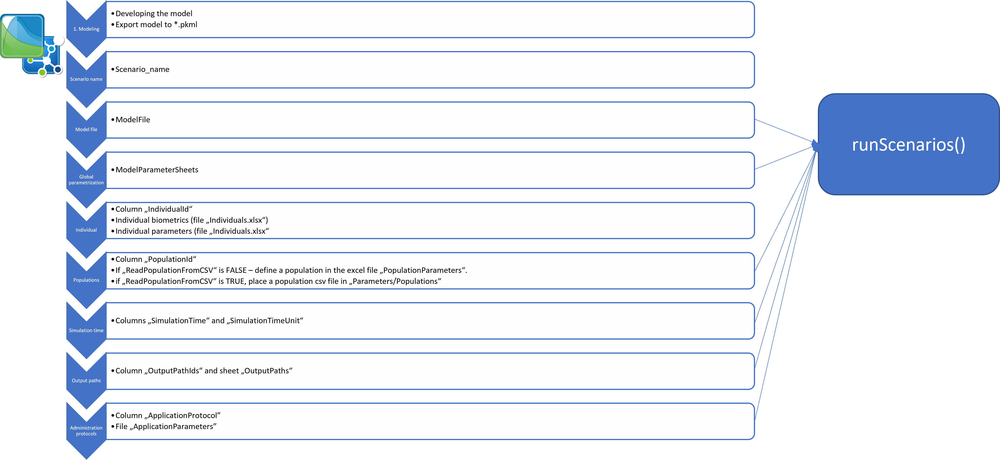
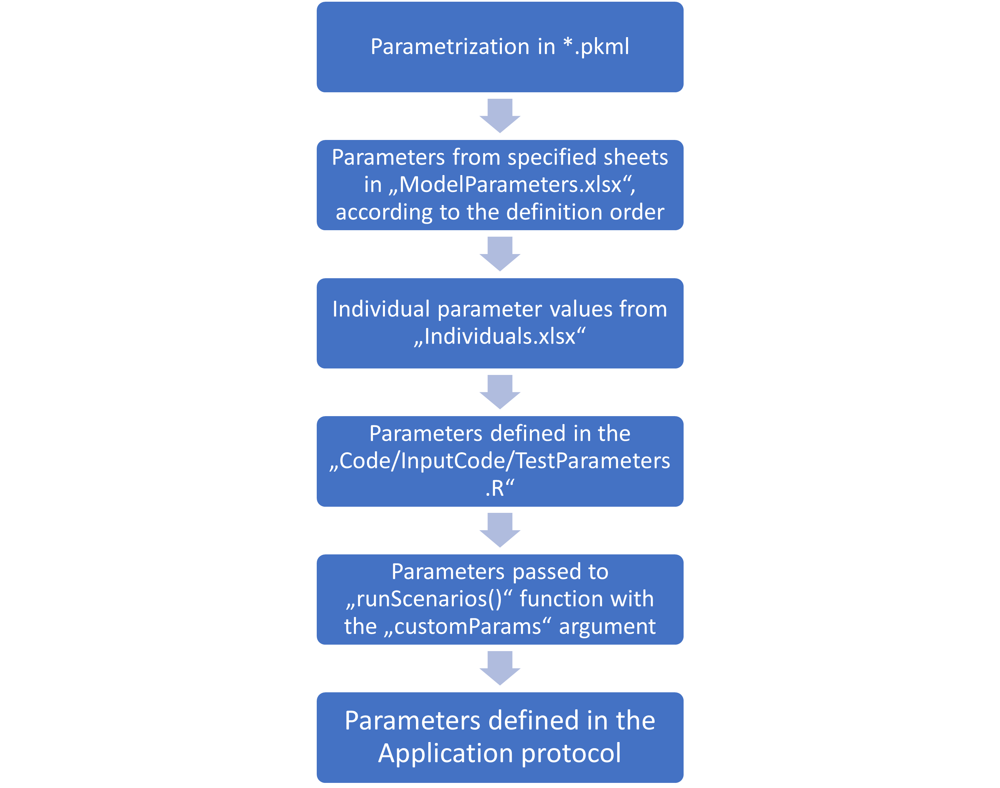

```{r, include = FALSE, warning =FALSE, message = FALSE}
knitr::opts_chunk$set(
  collapse = TRUE,
  comment = "#>"
)

library(esqlabsR)
```


Within the `esqlabsR` framework, the simulations are run by defining and executing multiple *scenarios*. A scenario is defined by the simulation file containing the model structure, parametrization of the model, application protocol, and (optionally) the physiology of the simulated individual or population. To simplify scenarios set up, all these information are stored in excel files with defined structure.

The step wise approach of setting up a new simulation scenario is shown in Figure 1, detailed description of the excel files structures and `R` code are given in the [Configuration files structure](#files-structure) section.




## Add a new scenario

### 1. Add the model file

After the model has been developed in PK-Sim and/or MoBi, a simulation must be stored as a *.pkml* file in the `Models/Simulations` folder.

### 2. Name the new scenario

To set up a simulation/scenario in `R`, open the file `Scenarios.xlsx` located in the folder `Parameters`. Start defining a scenario by giving it a *name* in the `Scenario_name` column. Scenario name will be used later to retrieve simulation results and use them e.g. in figure definitions.

### 3. Link to the model file

Specify the simulation `*.pkml` file to use in the column `ModelFile`.

If you simply want to run the simulation with the settings as it has been exported from PK-Sim or MoBi, you can proceed to [running Scenarios](#running-scenarios) section.

## Customize a scenario

### 4. Simulation Parameters

You can define simulation parameters in the `ModelParameters.xlsx` file. In order to apply to the simulation, you need to specify which sheets to load in the `ModelParameterSheets` column of the `Scenarios.xlsx` file.

### 5. Individuals

If you want to simulate a specific individual with individual characteristics (age, weight, etc.) or apply individual model parameter values to the simulation, define the individual in the `IndividualId` column. Then create a new individual entry in the `Individuals.xlsx` file.

a)  To create a new individual with specific biometrics, create a new row in the `IndividualBiometrics` sheet.
b)  To define an individual-specific parametrization, create a new sheet and name it as the ID of the individual.

### 6. Population

If you want to run a *population simulation*, specify a population in the column `PopulationId`. If you want to create a new population each time you run the scenario, define population demographics in the `Demographics` sheet of the `PopulationParameters.xlsx` file. Keep in mind that simulation results might differ each time you run the scenario, as new population will be generated each time!

If you want to import a population from existing csv file, set the value of the `ReadPopulationFromCSV` column to `TRUE`. The population csv file must be located in the `Parameters/Populations` folder.

### 7. Time

Simulation time can also be changed with the `SimulationTime` and `SimulationTimeUnit` columns.

### 8. OutputPath

You can define the outputs of the simulation in the `OutputPathsIds` column. For convenience, not the full paths to the outputs must be listed, but the their acronyms. The full path for each acronym must be defined in the sheet `OutputPaths`.

### 9. Administration Protocols

Finally, you can simulate different administration protocols from the same simulation file by defining an application protocol in the column `ApplicationProtocol`. See description below.

## Configuration files structure {#files-structure}

The relevant excel files for definition of the scenarios are:

-   `ApplicationParameters.xlsx`
-   `Individuals.xlsx`
-   `ModelParameters.xlsx`
-   `PopulationParameters.xlsx`
-   `Scenarios.xlsx`

The `Scenarios` sheet of the `Scenarios.xlsx` file has the following structure:

#### Scenario_name  
Unique name of the scenario. The name must be a [valid R variables name](https://cran.r-project.org/doc/FAQ/R-FAQ.html#What-are-valid-names_003f).

#### IndividualId  
Name (ID) of an individual. This name refers to the name of the individual as used in excel file `Individuals.xlsx` for definition of the biometric properties (sheet `IndividualBiometrics`) of the simulated individual individual-specific model parameters. For the latter, create a separate sheet in the `Individuals.xlsx` files with sheet name being the `IndividualId`. The structure of these sheets is the same as the structure of the sheets in `ModelParameter.xlsx` file, see decription below. **IndividualId** may be empty. In this case, the individual as defined in the `pkml` simulation without any individual-specific model parameters will be simulated.The same individual can be used in multiple scenarios. It is possible to scale from a human model to the species **Rat**, **Rabbit**, and **Monkey** by applying the respective individual to the simulation. Other species scalings are technically possible but the correctness of the results is not guaranteed as there exist some structural differences between the species.

#### PopulationId  
Name (ID) of a population. If empty, the scenario is simulated as an individual simulation. Otherwise, population simulation is performed. If the column **ReadPopulationFromCSV** is set to `FALSE`, **PopulationId** refers to the name o f the population as defined in the sheet `Demographics` of the file `PopulationParameters.xlsx`. To create a population with specific demographic characteristics, define an entry with the same population id in the `Demographics`. The same population can be used in multiple scenarios. If the column **ReadPopulationFromCSV** is s et to `TRUE`, the population will be imported from the csv file located in the folder `Parameters/Populations`, the name of the file must be the id of the population. **Note**: You can define both an **IndividualId** and a **PopulationId**. In t his case, individual-specific parameters from the `IndividualParameters.xlsx` will be applied to the simulation prior to applying the population parameters. Keep in mind, that any physiological parameters defined for an individual that are also part of the parameter set of a population will be overwritten by the population! If e.g. you specify the GFR of the individual in the `IndividualParameters.xlsx`, it will be overwritten by the GFR values sampled in the simulation.

#### ModelParameterSheets  
A list of sheet names from the `ModelParameter.xlsx` file, separated by a `,`. Each sheet must havethe columns `Container Path`, `Parameter Name`, `Value`, and `Units`. Parameter values from specified sheets will be applied to the model in the order of their definition. E.g., if we define `Global, Aciclovir`, then parameters from the `Aciclovir` sheet will be applied after the `Global` parameters. **ModelParameterSheets** may be empty or specify as many sheets as required. Note that the specified sheets must be present in the `ModelParameter.xlsx` file. The purpose of this approach is to have *global* parameters that can be applied to most scenarios, and separate set of parameters for e.g. different *disease states* (parameter sheets `Healthy` and `CKD`), or separate parametrization of different *compounds* (sheet `Aciclovir`).  
You can further refine the parametrization of the scenario by specifying the individual parameters in the `IndividualParameters.xlsx` file. Create a sheet with the name as the *IndividualId* specified for the respective scenario with the same structure as the `ModelParameters.xlsx` file. This way you can define e.g. individual-specific clearance values or, as in the example case, the glomerular filtration rate. Individual specific parameters are applied after the parameters defined in the *ModelParameterSheets*. You can use an individual in multiple scenarios. If an individual is specified in the scenario definition, but no sheet with this name exists in the `IndividualParameters.xlsx` file, this step is simply ignored.

#### ApplicationProtocol  
Name of the application protocol that will be applied. Applications are defined as a set of parameters that will be applied to the model in the file `ApplicationParameters.xlsx`. For each application, create a sheet with the name as specified in the **ApplicationProtocol** entry and populate it with the same structure as the `ModelParameter.xlsx` file. Configuring application protocols this way requires that the loaded simulation includes all possible applications that can be turned on and off by setting parameters, e.g. the `Dose` or `Start time` parameters. As it might be cumbersome to manually create entries for all administration parameters, we can use the `getAllApplicationParameters()` function to get a list of all (constant) parameters located in the `Applications` container. In the following example, we will extract application parameters for the molecule `Aciclovir` from the example simulation:

```{r}
sim <- loadSimulation(system.file("extdata", "Aciclovir.pkml", package = "ospsuite"))
applicationParams <- getAllApplicationParameters(sim)
print(applicationParams)
```

and export the parameters to an excel file using the `exportParametersToXLS()` function:

```{r, eval=FALSE}
  exportParametersToXLS(parameters = applicationParams, paramsXLSpath = "../Applications.xlsx")
```

The created excel file will have the same structure as all Parameter-files and can be directly loaded in MoBi or R using the `readParametersFromXLS()` function.

#### SimulationTime
Time of the simulation. Multiple simulation time intervals can be defined, each interval being a triplet of values \<StartTime, EndTime, Resolution\>, where `Resolution` is the number of simulated points per time unit defined in the column `TimeUnit`. Simulation intervals are separater by a `;`.

For example, to simulate the model for 10 minutes with a resolution of 1 point per minute, the value of the column `SimulationTime` should be `0, 10, 1`, and that of the column `SimulationTimeUnit` should be `min`. To simulate the model for \* 20 hours with a resolution of 1 point per minute, then \* for 3 weeks (equals to 3*7*24 = 504 hours) with a resolution of 1 point per hour, and finally \* for 2 days (equals to 504 + 2\*24 = 552 hours) with a resolution of 10 point per hour,

the value of the column `SimulationTime` should be `0, 20, 60; 20, 504, 1; 504, 552, 10`, and that of the column `SimulationTimeUnit` should be `h`.

#### SimulationTimeUnit  
Unit for `SimulationTime`. For supported units, see `ospsuite::ospUnits`.

#### SteadyState  
If `TRUE`, the model will be simulated for a "sufficiently long" time (1000 minutes by default).

#### SteadyStateTime  
Time for the steady-state.

#### SteadyStateTimeUnit  
Unit for `SteadyStateTime`. For supported units, see `ospsuite::ospUnits`.

#### ModelFile  
Name of the `pkml` file with the simulation. Must be located in the folder defined in `ProjectConfiguration$modelFolder`.

#### OutputPathsIds  
Paths of model outputs (i.e., paths to the molecules/ parameters for which outputs will be simulated) can be defined in the sheet `OutputPaths`. Create an entry for each output path by entering the full path into the column `OutputPath` and defining a unique identifier to this path in the column `OutputPathId`. The content of the sheet could look like this:

| OutputPathId       | OutputPath                                                                   |
|------------------|------------------------------------------------------|
| Aciclovir_PVB      | Organism\|PeripheralVenousBlood\|Aciclovir\|Plasma (Peripheral Venous Blood) |
| Aciclovir_fat_cell | Organism\|Fat\|Intracellular\|Aciclovir\|Concentration in container          |

In the `Scenarios` sheet, enter the IDs of all paths the outputs should be generated for, separated by a comma, e.g. `Aciclovir_PVB, Aciclovir_fat_cell`.

## Scenario parameterization hierarchy

The final parameterization is a combination of the different parameterization steps defined at various levels, as has been described in the section above. The following figure summarizes the hierarchy of the parameterization



If a parameter path is defined in multiple steps, its value will be overwritten by the subsequent steps. That means, individual parameter values will overwrite the values defined in the "ModelParameters.xlsx" file, and parameters defined in `customParams` argument of the `runScenarios()` function will overwrite everything else.

The order of parameter sheets of the "ModelParameters.xlsx" file defined in the **ModelParameterSheets** column define the order how the parameters are applied.


<!-- For demonstrating the simulation design process, we will use the example included in the package (which can be accessed using `example_ProjectConfiguration`). It models the administration of a single dose of 250 mg aciclovir intravenously to an individual with a 90 ml/min estimated glomerular filtration rate. -->

<!-- ```{r, warning = FALSE} -->
<!-- projectConfiguration <- createDefaultProjectConfiguration(example_ProjectConfiguration()) -->
<!-- ``` -->

