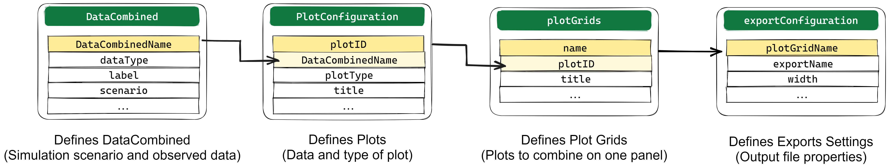

```{r, include = FALSE}
knitr::opts_chunk$set(
  collapse = TRUE,
  comment = "#>",
  message = FALSE,
  warning = FALSE,
  fig.width = 7,
  fig.asp = 0.618,
  fig.showtext = TRUE
)

defaultClassAttributes <- c("initialize", "clone", "print", ".__enclos_env__")

library(esqlabsR)
```


Plotting the simulation results is an integral part of model diagnostics and
quality control. `{esqlabsR}` implements an excel-based [Plotting
Workflow](#plotting-workflow) for figure creation directly from simulated
scenarios. It is also possible to use `{esqlabsR}`'s functions to [plot using R
code](#plotting-with-code).


## Plotting Workflow

This process relies on filling a **`Plots.xlsx`** file in order to specify all
the figures that need to be created. Then, `createPlotsFromExcel()` will
translate the information in the excel file into plots !

First, `DataCombined` are defined with simulation results coming from simulated
scenarios and observed data sets in the **DataCombined** sheet. More information
in the [Create a Datacombined](#specify-a-datacombined) section.


From each `DataCombined`, multiple plots of different types can be defined using
the **plotConfiguration** sheet. More information in the [Customizing
Plots](#customizing-plots) section.

Each plot to draw is defined in a **plotGrid** which is specified in the
**plotGrids** sheet. A **plotGrid** can contain one or several plots defined in
the plotConfiguration sheet and has many options to customize the layout of the
plots. More information in the [Drawing Plots](#drawing-plots) section.

plotGrids export options like size, quality, file type etc... are available in
the **exportConfiguration** sheet. More information in the [Export
Plot](#export-plots) section.

Once all the excel sheets are setup, just call the `createPlotsFromExcel()`
function to generate and export the plots.



### Specify a `DataCombined`

A `DataCombined` is where the data to plot is stored. It can contain simulated
results and/or observed data and links them together.

First, the user needs to define the name of the dataCombined. The name need to
be stored in the `DataCombinedName`. Then, for each `DataCombinedName`, the user
can attach simulated results (set dataType to `simulated`) and observed data
(set dataType to `observed`) and give them labels. For Simulated results, the
user needs to specify the name of the scenario and the output path of the
simulation. For observed data, the user needs to specify the name of the dataset
to use. Finally, both type of data can be linked together if they share the same
value in the `groups` column.

Other columns available in this sheet are relative to the data transformations
that can be performed by `dataCombined`. For more information on this, please
refer to the `{ospsuite}` documentation about it
[here](https://www.open-systems-pharmacology.org/OSPSuite-R/articles/data-combined.html#transformations).

### Customizing Plots

The default `Plot.xlsx` file already contains the most common columns required
to customize plots. However, the user can add all the necessary columns that are
needed to reach the desired result. The list of available variables can be
explored in a `defaultPlotConfiguration` object.

Here is a sample of the available plot settings:

```{r, echo=FALSE}
dpc <- DefaultPlotConfiguration$new()
names(dpc)[!(names(dpc) %in% defaultClassAttributes)][1:15]
```

You can access the full list by running `DefaultPlotConfiguration$new()`

For instance, if the subtitle needs to be changed, the user can add a column
named `subtitle` and fill it with the desired value for each plot.

Leaving a cell empty will result in the default value being used.

For properties that accept a list of values (e.g. `xAxisLimits`), the values
should be separated by a `,`. If an entry itself contains a `,`, enclose it
between parenthesis.


### Drawing Plots

`plotGrids` are the objects that will be used to draw the plots. They are
defined in the **plotGrids** sheet. The user needs to define a name for each
plotGrid. For single panel plot, only one plot must be listed in the plotIDs
column. `{esqlabsR}` also provide a simple way to combined several plots in a
multi-panel figure, in this case, the user needs to list all the plotIDs to
combine in the plotIDs column, separated by a `,`.

To customize the plotGrid, the user can add all the necessary columns that are
defined in the `PlotGridConfiguration` class. Here is a sample of the available:

```{r, echo=FALSE}	
pgc <- PlotGridConfiguration$new()
names(pgc)[!(names(pgc) %in% defaultClassAttributes)][1:15]
```


### Export Plots

In order to export plots to image files, the user can use the
**exportConfiguration** sheet. The plotGrids to export must be added in the
plotGridName column. Then, the output file name must be specified in the
outputName column. The output format can be customize using the properties
listed in the `ExportConfiguration` class. Here is a sample of the available:

```{r, echo=FALSE}  
ec <- ExportConfiguration$new()
names(ec)[!(names(ec) %in% defaultClassAttributes)][1:5]
```

### Plotting Workflow Example


#### Example Scenario

For the following examples, we will simulate an example scenario as described in
`vignette("esqlabsR")` and load the corresponding observed data.

```{r, echo = TRUE}
library(esqlabsR)
# Create a project configuration
projectConfiguration <- createProjectConfiguration(exampleProjectConfigurationPath())
# Create `ScenarioConfiguration` objects from excel files
scenarioConfigurations <- readScenarioConfigurationFromExcel(
  scenarioNames = "TestScenario",
  projectConfiguration = projectConfiguration
)
# Run scenario configuration
scenarios <- createScenarios(scenarioConfigurations = scenarioConfigurations)
simulatedScenarios <- runScenarios(
  scenarios = scenarios
)

# Load observed data
dataSheets <- "Laskin 1982.Group A"
observedData <- loadObservedData(projectConfiguration = projectConfiguration, sheets = dataSheets)
```


#### Setup the `Plot.xlsx` file
Then, the `Plot.xlsx` file is setup to define the `DataCombined`, customize
plots, specify plotGrids and export options. The `Plot.xlsx` file used in this
example can be found
[here](https://github.com/esqLABS/esqlabsR/raw/main/inst/extdata/examples/TestProject/Parameters/Plots.xlsx).


#### use `createPlotsFromExcel()`
In the next step, the user calls the function `createPlotsFromExcel()`, passing
the generated data:

```{r, echo = TRUE}
plots <- createPlotsFromExcel(
  simulatedScenarios = simulatedScenarios,
  observedData = observedData,
  plotGridNames = c("Aciclovir", "Aciclovir2"),
  projectConfiguration = projectConfiguration
)
```

The function returns a named list of `ggplot2` objects, with names being
the names of the plot grids:

```{r}
names(plots)
```


```{r}
plots$Aciclovir
```

```{r}
plots$Aciclovir2
```

Also, calling this function will export the plots as image files if the 
exportConfiguration sheet is setup correctly.

By default, the function will try to create all plots defined in the
**plotGrids** sheet. If any of the simulation results or the observed date
required by these plots cannot be found, an error is thrown. To override this
behavior, e.g., to only plot the observed data without having the results
simulated, change the value of the argument `stopIfNotFound` to `FALSE`. You can
also specify which plots to create with the `plotGridNames` argument.

## Plotting With Code

In some situation, the user needs to quickly draw a plot from a simulation
result object using code while wanting to use the default esqlabsR theme. In
this situation, using the `Plots.xlsx` file is not necessary. Instead, the user
can directly use `{esqlabsR}`'s and `{ospsuite}`'s plotting functions to create
the desired plot while preserving the `{esqlabsR}` theme.


### Basics of figure creation with `{ospsuite}`

Simulated modeling scenarios can be passed to plotting functions from the
`{ospsuite}` package to create uniformly-looking plots. To get familiar with the
`DataCombined` class used to store matching observed and simulated data, read
the [Working with `DataCombined`
class](https://www.open-systems-pharmacology.org/OSPSuite-R/dev/articles/data-combined.html)
article. The article [Visualizations with
`DataCombined`](https://www.open-systems-pharmacology.org/OSPSuite-R/dev/articles/data-combined-plotting.html)
covers the basics of creating supported plot types and how to customize them.


### Using esqlabsR

For the following examples, we will use the same scenario as described in the
[Example](#example) above.

```{r}
library(esqlabsR)
# Create a project configuration
projectConfiguration <- createProjectConfiguration(exampleProjectConfigurationPath())
# Create `ScenarioConfiguration` objects from excel files
scenarioConfigurations <- readScenarioConfigurationFromExcel(
  scenarioNames = "TestScenario",
  projectConfiguration = projectConfiguration
)
# Run scenario configuration
scenarios <- createScenarios(scenarioConfigurations = scenarioConfigurations)
simulatedScenarios <- runScenarios(
  scenarios = scenarios
)

# Load observed data
dataSheets <- "Laskin 1982.Group A"
observedData <- loadObservedData(projectConfiguration = projectConfiguration, sheets = dataSheets)
```


For the following steps, no `Plots.xlsx` file is needed. Instead, we will use
the `DataCombined` class to store the simulated and observed data, use the
`{ospsuite}`'s plotting functions to create the plots together with the
`{esqlabsR}` functions to customize the plots and their export.

#### Create a `DataCombined` object

The simulation results are stored in a list returned by the `runScenarios()`
function. Plotting and visualization are performed by storing these results,
matching observed data in a `DataCombined` object, and passing it to plotting
functions. Observed data in the form of `DataSet` objects are added to a
`DataCombined` object via the `addDataSets()` function, and simulated results
can be added by using the `addSimulationResults()` function. Observed and
simulated data can be linked by setting the `groups` argument in both methods.
Data sets of the same group will then be plotted together when calling plotting
functions on the `DataCombined` object.

Let's create a `DataCombined` object and populate it with data with the
following code:

```{r datacombined}
dataCombined <- DataCombined$new()
dataCombined$addDataSets(observedData, names = "Observed", groups = "Aciclovir")
dataCombined$addSimulationResults(simulatedScenarios$TestScenario$results,
  names = "Simulated",
  groups = "Aciclovir"
)
```


You can also return the `DataCombined` objects defined in the `DataCombined`
sheet with the function `createDataCombinedFromExcel()`, read (this
section)[\#specify-a-datacombined] for more information.


#### Customize and generate plots

Customization of the generated figures - specifying title, axes ranges, axes
units, the position of the legend, etc., are done through *plot configurations*
- objects of the class
[`DefaultPlotConfiguration`](https://www.open-systems-pharmacology.org/OSPSuite-R/dev/reference/DefaultPlotConfiguration.html).
To combine multiple plots into a multi-panel figure, create a
`PlotGridConfiguration` object, add plots to it, and plot with the `plotGrid()`
method. Finally, to export a plot to a file (e.g., `PNG` or `PDF`), use an
`ExportConfiguration` object.

To use configurations with a similar look and feel in the different `esqLABS`
projects, create the configurations using the following functions:

  - [`createEsqlabsPlotConfiguration()`](https://esqlabs.github.io/esqlabsR/reference/createEsqlabsPlotConfiguration.html)
  - [`createEsqlabsPlotGridConfiguration()`](https://esqlabs.github.io/esqlabsR/reference/createEsqlabsPlotGridConfiguration.html)
  - [`createEsqlabsExportConfiguration(projectConfiguration)`](https://esqlabs.github.io/esqlabsR/reference/createEsqlabsExportConfiguration.html)

For the list of supported properties of the `PlotGirdConfiguration`, refer to
the
[reference](https://www.open-systems-pharmacology.org/TLF-Library/reference/ExportConfiguration.html)

The next example shows how to create a multi-panel figure using the default
configurations.

```{r plot-time-profile, fig.asp=1}
plotConfig <- createEsqlabsPlotConfiguration()
gridConfig <- createEsqlabsPlotGridConfiguration()

plotConfig$title <- "Time profile"
indivPlot <- plotIndividualTimeProfile(dataCombined, defaultPlotConfiguration = plotConfig)

plotConfig$title <- "Observed-vs-simulated"
obsVsSimPlot <- plotObservedVsSimulated(dataCombined, defaultPlotConfiguration = plotConfig)

plotConfig$title <- "Res-vs-time"
resVsTimePlot <- plotResidualsVsTime(dataCombined, defaultPlotConfiguration = plotConfig)

plotConfig$title <- "Res-vs-simulated"
resVsSimPlot <- plotResidualsVsSimulated(dataCombined, defaultPlotConfiguration = plotConfig)

gridConfig$addPlots(list(indivPlot, obsVsSimPlot, resVsTimePlot, resVsSimPlot))
gridConfig$title <- "All aciclovir plots"
gridPlot <- plotGrid(gridConfig)
gridPlot
```

#### Export Plots

To save the plot to a `PNG` file, use the
[`ExportConfiguration`](https://www.open-systems-pharmacology.org/TLF-Library/reference/ExportConfiguration.html).
Make sure that the `fileName` argument ends with `.png`:

```{r saveToPng}
exportConfig <- createEsqlabsExportConfiguration(projectConfiguration$outputFolder)
exportConfig$savePlot(gridPlot, fileName = "All plots.png")
```


By default, the height of the output figure is calculated from the
number of rows in the multi-panel plot and the height defined in
`ExportConfiguration$heightPerRow`. If you want to define a fixed height
with the parameter `ExportConfiguration$height`, set
`ExportConfiguration$heightPerRow = NULL`.

## Observed Data {#observed-data}

Functionalities of `esqlabsR` require observed data to be present as
[`DataSet`](https://www.open-systems-pharmacology.org/OSPSuite-R/reference/DataSet.html)
objects. Please refer to the article [Observed
data](https://www.open-systems-pharmacology.org/OSPSuite-R/dev/articles/observed-data.html)
for information on loading data from Excel or `*.pkml` files.
`{esqlabsR}` offers a convenience function `loadObservedData()` that
facilitates loading data in `esqLABS` projects. Assuming the standard
project folder structure is followed, and a valid `ProjectConfiguration`
(see [Standard workflow](standard-workflow.html)) and Excel files with
observed data are present in the `projectConfiguration$dataFolder`
folder, the following code loads the data:

```{r loadObservedData}
projectConfiguration <- createProjectConfiguration(exampleProjectConfigurationPath())

dataSheets <- "Laskin 1982.Group A"

observedData <- loadObservedData(
  projectConfiguration = projectConfiguration,
  sheets = dataSheets
)

print(names(observedData))
```

The function loads the data from the file
`projectConfiguration$dataFile` from the folder
`projectConfiguration$dataFolder` and returns a list of
`DataSet`objects. The resulting object can be used to plot results to
compare simulated and observed data.


## Troubleshooting

  - At any time, you can check the groups assigned to the datasets in the
    `DataCombined` object by calling the
    `DataCombined$groupMap` or
    by examining the output of `dataCombined$toDataFrame()`.

More detailed information on function signatures can be found in the following:

  - `ospsuite` documentation on:
      - [loadDataImporterConfiguration()](https://www.open-systems-pharmacology.org/OSPSuite-R/reference/loadDataImporterConfiguration.html)
      - [DataImporterConfiguration
        class](https://www.open-systems-pharmacology.org/OSPSuite-R/reference/DataImporterConfiguration.html)
      - [createImporterConfigurationForFile()](https://www.open-systems-pharmacology.org/OSPSuite-R/reference/createImporterConfigurationForFile.html)
      - [DataSet
        class](https://www.open-systems-pharmacology.org/OSPSuite-R/reference/DataSet.html)
      - [dataSetToDataFrame()](https://www.open-systems-pharmacology.org/OSPSuite-R/reference/dataSetToDataFrame.html)
      - [loadDataSetsFromExcel()](https://www.open-systems-pharmacology.org/OSPSuite-R/reference/loadDataSetsFromExcel.html)
      - [loadDataSetFromPKML()](https://www.open-systems-pharmacology.org/OSPSuite-R/reference/loadDataSetFromPKML.html)
      - [saveDataSetToPKML()](https://www.open-systems-pharmacology.org/OSPSuite-R/reference/saveDataSetToPKML.html)
      - [`DataCombined`
        class](https://www.open-systems-pharmacology.org/OSPSuite-R/reference/DataCombined.html)
      - [`plotIndividualTimeProfile()`](https://www.open-systems-pharmacology.org/OSPSuite-R/reference/plotIndividualTimeProfile.html)
      - [`plotObservedVsSimulated()`](https://www.open-systems-pharmacology.org/OSPSuite-R/reference/plotObservedVsSimulated.html)
      - [`plotResidualsVsSimulated()`](https://www.open-systems-pharmacology.org/OSPSuite-R/reference/plotResidualsVsSimulated.html)
      - [`plotResidualsVsTime()`](https://www.open-systems-pharmacology.org/OSPSuite-R/reference/plotResidualsVsTime.html)
  - `tlf` documentation on:
      - [`PlotGridConfiguration`](https://www.open-systems-pharmacology.org/TLF-Library/reference/PlotGridConfiguration.html)
      - [`plotGrid()`](https://www.open-systems-pharmacology.org/TLF-Library/reference/plotGrid.html)
      - [`ExportConfiguration`](https://www.open-systems-pharmacology.org/TLF-Library/reference/ExportConfiguration.html)
