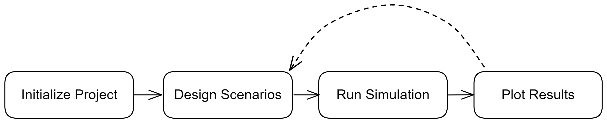

```{r, include = FALSE}
knitr::opts_chunk$set(
  collapse = TRUE,
  comment = "#>"
)
```


esqlabsR's projects are organized in a 4 steps process:

1. Initialize Project
2. Design Scenarios
3. Run Simulations
4. Plot Results


While step 1 need to be done just once, you will be able to iterate easily as
you fine tune your simulation and plots using simple code and excel files.



## 1. Project initialization
This first step is here to initialize the specific directories and file 
structure that esqlabsR needs.

The output is a `ProjectConfiguration` object that will be used 
in many steps during the rest of the process.

Learn more in `vignette("esqlabsR-project-structure")`.

## 2. Design Scenarios
In esqlabsR, simulations are defined as *scenarios*, which are setup during this
step. During this process, you will be able to setup all the parameters and 
options so you can build any simulation scenario you want.

Learn more in `vignette("esqlabsR-design-scenarios")`.

## 3. Run Simulations
This is where esqlabsR will interact with the {ospsuite} to run simulations.

At the end of this step, you will get your simulation results.

Learn more in `vignette("esqlabsR-run-simulations")`.

## 4. Plot Results
esqlabsR also integrate convenient and automated ways to generate plots and 
compose plotgrids from simulation results.

Learn more in `vignette("esqlabsR-plot-results")`.


