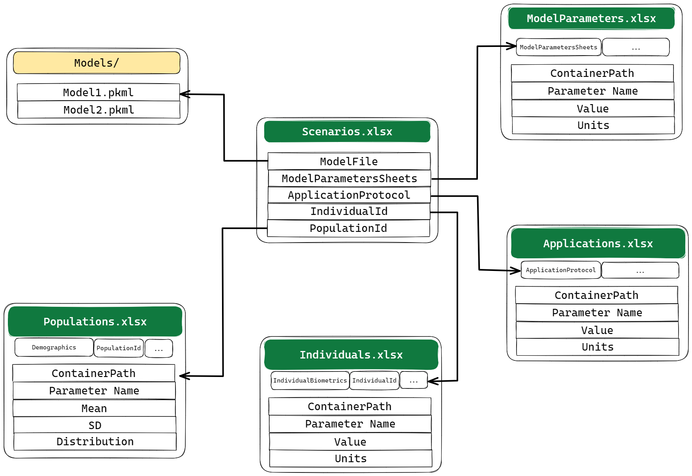

```{r, include = FALSE}
knitr::opts_chunk$set(
  collapse = TRUE,
  comment = "#>",
  warning = FALSE,
  message = FALSE
)
library(esqlabsR)
require(readxl)
showtext::showtext_opts(dpi=300)
```


## Introduction


We designed esqlabsR to make life easier for OSPS users. To achieve this, we
had designed a streamlined simulation workflow that relies on simple concepts :

- esqlabsR uses a predefined project structure to make sure its stays organized,
- esqlabsR uses excel files as a convenient way to inputs parameters,


## Initialize Project

The major way `esqlabsR` facilitate modeling and simulation with OSPS is the 
adoption of a project structure based on Excel files. 
These templates are where all the parameters for running simulations, 
compute results and generating plots are defined. They are organized in 
different folders and their structure must not be altered.


A project can me initialized with the `init_project` function.

```{r, eval=FALSE}
library(esqlabsR)

init_project(type = "example") 
# or simply init_project() to create an empty folder structure and excel templates.
```

It will create the expected simulation project's folder structure:

```sh
simulation_project/
├── ProjectConfiguration.xlsx
├── Data
├── Models
├── Parameters
└── Results
```

Each one of these folders contains a series of `.xlsx` files with specific 
purpose. But the cornerstone of this setup is the `ProjectConfiguration.xlsx`.

This file defines *where* all the necessary files are stored in the project 
folder. All the path specified in the `Value` column should be *relative* to the
`ProjectConfiguration.xlsx` location. It must be imported using 
`createDefaultProjectConfiguration`

```{r, eval=FALSE}
my_project_configuration <- createDefaultProjectConfiguration(path = "path/to/ProjectConfiguration.xlsx")

```

```
ProjectConfiguration: 
Relative path from working directory: C:/[path]/TestProject
Project Configuration File: Code/ProjectConfiguration.xlsx 
Model folder: Models/Simulations 
Parameters folder: Parameters 
Parameters file name: Parameters/ModelParameters.xlsx 
Individual parameters file name: Parameters/Individuals.xlsx 
Population parameters file name: Parameters/PopulationParameters.xlsx
Scenario definitions file name: Parameters/Scenarios.xlsx
...
```
<!-- Scenario applications definitions file name: Parameters/ApplicationParameters.xlsx  -->
<!-- Plot definitions file name: Parameters/Plots.xlsx  -->
<!-- Experimental data folder: Data  -->
<!-- Experimental data file: Data/TestProject_TimeValuesData.xlsx  -->
<!-- Data importer configuration: Data/esqlabs_dataImporter_configuration.xml  -->
<!-- Compound Properties File: Data/Compound Properties.xlsx  -->
<!-- Output folder: Results  -->

Notice that the `ProjectConfiguration` links to the other and files that 
constitute the project.

For more information about esqlabsR's project structure, read `vignette("esqlabsR-project-structure")`.

## Design Simulations

Now that our project is ready, the next step is to run simulations. In esqlabsR,
simulation are run by defining and executing multiple **scenarios**.

To modify, add or delete a scenario, we edit the `Parameters/Scenarios.xslx` 
file. Each row of this file is a scenario. Each Column is a parameter that will 
be used to define the scenarios.

Here are the main parameters that can be set for a scenario:

- `ModelFile` is the name of the `.pkml` file that can be found in the `Models/` directory.
- `ModelParameterSheets` is the name of the *sheet* in `Parameters/ModelParameters.xlsx` that contains the parameters to apply to the model,
- `ApplicationProtocol` is the name of the *sheet* in `Parameters/ApplicationParameters.xlsx` that specify the simulated drug administration protocol,
- `SimulationTime` and `SimulationTimeUnit` define the time range to simulate, it should be three numbers for start, end, resolution
- `Individuald`: the id of the individual to simulate. The id and settings for individuals are defined in `Parameters/Individuals.xlsx`,
- `PopulationId`: the id of the *population* to simulate. The id and settings for populations are defined in `Parameters/PopulationParameters.xlsx`,

Notice that the `Scenarios.xslx` file is mainly constituted of "link" to other excel templates. 



For example, if we want to change the characteristic of the individual we run the simulation on, we can either edit its properties directly in the `Individuals.xlsx` file or  add a new row with a different `IndividualId` and change to this new value in the `Scenarios.xslx` file.

For more information on all the scenario parameters that can be setup, read `vignette("esqlabsR-design-simulations")`.


## Run Simulations

Once all the scenario parameters are all setup in th excel files, we can import 
them using `createScenarios` and `readScenarioConfigurationFromExcel`:

```{r, echo=FALSE, warning=FALSE, message = FALSE}
my_project_configuration <- createDefaultProjectConfiguration(path = example_ProjectConfiguration())
```

```{r}
my_scenarios <-  createScenarios(
  readScenarioConfigurationFromExcel( 
    scenarioNames = "TestScenario", 
    projectConfiguration = my_project_configuration))
```

```{r, echo = FALSE}
my_scenarios$TestScenario$scenarioConfiguration$print(projectConfiguration = FALSE)
```

Then, we run the simulations by passing the scenarios we defined:
```{r}
my_simulation <- runScenarios(my_scenarios)
```


Simulation results can be saved for later use:
`saveScenarioResults` and `loadScenarioResults`.

```{r, eval = FALSE}
saveScenarioResults(my_simulation,
                    projectConfiguration = my_project_configuration,
                    outputFolder = my_project_configuration$outputFolder)

my_simulation <- loadScenarioResults(scenarioNames = "TestScenario",
                                     resultsFolder = my_project_configuration$outputFolder)

```


Learn more on how to run simulations in `vignette("esqlabsR-run-simulations")`.

## Plot Results

The simulation results can now be plotted. For this, the package relies on 
osps's datacombined and plotting functions.

First, a `DataCombined` object is initialized:

```{r}
my_datacombined <- DataCombined$new()
```

Then, simulation result are added to the dataCombined object:

```{r}
my_datacombined$addSimulationResults(my_simulation$TestScenario$results,
                                     names = "Simulated",
                                     groups = "Aciclovir")
```

Finally, the plot is generated:

```{r, out.width="80%", fig.align="center", fig.width=5, fig.asp=0.618, dpi=300}
plotIndividualTimeProfile(my_datacombined)
```


In some cases, we also want to plot the observed experimental data (stored in 
`Data/`). DataCombined also has the abilitity to store observed dataset for them 
to be plotted.

  
```{r, out.width="80%", fig.align="center", fig.width=5, fig.asp=0.618, dpi=300}
observed_data <- loadObservedData(projectConfiguration = my_project_configuration,
                                  sheets = "Laskin 1982.Group A")

my_datacombined$addDataSets(observed_data, names = "Observed", groups = "Aciclovir")

plotObservedVsSimulated(my_datacombined)
```

Many other plot types are available in `{esqlabsR}`, read `vignette("esqlabsR-plot-results")` 
to learn more.
