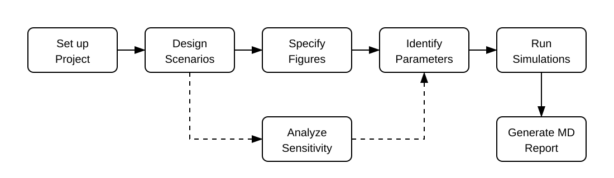

```{r, include = FALSE}
knitr::opts_chunk$set(
  collapse = TRUE,
  comment = "#>",
  warning = FALSE,
  message = FALSE,
  fig.showtext = TRUE
)
library(esqlabsR)
```

The workflows of `esqlabsR` heavily rely on a **Project**: the object holding the models, subjects, dosing, parameters, outputs, observed data, and figures for an analysis. This guide covers the project-level tasks: loading one into your R session, creating one from scratch, saving your edits, undoing them, and handing over the whole project to someone else as a single file.



Setting a project up happens once. Writing its definitions (`vignette("how-to-design-scenarios")`), running it (`vignette("how-to-run-simulations")`), and plotting it (`vignette("how-to-plot-results")`) are where you iterate.

On disk a project is a folder: a `Project.json` file, a `definitions/` folder holding one file per definition, and working folders for models, data, populations, and results. `vignette("reference-project-file")` describes the layout and every field; `vignette("about-the-project-model")` explains why it is arranged this way.

## Load an existing project

`loadProject()` reads a `Project.json` and its `definitions/` tree into a `Project` object. The package comes with a complete example project, and `exampleProjectPath()` returns the path to its project file.

```{r}
project <- loadProject(exampleProjectPath())
project
```

Printing a project shows its name, source path, working folders, and a count of each kind of definition. Each definition section is a named list, with one entry per id:

```{r}
project$definitions$scenarios
```

The sections are read-only. To change a definition, use an `add*`, `set*`, or `remove*` function (see `vignette("how-to-design-scenarios")`) or edit its JSON file directly.

If `loadProject()` spots a reference to something that does not exist, such as a scenario pointing at an individual that is not defined, it warns immediately but still returns the project, so you can inspect and repair it. For the full picture run `validateProject()`.

## Create a new project

`initProject()` creates a project at `destination`, creating that folder if it does not exist yet. Pass `type = "minimal"` for an empty project, or `type = "example"` to copy the example project so you have something runnable to start from.

The chunks below create their projects in temporary folders so nothing is written into your own folders. In your own work you would pass the folder where the project should live.

```{r}
minimal_dir <- withr::local_tempdir()
initProject(destination = minimal_dir, type = "minimal", createExcel = FALSE)
```

A minimal project is the folder structure plus a `Project.json` with no definitions in it yet:

```
MyProject/
├── Project.json          # metadata only, no definitions yet
├── definitions/          # empty until you add definitions
├── Models/
│   ├── Simulations/      # .pkml files the scenarios reference
│   └── Snapshots/        # PK-Sim / MoBi snapshots (reserved)
├── Data/                 # observed data files
├── Populations/          # population .csv files
└── Results/
    ├── Figures/
    └── SimulationResults/
```

Each working folder holds a short `README.md` saying what belongs there.

```{r}
example_dir <- withr::local_tempdir()
initProject(destination = example_dir, type = "example", createExcel = FALSE)
```

`type = "example"` fills the `definitions/` tree instead, one file per definition. `createExcel = FALSE` keeps the project JSON-only; `initProject()` can also write an Excel project alongside it, which `vignette("how-to-migrate-from-excel")` covers.

## Save your edits

Editing a project changes only the copy in your R session. `addScenario()`, `addIndividual()`, `setScenario()` and the rest change the loaded object and mark it as having unsaved changes; nothing on disk changes until you save.

`saveProject()` writes them. It brings the files on disk in line with the project in your R session, writing only what changed and deleting the files of definitions you removed, so `git diff` shows exactly what you touched. A save with nothing to write says so and leaves the files alone, meaning saving repeatedly is always safe.

Here we use the copy created above, because the example that comes with the package is installed read-only:

```{r}
editable <- loadProject(file.path(example_dir, "Project.json"))
addOutputPath(
  editable,
  id = "pvb",
  path = "Organism|PeripheralVenousBlood|Aciclovir|Plasma (Peripheral Venous Blood)"
)
saveProject(editable)
```

Two ways to see where a project stands: printing it marks unsaved work as `<Project 'name'> [unsaved changes]`, and `projectStatus()` reports both whether there are unsaved edits and whether the Excel files next to it are out of date.

## Discard unsaved edits

`reloadProject()` is the undo. It throws away every unsaved change and re-reads the project from disk, in place, which makes it safe to try a few variants of a scenario and then back out of all of them.

```{r, eval = FALSE}
reloadProject(editable)
```

## Share a project as a single file

`snapshotProject()` writes the project as it is in your R session, unsaved edits included, into one `.esqlabsR` file, so the project definitions travel as a single file rather than a folder. Give it a target `dir` and an optional `name`; the extension is added for you, and it returns the path it wrote.

The snapshot holds the project's metadata and definitions, not the files those definitions point at. Model files (`.pkml`, exported from PK-Sim or MoBi), observed-data files and importer configurations, scripts, and population CSVs still have to reach the recipient another way, or sit at a path both of you can reach (a path containing an environment variable, pointing at a shared drive, is one way; see `vignette("reference-project-file")`).

```{r}
snapshot_dir <- withr::local_tempdir()
snapshot_path <- snapshotProject(editable, dir = snapshot_dir, name = "study")
```

`restoreProject()` turns that file back into a working project. Give it a target folder; it recreates `Project.json` and the `definitions/` folder there and returns a freshly loaded `Project` that works from that folder:

```{r}
restored_dir <- withr::local_tempdir()
shared <- restoreProject(snapshot_path, restored_dir)
shared
```

By default `restoreProject()` refuses any folder that is not empty, not just one that already holds a project, so a stray README or CSV is enough to stop it. Pass `overwrite = TRUE` to roll an existing project folder back to the snapshot in place, which is also how you use a snapshot to set an experiment aside and return to it later.

## Where to go next

Describe what you want to simulate with `vignette("how-to-design-scenarios")`, then check it with `vignette("how-to-validate-a-project")` before running it with `vignette("how-to-run-simulations")`.

For the fields and layout referred to above, see `vignette("reference-project-file")` and `vignette("reference-definition-fields")`. For why projects behave this way, including why saving is explicit and why definition ids are rewritten when you create them, see `vignette("about-the-project-model")`.
