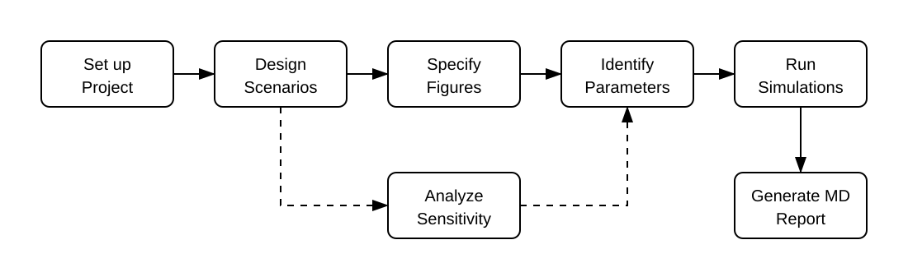

```{r, include = FALSE}
knitr::opts_chunk$set(
  collapse = TRUE,
  comment = "#>",
  warning = FALSE,
  message = FALSE,
  fig.showtext = TRUE
)
library(esqlabsR)
```

The workflows of `esqlabsR` heavily rely on a **Project**: the object holding the models, subjects, dosing, parameters, outputs, observed data, and figures for an analysis. This guide covers the project-level tasks: loading one into your R session, creating one from scratch, saving your edits, undoing them, and handing over the whole project to someone else as a single file.



A project is stored as a folder, containing a `Project.json` file, a `definitions/` folder holding one file per definition, and working folders for models, data, populations, and results. `vignette("reference-project-file")` describes the layout and every field; `vignette("about-the-project-model")` explains why it is arranged this way.

## Load an existing project

`loadProject()` reads a `Project.json` and its `definitions/` tree into a `Project` object. The package comes with a complete example project, and `exampleProjectPath()` returns the path to its project file.

```{r}
project <- loadProject(exampleProjectPath())
project
```

Printing a project shows its name and description, the name of its project file, its working folders, the count of each kind of definition, and the names of its Excel files, if any. Folders and files are printed relative to the project folder. If you need the full paths, read `project$info$projectFilePath` to get the root folder.

Each definition section is a named list keyed by id:

```{r}
project$definitions$scenarios
```

The sections are read-only. To change a definition, use the `add*`, `set*`, or `remove*` functions (see `vignette("how-to-design-scenarios")`) or edit its JSON file directly.

If `loadProject()` spots a reference to something that does not exist, such as a scenario pointing at an individual that is not defined, it warns immediately but still returns the project, so you can inspect and repair it. For the full validation of project's consistency, run `validateProject()`.

## Create a new project

`initProject()` creates a project at `destination`, creating that folder if it does not exist yet. Pass `type = "minimal"` for an empty project, or `type = "example"` to copy the example project so you have something runnable to start from.

The chunks below create their projects in temporary folders so nothing is written into your own folders. In your own work you would pass the folder where the project should live.

```{r}
minimal_dir <- withr::local_tempdir()
initProject(destination = minimal_dir, type = "minimal", createExcel = FALSE)
```

A minimal project is the folder structure plus a `Project.json` with no definitions in it yet:

```
MyProject/
├── Project.json          # metadata only, no definitions yet
├── definitions/          # empty until you add definitions
├── Models/
│   ├── Simulations/      # .pkml files the scenarios reference
│   └── Snapshots/        # PK-Sim / MoBi snapshots (reserved)
├── Data/                 # observed data files
├── Populations/          # population .csv files
└── Results/
    ├── Figures/
    └── SimulationResults/
```

Each working folder holds a short `README.md` saying what belongs there.

```{r}
example_dir <- withr::local_tempdir()
initProject(destination = example_dir, type = "example", createExcel = FALSE)
```

`type = "example"` fills the `definitions/` tree, one file per definition. `createExcel = FALSE` keeps the project JSON-only; by default `initProject()` also writes a set of Excel files alongside it, covered in the "Edit a project in Excel" section below.

## Save your edits

Editing a project through `addScenario()`, `addIndividual()`, `setScenario()`, and the rest modifies the loaded `Project`. Changes that have not been saved yet are marked as `<Project 'name'> [unsaved changes]` when printing the project, and `projectStatus()` reports both whether there are unsaved edits and whether the Excel files next to it are out of date.

To write the edits to the project files, use `saveProject()`. It brings the files on disk in line with the project in your R session.

Here we use the copy created above:

```{r}
editable <- loadProject(file.path(example_dir, "Project.json"))
addOutputPath(
  editable,
  id = "pvb",
  path = "Organism|PeripheralVenousBlood|Aciclovir|Plasma (Peripheral Venous Blood)"
)
saveProject(editable)
```

## Discard unsaved edits

`reloadProject()` is the undo. It throws away every unsaved change and re-reads the project from disk, in place, which makes it safe to try a few variants of a scenario and then back out of all of them.

```{r, eval = FALSE}
reloadProject(editable)
```

## Edit a project in Excel

The `Project.json` file and its `definitions/` tree are the main source for all workflows. For user convenience, a project can also be represented as a set of Excel files. You can work on a spreadsheet instead of editing JSON files by hand. Think of the Excel files as a picture of the project taken at the moment you exported it. Editing them changes nothing until you read them back in.

### Where the files are

The Excel files sit in the project folder, next to `Project.json`:

```
MyProject/
├── Project.json
├── Project.xlsx                        # working folders and file names
├── definitions/                        # project definitions in json format
└── Configurations/                     # definitions in excel format
    ├── Applications.xlsx
    ├── Individuals.xlsx
    ├── InitialConditions.xlsx
    ├── ModelParameters.xlsx
    ├── ParameterIdentification.xlsx
    ├── Plots.xlsx
    ├── Populations.xlsx
    └── Scenarios.xlsx
```

The top-level file is named after the project file, so a project loaded from `MyStudy.json` exports `MyStudy.xlsx`. Each file under `Configurations/` covers one kind of definition. `initProject()` writes all of them unless you pass `createExcel = FALSE`, as the chunks above did.

### Write the Excel files

`exportProjectToExcel()` writes the files from a loaded project. Without `outputDir` it writes into the project's own folder, which is what you normally want; in the example here we send them to a temporary folder so nothing is written into your own folders.

```{r}
excel_dir <- withr::local_tempdir()
exportProjectToExcel(editable, outputDir = excel_dir)
list.files(excel_dir, recursive = TRUE, pattern = "[.]xlsx$")
```

Exporting refuses to write over Excel files that are already there. Pass `overwrite = TRUE`if you want to overwrite them.

### Read the Excel files back

`importProjectFromExcel()` recreates the project (including its definitions) from excel files. Keep in mind that it does not load the project into the R session, but writes/overwrites the `*.json` files.

```{r, eval = FALSE}
importProjectFromExcel(
  projectConfigPath = "MyProject/Project.xlsx",
  outputDir = "MyProject",
  overwrite = TRUE
)
# Now load the project as usual
project <- loadProject("MyProject/Project.json")
validateProject(project)
```

The typical use case is to load the project to Excel, edit it there, and then export the changes back to the project `*.json` format. The sequence is therefore: `project <- loadProject()` -> `exportProjectToExcel(project)` -> <Edit in Excel> -> `importProjectFromExcel()` -> `project <- loadProject()`.

Read the import step carefully, because it is the one that can lose work. It rewrites the whole `definitions/` tree from what the Excel files hold, which deletes any definition you created on the JSON side and never exported. That is why it refuses to run over an existing project until you pass `overwrite = TRUE`. The safe habit is to work in one form at a time: either edit the spreadsheets and import, or edit the project in R and export, but not both at once.

To check where you stand, `projectStatus(project)` reports whether the Excel files still match the loaded project:

```{r, eval = FALSE}
projectStatus(editable)$excel_in_sync
```

### Notes

**Definition ID canonization**. Every id in a project is lowercase and filename-safe, because each id is also the name of a definition file (`vignette("about-the-project-model")` explains why). Import applies that rule without a message, and rewrites the references along with it, so a scenario you called `MyScenario` in the spreadsheet comes back as `myscenario`, and the next export writes `myscenario` into the spreadsheet. In R you can keep typing `MyScenario`: `runScenarios(project, scenarios = "MyScenario")` runs `myscenario` and tells you so. And a scenario's `solverSettings` has no column in the spreadsheets, so exporting warns and leaves it out.

**Observed Data definition in Excel**. The Excel files can name only one observed-data workbook, the `dataFile` row in `Project.xlsx`. If the project has more than one observed-data source, or a PKML, script, or programmatic source, the export writes one Excel source and warns about the others. A project imported from these files has only that one source, reading every sheet of its workbook, and re-importing over the existing project removes the other sources from it.

**Importing pre-6.0.0 projects from Excel**. If you are bringing a pre-6.0.0 project over rather than using Excel as an editing surface, `vignette("how-to-migrate-from-excel")` is the guide for that, and it lists the rest of what to check after an import.

## Share a project as a single file

`snapshotProject()` writes the project as it is in your R session, unsaved edits included, into one `.esqlabsR` file located in the current working directory (`getwd()`), so the project definitions travel as a single file rather than a folder. Give it a target `dir` and an optional `name`.

The snapshot holds the project's metadata and definitions, not the files those definitions point at. Model files (`.pkml`, exported from PK-Sim or MoBi), observed-data files and importer configurations, scripts, and population CSVs still have to reach the recipient another way, or sit at a path both of you can reach (a path containing an environment variable, pointing at a shared drive, is one way; see `vignette("reference-project-file")`).

```{r}
snapshot_dir <- withr::local_tempdir()
snapshot_path <- snapshotProject(editable, dir = snapshot_dir, name = "study")
```

`restoreProject()` turns that file back into a working project. Give it a target folder; it recreates `Project.json` and the `definitions/` folder there and returns a freshly loaded `Project` that works from that folder:

```{r}
restored_dir <- withr::local_tempdir()
shared <- restoreProject(snapshot_path, restored_dir)
shared
```

By default `restoreProject()` refuses any folder that is not empty, not just one that already holds a project, so a stray README or CSV is enough to stop it. Pass `overwrite = TRUE` to roll an revert an project folder back to the snapshot in place.

## Where to go next

Describe what you want to simulate with `vignette("how-to-design-scenarios")`, then check it with `vignette("how-to-validate-a-project")` before running it with `vignette("how-to-run-simulations")`.

For the fields and layout referred to above, see `vignette("reference-project-file")` and `vignette("reference-definition-fields")`. For why projects behave this way, including why saving is explicit and why definition ids are rewritten when you create them, see `vignette("about-the-project-model")`.
