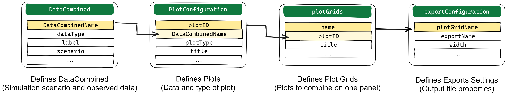

```{r, include = FALSE}
knitr::opts_chunk$set(
  collapse = TRUE,
  comment = "#>",
  message = FALSE,
  warning = FALSE,
  fig.width = 7,
  fig.asp = 0.618,
  fig.showtext = TRUE
)

defaultClassAttributes <- c("initialize", "clone", "print", ".__enclos_env__")

library(esqlabsR)
```

Plotting the simulation results is an integral part of model diagnostics and
quality control. `{esqlabsR}` implements a JSON-driven [Plotting
Workflow](#plotting-workflow) that reads plot definitions from `Project.json`
and renders figures directly from simulated scenarios. It is also possible
to [plot using R code](#plotting-with-code) when you need ad-hoc control.

## Plotting Workflow

Plots are defined in the `plots` section of `Project.json`. The `plots` block
contains four sub-sections:

```json
"plots": {
  "dataCombined":        [ /* ... */ ],
  "plotConfiguration":   [ /* ... */ ],
  "plotGrids":           [ /* ... */ ],
  "exportConfiguration": [ /* ... */ ]
}
```

- **`dataCombined`** declares which simulation outputs and observed datasets
  should be paired for each named data combination. More information in the
  [Specify a DataCombined](#specify-a-datacombined) section.
- **`plotConfiguration`** specifies how each `dataCombined` entry should be
  rendered (plot type, axes, titles, colours). More information in the
  [Customizing Plots](#customizing-plots) section.
- **`plotGrids`** arranges individual plots into figure grids, with options
  to customize the layout. More information in the [Drawing Plots](#drawing-plots)
  section.
- **`exportConfiguration`** controls file output (format, size, directory).
  More information in the [Export Plots](#export-plots) section.

Once these JSON sections are populated, call `createPlots()` to generate and
optionally export the plots.



### Specify a `DataCombined`

A `DataCombined` pairs simulation results with observed data under a shared
group label. The `dataCombined` section is a flat array of objects, each
describing one data series:

```json
"dataCombined": [
  {
    "DataCombinedName": "Aciclovir_individual",
    "dataType": "simulated",
    "label": "Aciclovir simulated (male)",
    "scenario": "Aciclovir_iv",
    "path": "Organism|PeripheralVenousBlood|Aciclovir|Plasma (Peripheral Venous Blood)",
    "group": "Aciclovir PVB"
  },
  {
    "DataCombinedName": "Aciclovir_individual",
    "dataType": "observed",
    "label": "Laskin 1982.Group A",
    "dataSet": "Laskin 1982.Group A_Aciclovir_1_Human_MALE_PeripheralVenousBlood_Plasma_2.5 mg/kg_iv_",
    "group": "Aciclovir PVB"
  }
]
```

Each element of the `dataCombined` array is one data series. Series with
the same `DataCombinedName` are collected into one `DataCombined` object.
For `"simulated"` series, specify the `scenario` and `path`. For
`"observed"` series, set `dataType` to `"observed"` and point `dataSet` at
the importer-generated dataset name (see `loadObservedData(project)` to
discover the names available in your project). Simulated and observed
series sharing the same `group` value are linked together in the plot.

Additional transformation fields (`xOffsets`, `yOffsets`, `xScaleFactors`,
`yScaleFactors`, …) map 1:1 to the corresponding Excel columns; see the
[`{ospsuite}` DataCombined
article](https://www.open-systems-pharmacology.org/OSPSuite-R/articles/data-combined.html#transformations)
for their meaning.

### Customizing Plots

The `plotConfiguration` section is a flat array of objects, each controlling
how one data combination is rendered. Fields map to properties of
`DefaultPlotConfiguration`:

```json
"plotConfiguration": [
  {
    "plotID": "P1",
    "DataCombinedName": "Aciclovir_individual",
    "plotType": "individual",
    "title": "Aciclovir IV 250 mg",
    "subtitle": "Individual time profiles",
    "xUnit": "h",
    "xValuesLimits": "0, 24"
  }
]
```

Here is a sample of the available plot settings (full list in
`DefaultPlotConfiguration$new()`):

```{r, echo=FALSE}
dpc <- DefaultPlotConfiguration$new()
names(dpc)[!(names(dpc) %in% defaultClassAttributes)][1:15]
```

Omitted (or `null`) fields fall back to the `DefaultPlotConfiguration`
value. Properties that accept multiple values (e.g. `xValuesLimits`,
`yValuesLimits`) take a comma-separated string, not a JSON array:
`"xValuesLimits": "0, 24"`.

### Drawing Plots

The `plotGrids` section is a flat array of objects, each arranging one or
more `plotConfiguration` entries into a figure grid:

```json
"plotGrids": [
  {
    "name": "Individual_diagnostics",
    "plotIDs": "P1, P2, P3",
    "title": "Aciclovir — Individual Diagnostics"
  }
]
```

Each entry has a `name` (the grid ID used as the key elsewhere) and a
`plotIDs` field. `plotIDs` is a **comma-separated string** of
`plotConfiguration` IDs — even for a single-panel grid: `"plotIDs": "P1"`.
For multi-panel figures, list multiple comma-separated IDs:
`"plotIDs": "P1, P2, P3"`. Additional fields map to `PlotGridConfiguration`
properties — a sample:

```{r, echo=FALSE}
pgc <- PlotGridConfiguration$new()
names(pgc)[!(names(pgc) %in% defaultClassAttributes)][1:15]
```

### Export Plots

The optional `plots.exportConfiguration` section controls file output. When
present, `createPlots()` writes each plot grid to disk under the project's
`outputFolder`. The `plotGridName` field links each entry to a name from
`plotGrids`, and that linkage is how `createPlots()` knows which grid to
export:

```json
"exportConfiguration": [
  {
    "plotGridName": "Individual_diagnostics",
    "outputName": "Aciclovir_diagnostics",
    "format": "png",
    "width": 20,
    "height": 15,
    "units": "cm",
    "dpi": 300
  }
]
```

Additional fields map to `ExportConfiguration` properties — a sample:

```{r, echo=FALSE}
ec <- ExportConfiguration$new()
names(ec)[!(names(ec) %in% defaultClassAttributes)][1:5]
```

### Plotting Workflow Example

#### Example Scenario

For the following examples, we will simulate an example scenario as described in
`vignette("esqlabsR")` and load the corresponding observed data.

```{r, echo = TRUE}
library(esqlabsR)
# Load the project configuration from JSON
projectConfigPath <- system.file(
  "extdata", "projects", "Example", "Project.json",
  package = "esqlabsR"
)
project <- loadProject(projectConfigPath)

# Run all scenarios
simulatedScenarios <- runScenarios(project)

# Load the observed data DataSet objects
observedData <- loadObservedData(project)
```

#### Define plots in `Project.json`

The `plots` section of `Project.json` defines the `DataCombined` entries,
`plotConfiguration` entries, `plotGrids`, and (optionally) `exportConfiguration`.
The example project used above has the canonical entries — inspect
`Project.json` in the Example project directory for reference syntax.

If you prefer to edit in Excel, `importProjectFromExcel()` and
`exportProjectToExcel()` round-trip the `plots` section through a
`Plots.xlsx` file. See `vignette("project-structure")` for the Excel bridge.

#### Use `createPlots()`

In the next step, the user calls the function `createPlots()`, passing
the project configuration and simulated results:

```{r, echo = TRUE}
plots <- createPlots(
  project = project,
  plotGridNames = c("Individual_diagnostics", "Observed_vs_simulated"),
  simulatedScenarios = simulatedScenarios
)
```

The function returns a named list of `ggplot2` objects, with names being
the names of the plot grids:

```{r}
names(plots)
```

```{r}
plots$Individual_diagnostics
```

```{r}
plots$Observed_vs_simulated
```

Also, calling this function will export the plots as image files if the
`exportConfiguration` entry in `Project.json` is populated.

By default, the function will try to create all plots defined in the
`plotGrids` section of `Project.json`. If any of the simulation results or the observed data
required by these plots cannot be found, an error is thrown. To override this
behavior, e.g., to only plot the observed data without having the results
simulated, change the value of the argument `stopIfNotFound` to `FALSE`. You can
also specify which plots to create with the `plotGridNames` argument.

#### Extract `DataCombined` required for plotting and calculate residuals

The `createPlots()` function automatically creates all `DataCombined`
required for the specified plots. In some cases it is useful to get the `DataCombined`
objects before plotting. E.g., you could calculate the residuals between all
groups defined in the `DataCombined` (see [`{ospsuite}` documentation](https://www.open-systems-pharmacology.org/OSPSuite-R/articles/data-combined.html#transformations) for more details), or modify the `DataCombined` before using them
for plotting. To do so, you can use the `createDataCombined()` function:

```{r}
# Create DataCombined used in the plots "Individual_diagnostics" and "Observed_vs_simulated"
dataCombined <- createDataCombined(
  project = project,
  plotGridNames = c("Individual_diagnostics", "Observed_vs_simulated"),
  simulatedScenarios = simulatedScenarios
)

print(dataCombined)

# Calculate residuals. Residuals are returned for each observed data point
residuals <- calculateResiduals(
  dataCombined = dataCombined[[1]],
  scaling = "lin"
)

# Calculate the sum of residuals to convieniently quanity the quality of predictions
sumResiduals <- sum(residuals$residualValues)

print(paste0("The sum of linear residuals for is ", sumResiduals))
```

You can modify the created `DataCombined`, e.g., by changing the offsets, and pass
them to the `createPlots()` function:

```{r}
# Change the offset of the first group
dataCombined[[1]]$setDataTransformations(xOffsets = 0)
# Create the plots using the modified DataCombined
plots <- createPlots(
  project = project,
  plotGridNames = c("Individual_diagnostics", "Observed_vs_simulated"),
  simulatedScenarios = simulatedScenarios,
  dataCombinedList = dataCombined
)
```

## Plotting With Code

In some situation, the user needs to quickly draw a plot from a simulation
result object using code while wanting to use the default esqlabsR theme. In
this situation, using the `Plots.xlsx` file is not necessary. Instead, the user
can directly use `{esqlabsR}`'s and `{ospsuite}`'s plotting functions to create
the desired plot while preserving the `{esqlabsR}` theme.

### Basics of figure creation with `{ospsuite}`

Simulated modeling scenarios can be passed to plotting functions from the
`{ospsuite}` package to create uniformly-looking plots. To get familiar with the
`DataCombined` class used to store matching observed and simulated data, read
the [Working with `DataCombined`
class](https://www.open-systems-pharmacology.org/OSPSuite-R/dev/articles/data-combined.html)
article. The article [Visualizations with
`DataCombined`](https://www.open-systems-pharmacology.org/OSPSuite-R/dev/articles/data-combined-plotting.html)
covers the basics of creating supported plot types and how to customize them.

### Using esqlabsR

For the following examples, we will use the same scenario as described in the
[Example](#example-scenario) above.

```{r}
library(esqlabsR)
# Load the project configuration from JSON
projectConfigPath <- system.file(
  "extdata", "projects", "Example", "Project.json",
  package = "esqlabsR"
)
project <- loadProject(projectConfigPath)

# Run the scenario
simulatedScenarios <- runScenarios(
  project,
  scenarioNames = "Aciclovir_iv"
)

# Load the observed data DataSet objects
observedData <- loadObservedData(project)
```

For the following steps, no `Plots.xlsx` file is needed. Instead, we will use
the `DataCombined` class to store the simulated and observed data, use the
`{ospsuite}`'s plotting functions to create the plots together with the
`{esqlabsR}` functions to customize the plots and their export.

#### Create a `DataCombined` object

The simulation results are stored in a list returned by the `runScenarios()`
function. Plotting and visualization are performed by storing these results,
matching observed data in a `DataCombined` object, and passing it to plotting
functions. Observed data in the form of `DataSet` objects are added to a
`DataCombined` object via the `addDataSets()` function, and simulated results
can be added by using the `addSimulationResults()` function. Observed and
simulated data can be linked by setting the `groups` argument in both methods.
Data sets of the same group will then be plotted together when calling plotting
functions on the `DataCombined` object.

Let's create a `DataCombined` object and populate it with data with the
following code:

```{r datacombined}
dataCombined <- DataCombined$new()
dataCombined$addDataSets(observedData, names = "Observed", groups = "Aciclovir")
dataCombined$addSimulationResults(simulatedScenarios$Aciclovir_iv$results,
  names = "Simulated",
  groups = "Aciclovir"
)
```

You can also return the `DataCombined` objects defined in the `dataCombined`
entry of `Project.json` with the function `createDataCombined()` — see
[Specify a DataCombined](#specify-a-datacombined) for more information.

#### Customize and generate plots

Customization of the generated figures - specifying title, axes ranges, axes
units, the position of the legend, etc., are done through _plot configurations_

- objects of the class
  [`DefaultPlotConfiguration`](https://www.open-systems-pharmacology.org/OSPSuite-R/dev/reference/DefaultPlotConfiguration.html).
  To combine multiple plots into a multi-panel figure, create a
  `PlotGridConfiguration` object, add plots to it, and plot with the `plotGrid()`
  method. Finally, to export a plot to a file (e.g., `PNG` or `PDF`), use an
  `ExportConfiguration` object.

To use configurations with a similar look and feel in the different `esqLABS`
projects, create the configurations using the following functions:

- [`createEsqlabsPlotConfiguration()`](https://esqlabs.github.io/esqlabsR/reference/createEsqlabsPlotConfiguration.html)
- [`createEsqlabsPlotGridConfiguration()`](https://esqlabs.github.io/esqlabsR/reference/createEsqlabsPlotGridConfiguration.html)
- [`createEsqlabsExportConfiguration(project)`](https://esqlabs.github.io/esqlabsR/reference/createEsqlabsExportConfiguration.html)

For the list of supported properties of the `PlotGirdConfiguration`, refer to
the
[reference](https://www.open-systems-pharmacology.org/TLF-Library/reference/ExportConfiguration.html)

The next example shows how to create a multi-panel figure using the default
configurations.

```{r plot-time-profile, fig.asp=1}
plotConfig <- createEsqlabsPlotConfiguration()
gridConfig <- createEsqlabsPlotGridConfiguration()

plotConfig$title <- "Time profile"
indivPlot <- plotIndividualTimeProfile(dataCombined, defaultPlotConfiguration = plotConfig)

plotConfig$title <- "Observed-vs-simulated"
obsVsSimPlot <- plotObservedVsSimulated(dataCombined, defaultPlotConfiguration = plotConfig)

plotConfig$title <- "Res-vs-time"
resVsTimePlot <- plotResidualsVsTime(dataCombined, defaultPlotConfiguration = plotConfig)

plotConfig$title <- "Res-vs-simulated"
resVsSimPlot <- plotResidualsVsSimulated(dataCombined, defaultPlotConfiguration = plotConfig)

gridConfig$addPlots(list(indivPlot, obsVsSimPlot, resVsTimePlot, resVsSimPlot))
gridConfig$title <- "All aciclovir plots"
gridPlot <- plotGrid(gridConfig)
gridPlot
```

#### Export Plots

To save the plot to a `PNG` file, use the
[`ExportConfiguration`](https://www.open-systems-pharmacology.org/TLF-Library/reference/ExportConfiguration.html).
Make sure that the `fileName` argument ends with `.png`:

```{r saveToPng}
exportConfig <- createEsqlabsExportConfiguration(project$outputFolder)
exportConfig$savePlot(gridPlot, fileName = "All plots.png")
```

By default, the height of the output figure is calculated from the
number of rows in the multi-panel plot and the height defined in
`ExportConfiguration$heightPerRow`. If you want to define a fixed height
with the parameter `ExportConfiguration$height`, set
`ExportConfiguration$heightPerRow = NULL`.

## Observed Data

Functionalities of `esqlabsR` require observed data to be present as
[`DataSet`](https://www.open-systems-pharmacology.org/OSPSuite-R/reference/DataSet.html)
objects. Please refer to the article [Observed
data](https://www.open-systems-pharmacology.org/OSPSuite-R/dev/articles/observed-data.html)
for information on loading data from Excel or `*.pkml` files.

In `{esqlabsR}` v6.0.0+, observed data is declared in the `observedData`
section of the `Project.json` file and loaded automatically
when the project is loaded with `loadProject()`. The data supports both
`"excel"` and `"pkml"` types with per-entry file, sheet, and importer
configuration settings.

```{r loadObservedData}
projectConfigPath <- system.file(
  "extdata", "projects", "Example", "Project.json",
  package = "esqlabsR"
)
project <- loadProject(projectConfigPath)

# Load the observed data DataSet objects
observedData <- loadObservedData(project)

print(names(observedData))
```

The resulting object is a list of `DataSet` objects that can be used to
plot results and compare simulated and observed data.

## Troubleshooting

- At any time, you can check the groups assigned to the datasets in the
  `DataCombined` object by calling the
  `DataCombined$groupMap` or
  by examining the output of `dataCombined$toDataFrame()`.

More detailed information on function signatures can be found in the following:

- `ospsuite` documentation on:
  - [loadDataImporterConfiguration()](https://www.open-systems-pharmacology.org/OSPSuite-R/reference/loadDataImporterConfiguration.html)
  - [DataImporterConfiguration
    class](https://www.open-systems-pharmacology.org/OSPSuite-R/reference/DataImporterConfiguration.html)
  - [createImporterConfigurationForFile()](https://www.open-systems-pharmacology.org/OSPSuite-R/reference/createImporterConfigurationForFile.html)
  - [DataSet
    class](https://www.open-systems-pharmacology.org/OSPSuite-R/reference/DataSet.html)
  - [dataSetToDataFrame()](https://www.open-systems-pharmacology.org/OSPSuite-R/reference/dataSetToDataFrame.html)
  - [loadDataSetsFromExcel()](https://www.open-systems-pharmacology.org/OSPSuite-R/reference/loadDataSetsFromExcel.html)
  - [loadDataSetFromPKML()](https://www.open-systems-pharmacology.org/OSPSuite-R/reference/loadDataSetFromPKML.html)
  - [saveDataSetToPKML()](https://www.open-systems-pharmacology.org/OSPSuite-R/reference/saveDataSetToPKML.html)
  - [`DataCombined`
    class](https://www.open-systems-pharmacology.org/OSPSuite-R/reference/DataCombined.html)
  - [`plotIndividualTimeProfile()`](https://www.open-systems-pharmacology.org/OSPSuite-R/reference/plotIndividualTimeProfile.html)
  - [`plotObservedVsSimulated()`](https://www.open-systems-pharmacology.org/OSPSuite-R/reference/plotObservedVsSimulated.html)
  - [`plotResidualsVsSimulated()`](https://www.open-systems-pharmacology.org/OSPSuite-R/reference/plotResidualsVsSimulated.html)
  - [`plotResidualsVsTime()`](https://www.open-systems-pharmacology.org/OSPSuite-R/reference/plotResidualsVsTime.html)
- `tlf` documentation on:
  - [`PlotGridConfiguration`](https://www.open-systems-pharmacology.org/TLF-Library/reference/PlotGridConfiguration.html)
  - [`plotGrid()`](https://www.open-systems-pharmacology.org/TLF-Library/reference/plotGrid.html)
  - [`ExportConfiguration`](https://www.open-systems-pharmacology.org/TLF-Library/reference/ExportConfiguration.html)
