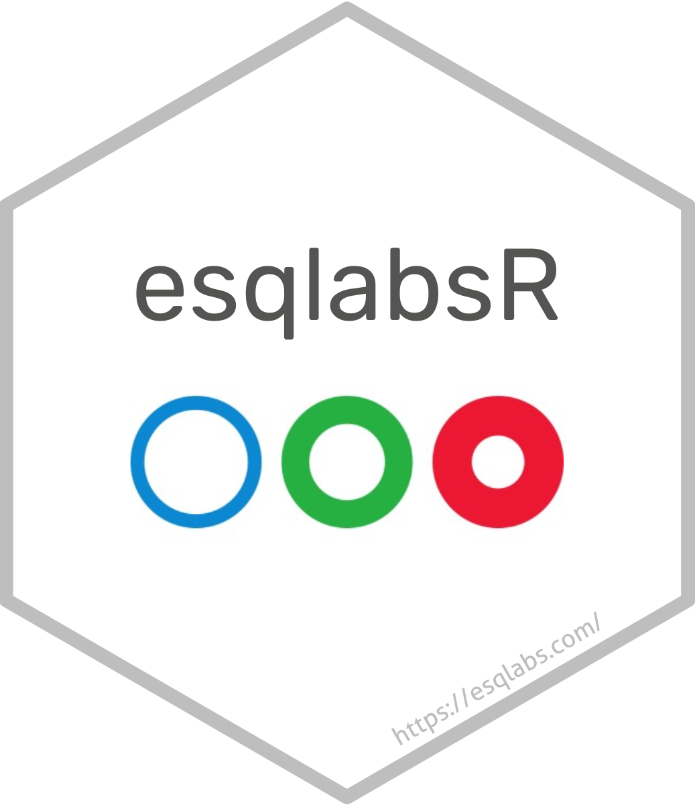
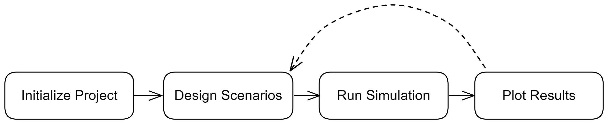

# esqlabsR ?  {background-color="#0D8DDA" .white-text}

```{r, include=FALSE, message = FALSE, warning = FALSE}
require(emoji)
require(reactable)
library(esqlabsR)
library(dplyr)
library(showtext)


showtext::showtext_opts(dpi = 300)

# Load the worked example shipped with the package (read-only).
project <- loadProject(exampleProjectPath())
```

```{css, echo = FALSE}
.center {
text-align: center;
}

.white-text {
color: white;
}

.sourceCode.language-mermaid {
display: none;
}
```

## `{esqlabsR}` What ?
<br>

:::: {.columns}
::: {.column width="60%"}

<br>

-   R package
-   for PBK and QSP/T Modeling
-   Based on [Open Systems Pharmacology
Software](https://www.open-systems-pharmacology.org/)
:::

::: {.column .center width="40%"}
{width="80%"}
:::
::::

::: footer
`{esqlabsR}` ?
:::

## `{esqlabsR}` Why ?
<br>

-   Simple functions to design, run, and save simulations,
-   Store a whole modeling project as plain text files,
-   Generate standardized plots automatically.

<br>

::: {.center}
**`r emoji::emoji(keyword = "arrow_right")` Streamlined simulation workflow `r emoji::emoji(keyword = "rocket")`
**
:::

::: footer
`{esqlabsR}` ?
:::

## `{esqlabsR}` Where ?
<br>
<br>

-  Code repository: [github.com/esqLABS/esqlabsR](https://github.com/esqLABS/esqlabsR)

-  Documentation: [esqlabs.github.io/esqlabsR/](https://esqlabs.github.io/esqlabsR)

-  [Get started tutorial](https://esqlabs.github.io/esqlabsR/articles/esqlabsR.html)


::: footer
`{esqlabsR}` ?
:::


## `{esqlabsR}` How ?
<br>

::: {.center}
```{r, eval=FALSE}
install.packages("pak")

options(repos = c(
  OSP = "https://open-systems-pharmacology.r-universe.dev",
  getOption("repos")
))

pak::pak("esqLABS/esqlabsR@*release")
```
<br>

**`r emoji::emoji("package")` Installation**
:::

## `{esqlabsR}` How ?
<br>

::: {.center}

<br>

**esqlabsR workflow**
:::

::: footer
`{esqlabsR}` ?
:::


# Get started {background-color="#26B042" .white-text}


# I. The project

## What is a project ?
<br>

A **Project** holds everything a simulation needs: models, scenarios,
individuals, populations, parameters, output paths, observed data, and plots.

. . .

<br>

On disk, a project is a directory. In R, it is one object you load once and
pass to every workflow function.

```{r, eval=FALSE}
library(esqlabsR)
project <- loadProject("path/to/Project.json")
```

::: footer
I The project
:::

## Start a new project
<br>

`initProject()` scaffolds the directory structure for you.

```{r, eval=FALSE}
# An empty project to fill in
initProject("my_project", type = "minimal")

# A ready-to-run worked example
initProject("my_example", type = "example")
```

<br>

The bundled worked example is one call away:

```{r, eval=FALSE}
project <- loadProject(exampleProjectPath())
```

::: footer
I The project
:::

## A project is a directory {auto-animate=true}

A `Project.json` container plus a `definitions/` tree, one JSON file per definition.

```{.sh}
my_project
├── Project.json
├── definitions
│   ├── scenarios
│   │   └── aciclovir_iv.json
│   ├── individuals
│   │   └── adult_male.json
│   ├── populations
│   │   └── european_adults.json
│   ├── parameter-sets
│   │   ├── global.json
│   │   └── aciclovir.json
│   ├── applications
│   │   └── aciclovir_iv_250mg.json
│   ├── output-paths
│   │   └── aciclovir_pvb.json
│   └── plots
│       └── plots.json
├── Models
│   └── Simulations
│       └── Aciclovir.pkml
├── Data
└── Results
```

::: footer
I The project
:::

## A project is a directory {auto-animate=true}

`Project.json` is the container; the `definitions/` tree is the source of truth.

```{.sh code-line-numbers="2,3"}
my_project
├── Project.json
├── definitions
│   ├── scenarios
│   │   └── aciclovir_iv.json
│   ├── individuals
│   │   └── adult_male.json
│   ├── populations
│   │   └── european_adults.json
│   ├── parameter-sets
│   │   ├── global.json
│   │   └── aciclovir.json
│   ├── applications
│   │   └── aciclovir_iv_250mg.json
│   ├── output-paths
│   │   └── aciclovir_pvb.json
│   └── plots
│       └── plots.json
├── Models
│   └── Simulations
│       └── Aciclovir.pkml
├── Data
└── Results
```

::: footer
I The project
:::

## One object, every section

`loadProject()` reads the whole tree into a single `Project` object.

```{r}
project
```

::: footer
I The project
:::

## Share a project as one file {auto-animate=true}

<br>

A **snapshot** packs a project into a single portable `.esqlabsR` file.

<br>

```{r, eval = FALSE}
# Freeze the project into one shareable file
snapshotProject(project, name = "aciclovir_study") # writes aciclovir_study.esqlabsR

# Re-materialize it as a full project directory
restoreProject("aciclovir_study.esqlabsR", dir = "restored_project")
```

<br>

- Plain text, JSON-based (Git-friendly)
- One file to send a colleague
- Reproducible project setup

::: footer
I The project
:::

# II. Authoring scenarios

## Scenarios
<br>

Simulations are defined by **Scenarios**.

. . .

A scenario pins down a model, an individual or population, an application,
the parameter sets to apply, a time grid, and the output paths to record.

. . .

```{r}
names(project$definitions$scenarios)
```

::: footer
II Authoring scenarios
:::

## What a scenario links {auto-animate=true}

```{mermaid}
%%| echo: false
flowchart TD
    Scenario["`**Scenario**
    aciclovir_iv`"]

    Model["`**Model**
    Aciclovir.pkml`"]

    ParamSets["`**Parameter Sets**
    global
    aciclovir`"]

    Application["`**Application**
    aciclovir_iv_250mg`"]

    Individual["`**Individual**
    adult_male`"]

    OutputPaths["`**Output Paths**
    aciclovir_pvb`"]

    Scenario -->|modelFile| Model
    Scenario -->|parameterSets| ParamSets
    Scenario -->|application| Application
    Scenario -->|individual| Individual
    Scenario -->|outputPaths| OutputPaths

    style Scenario fill:#e1f5e1,stroke:#4caf50,stroke-width:3px
    style Model fill:#fff9c4,stroke:#fbc02d,stroke-width:2px
    style ParamSets fill:#e1f5e1,stroke:#4caf50,stroke-width:2px
    style Application fill:#e1f5e1,stroke:#4caf50,stroke-width:2px
    style Individual fill:#e1f5e1,stroke:#4caf50,stroke-width:2px
    style OutputPaths fill:#e1f5e1,stroke:#4caf50,stroke-width:2px
```

::: footer
II Authoring scenarios
:::

## Authoring in R
<br>

The `add*` / `set*` / `remove*` family edits a project by id.

```{r, eval = FALSE}
# Output path: a short id bound to an OSPS-notation path
addOutputPath(
  project,
  id = "aciclovir_pvb",
  path = "Organism|PeripheralVenousBlood|Aciclovir|Plasma (Peripheral Venous Blood)"
)

# Scenario referencing definitions by their ids
addScenario(
  project,
  id = "aciclovir_iv",
  modelFile = "Aciclovir.pkml",
  individual = "adult_male",
  application = "aciclovir_iv_250mg",
  parameterSets = c("global", "aciclovir"),
  outputPaths = "aciclovir_pvb"
)
```

::: footer
II Authoring scenarios
:::

## Edit in memory, then save
<br>

Every edit changes the project in memory; `saveProject()` writes the changes to
the definition files.

```{r, eval = FALSE}
# Build a parameter set entry by entry
addParameterSet(project, id = "aciclovir")
addParameterEntry(
  project,
  id = "aciclovir",
  containerPath = "Aciclovir",
  parameterName = "Lipophilicity",
  value = -0.09,
  units = "Log Units"
)

# Add an individual
addIndividual(project, id = "adult_male", species = "Human", gender = "MALE")

# Commit the edits to disk
saveProject(project)
```

. . .

::: {.center}
Ids are canonicalized: lowercased and made filename-safe.
:::

::: footer
II Authoring scenarios
:::

# III. Run simulations

## Run scenarios
<br>

`runScenarios()` takes the project and the scenario ids to run.

```{r}
results <- runScenarios(project, scenarios = "aciclovir_iv")
```

<br>

It returns a **Scenario Result** list, keyed by scenario name.

```{r}
names(results)
names(results$aciclovir_iv)
```

::: footer
III Run simulations
:::

## Inside a Scenario Result
<br>

```{r, echo = FALSE}
reactable::reactable(
  data = head(results$aciclovir_iv$outputValues$data),
  outlined = TRUE,
  pagination = FALSE,
  highlight = TRUE,
  style = list(fontSize = 18)
)
```

<br>

Each result bundles the simulation, the raw results, the extracted output
values, and the population (when there is one).

::: footer
III Run simulations
:::


# IV. Plot results

## DataCombined and plots
<br>

Plots are declared in the project. `createPlots()` reads them and the
simulated scenarios, and returns **Plot Grids**.

```{r, fig.align="center", out.width="70%", fig.width=6, fig.asp=0.7, dpi=300}
grids <- createPlots(project, scenarioResults = results)

grids[["individual_diagnostics"]]
```

::: footer
IV Plot results
:::

## Combine data yourself
<br>

Need finer control ? Build the `DataCombined` directly with
`createDataCombined()`, then plot with the `{ospsuite}` workflow.

```{r, eval = FALSE}
dc <- createDataCombined(
  project,
  dataCombinedNames = "aciclovir_individual",
  scenarioResults = results
)

ospsuite::plotIndividualTimeProfile(dc$aciclovir_individual)
```

::: footer
IV Plot results
:::


# V. And more {background-color="#0D8DDA" .white-text}

## Validation
<br>

`validateProject()` checks every section and the cross-references between
them, returning one result per section.

```{r, eval = FALSE}
results <- validateProject(project)

if (isAnyCriticalErrors(results)) {
  print(validationSummary(results))
}
```

::: footer
V And more
:::

## Parameter identification & sensitivity
<br>

Fit parameters to observed data, declared as tasks in the project:

```{r, eval = FALSE}
piResults <- runPI(project, tasks = "aciclovirsimple")
```

<br>

Quantify how outputs respond to parameter changes:

```{r, eval = FALSE}
sens <- sensitivityCalculation(
  simulation = results$aciclovir_iv$simulation,
  outputPaths = project$definitions$outputPaths[["aciclovir_pvb"]],
  parameterPaths = "Aciclovir|Lipophilicity"
)
```

::: footer
V And more
:::

## Excel bridge
<br>

Prefer spreadsheets ? Move a project to and from Excel without losing the
working tree.

```{r, eval = FALSE}
# Excel -> working tree project
project <- importProjectFromExcel("Project.xlsx")

# Project -> Excel mirror
exportProjectToExcel(project, outputDir = "excel_export")
```

<br>

The project tree stays authoritative; the round trip is a fixed point.

::: footer
V And more
:::


##

<br>
<br>

::: {.center}

:::


## Help us improve esqlabsR  {background-color="#EB1733"}

<br>

:::{.center}
- Install & try,
- Add a `r emoji::emoji("star")` to the github repository,
- Leave comments/requests at:
  [github.com/esqLABS/esqlabsR/issues](https://github.com/esqLABS/esqlabsR/issues)
:::


# {width=400}

:::{.center}
**Thank you**
:::
