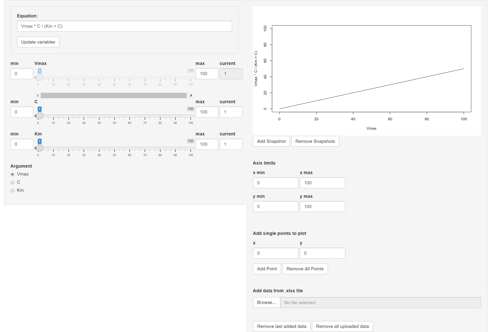
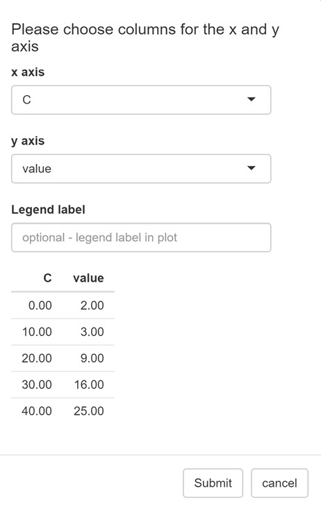
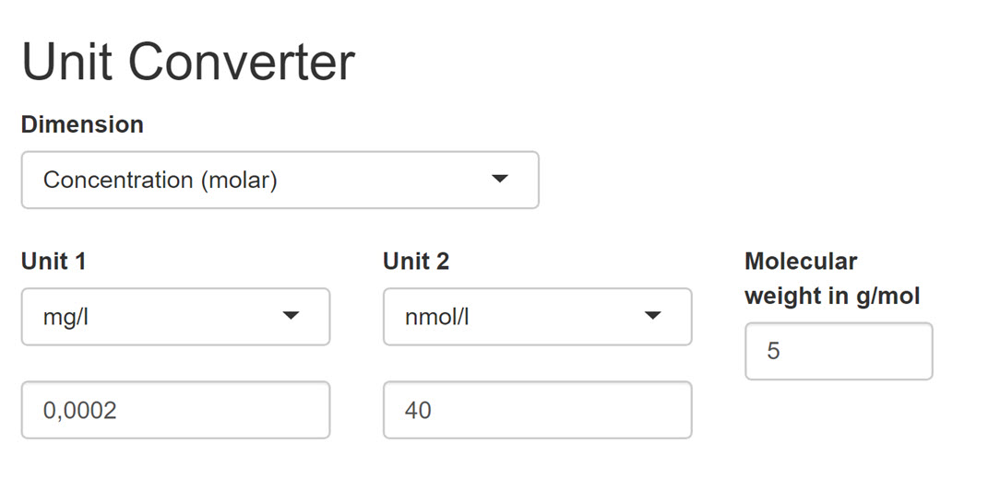

The esqlabsR packages comes with two Shiny apps: the Function Visualizer and the Unit Converter app. They are run by the commands `startFunctionVisualizer()` and `startUnitConverter()`, which will open a new window with a graphical user interface.

### Function Visualizer

The Function Visualizer allows users to easily plot a chosen function for different parameter values and add any data points for comparison. 

{width=100%}
The function can be entered in the *Equation* field. It must be defined according to R syntax and can include standard arithmetic operators `-`, `+`, `*`, `/`, `%%` and `%/%` as well as the functions `exp`, `log`, `sin`, `exp`, `cos`, `tan`, `sqrt`, `floor`, `ceiling` and the constant `pi`. After setting the function, the function argument (*Argument* field) and values for each remaining parameter (either by slider or in the respective *current* input field) can be chosen. The curve for the current parameter settings can be permanently added to the output plot (*Add snapshot*) to compare it to other parameter settings. You can zoom in on the plot by changing the *axis limits*. 

{width=100%}

Data points can be added to the graph in the *Add single points to plot* section below the plot, they will be displayed by `+` in the output. Another option for adding multiple data points at once is by uploading data from a xls/xlsx file. The columns for the x and y values, as well as a label for the data to appear in the legend of the plot, can be chosen in a pop-up window. 

{width=25%}
### Unit Converter

The Unit Converter provides a graphical interface for use of the [toUnit()](https://www.open-systems-pharmacology.org/OSPSuite-R/reference/toUnit.html) function. First you choose one of the dimensions from the dropdown menu, then two units to convert between and type in the value to be converted. In the special case of the dimensions `Concentration` and `Amount` conversion between molecular and mass units is possible, e.g. from mol/l to mg/l, therefore a molecular weight in g/mol must be provided in the respective field. In all other cases this field is deactivated.

{width=25%}
