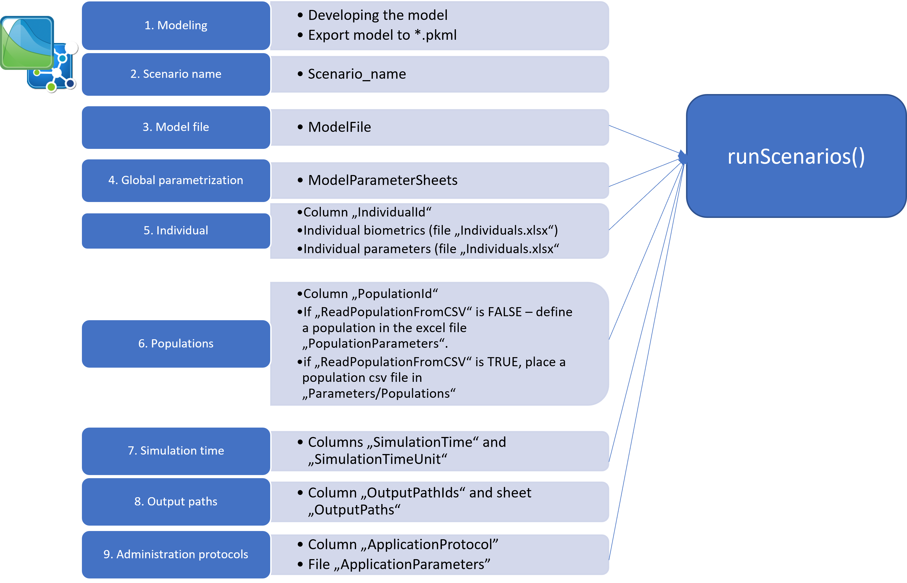

```{r, include = FALSE}
knitr::opts_chunk$set(
  collapse = TRUE,
  comment = "#>"
)
knitr::opts_knit$set(
  root.dir = "../tests/data/TestProject/Code/"
)
```

```{r, echo = FALSE, results = "hide", message = F}
library(esqlabsR)
```

### Simulation workflow

Within the `esqlabsR` framework, the simulations are run by defining and
executing multiple *scenarios*. A scenario is defined by the simulation
file containing the model structure, parametrization of the model,
application protocol, and (optionally) the physiology of the simulated
individual or population. To simplify scenarios set up, all these
information are stored in excel files with defined structure.

The package includes [an example scenario](https://github.com/esqLABS/esqlabsR/blob/HEAD/tests/data/TestProject/Parameters/Scenarios.xlsx)
that models the administration of a single dose of 250 mg aciclovir
intravenously to an individual with a 90 ml/min estimated glomerular
filtration rate. 

The step wise approach of setting up a new simulation scenario is shown
in Figure 1, detailed description of the excel files structures and `R`
code are given in the [Configuration files structure](#files-structure) section.



#### Project configuration

Information about location of scenario definition files, simulation
files, output folders etc. is stored in excel file
`ProjectConfiguration.xlsx` located in the folder `Code`. Usually it is
not required to edit the contents of this file.

The first step in the workflow is to create a `ProjectConfiguration`
from this file that will be used by the scripts to know where to find
the required data (for all following examples, we assume that the
current working directory is the `Code` folder):

```{r}
projectConfiguration <- createDefaultProjectConfiguration()
print(projectConfiguration)
```

If required, you can change the location of one of the files or folders:

```{r,eval=FALSE}
# change the location of the output folder
projectConfiguration$outputFolder <- "../anotherOutputFolder"

# change the location of the model parameters file
projectConfiguration$modelParametersFile <- "../anotherModelParameters.xlsx"
```

#### Add new scenario
1. After the model has been developed in PK-Sim and/or MoBi, a 
simulation must be stored as a *.pkml* file in the `Models/Simulations` folder. 

2. To set up a simulation/scenario in `R`, open the file `Scenarios.xlsx` 
    located in the folder `Parameters`. Start defining a scenario by giving it a 
    *name* in the `Scenario_name` column. Scenario name will be used later to 
    retrieve simulation results and use them e.g. in figure definitions.

3.  Specify the simulation `*.pkml` file to use in the column `ModelFile`.

If you simply want to run the simulation with the settings as it has been 
exported from PK-Sim or MoBi, you can proceed to [running Scenarios](#running-scenarios)
section.

#### Customize the scenario

##### 4. Simulation Parameters
You can define simulation parameters in the `ModelParameters.xlsx` file.
In order to apply to the simulation, you need to specify which sheets to load 
in the `ModelParameterSheets` column of the `Scenarios.xlsx` file.

##### 5. Individuals
If you want to simulate a specific individual with individual
    characteristics (age, weight, etc.) or apply individual model
    parameter values to the simulation, define the individual in the
`IndividualId` column. Then create a new individual entry in the
`Individuals.xlsx` file.
    
a)  To create a new individual with specific biometrics, create a
    new row in the `IndividualBiometrics` sheet.
b)  To define an individual-specific parametrization, create a new
    sheet and name it as the ID of the individual.

##### 6. Population
If you want to run a *population simulation*, specify a population
in the column `PopulationId`. If you want to create a new population
each time you run the scenario, define population demographics in
the `Demographics` sheet of the `PopulationParameters.xlsx` file.
Keep in mind that simulation results might differ each time you run
the scenario, as new population will be generated each time!

If you want to import a population from existing csv file, set the value
of the `ReadPopulationFromCSV` column to `TRUE`. The population csv file
must be located in the `Parameters/Populations` folder.

##### 7. Time
Simulation time can also be changed with the `SimulationTime` and 
`SimulationTimeUnit` columns.

##### 8. OutputPath
You can define the outputs of the simulation in the `OutputPathsIds`
column. For convenience, not the full paths to the outputs must be
listed, but the their acronyms. The full path for each acronym must
be defined in the sheet `OutputPaths`.

##### 9. Administration Protocols
Finally, you can simulate different administration protocols from the same
simulation file by defining an application protocol in the column
`ApplicationProtocol`. See description below.

### Configuration files structure {#files-structure}

The relevant excel files for definition of the scenarios are:
-  `ApplicationParameters.xlsx`
-  `Individuals.xlsx`
-  `ModelParameters.xlsx`
-  `PopulationParameters.xlsx`
-  `Scenarios.xlsx`

The `Scenarios` sheet of the `Scenarios.xlsx` file has the following structure:

-   **Scenario_name**  
unique name of the scenario. The name must be a [valid R variables 
    name](https://cran.r-project.org/doc/FAQ/R-FAQ.html#What-are-valid-names_003f).

-   **IndividualId**  
Name (ID) of an individual. This name refers to
    the name of the individual as used in excel file
    `Individuals.xlsx` for definition of the biometric
    properties (sheet `IndividualBiometrics`) of the simulated individual individual-specific
model parameters. For the latter, create a separate sheet in the `Individuals.xlsx` 
files with sheet name being the `IndividualId`. The structure of these sheets 
is the same as the structure of the sheets in `ModelParameter.xlsx` file, see 
decription below.

**IndividualId** may be empty. In this case, the
    individual as defined in the `pkml` simulation without any
individual-specific model parameters will be simulated.The same individual 
can be used in multiple scenarios.   

It is possible to scale from a human model to the species **Rat**, **Rabbit**, and
**Monkey** by applying the respective individual to the simulation. Other species 
scalings are technically possible but the correctness of the results is not 
guaranteed as there exist some structural differences between the species.

-   **PopulationId**
Name (ID) of a population. If empty, the scenario is simulated as an individual 
simulation. Otherwise, population simulation is performed. If the column 
**ReadPopulationFromCSV** is set to `FALSE`, **PopulationId** refers to the name o
f the population as defined in the sheet `Demographics` of the file `PopulationParameters.xlsx`.
To create a population with specific demographic characteristics, define
an entry with the same population id in the `Demographics`. The same population 
can be used in multiple scenarios. If the column **ReadPopulationFromCSV** is s
et to `TRUE`, the population will be imported from the csv file located in the 
folder `Parameters/Populations`, the name of the file must be the id of the population.

**Note**: You can define both an **IndividualId** and a **PopulationId**. In t
his case, individual-specific parameters from the `IndividualParameters.xlsx` 
will be applied to the simulation prior to applying the population parameters.
Keep in mind, that any physiological parameters defined for an individual that 
are also part of the parameter set of a population will be overwritten by the
population! If e.g. you specify the GFR of the individual in the `IndividualParameters.xlsx`, it
will be overwritten by the GFR values sampled in the simulation.

-   **ModelParameterSheets**
A list of sheet names from the `ModelParameter.xlsx` file, separated by a `,`.
Each sheet must have the columns `Container Path`, `Parameter Name`, `Value`, 
and `Units`. Parameter values from specified sheets will be applied to
    the model in the order of their definition. E.g., if we define
    `Global, Aciclovir`, then parameters from the `Aciclovir` sheet will
    be applied after the `Global` parameters. **ModelParameterSheets**
    may be empty or specify as many sheets as required. Note that the
    specified sheets must be present in the `ModelParameter.xlsx` file.
    The purpose of this approach is to have *global* parameters that can
    be applied to most scenarios, and separate set of parameters for
    e.g. different *disease states* (parameter sheets `Healthy` and
    `CKD`), or separate parametrization of different *compounds* (sheet
    `Aciclovir`).\
    You can further refine the parametrization of the scenario by
    specifying the individual parameters in the
    `IndividualParameters.xlsx` file. Create a sheet with the name as
    the *IndividualId* specified for the respective scenario with the
    same structure as the `ModelParameters.xlsx` file. This way you can
    define e.g. individual-specific clearance values or, as in the example case,
    the glomerular filtration rate. Individual specific parameters are
    applied after the parameters defined in the *ModelParameterSheets*.
    You can use an individual in multiple scenarios. If an individual is
    specified in the scenario definition, but no sheet with this name
    exists in the `IndividualParameters.xlsx` file, this step is simply
    ignored.

-   **ApplicationProtocol**
Name of the application protocol that will be applied. Applications are defined 
as a set of parameters that will be applied to the model in the file
    `ApplicationParameters.xlsx`. For each application, create a sheet
    with the name as specified in the **ApplicationProtocol** entry and
    populate it with the same structure as the `ModelParameter.xlsx`
    file. Configuring application protocols this way requires that the
    loaded simulation includes all possible applications that can be
    turned on and off by setting parameters, e.g. the `Dose` or
    `Start time` parameters. As it might be cumbersome to manually
    create entries for all administration parameters, we can use the
    `getAllApplicationParameters()` function to get a list of all
    (constant) parameters located in the `Applications` container. In
    the following example, we will extract application parameters for
    the molecule `Aciclovir` from the example simulation:

```{r}
sim <- loadSimulation(system.file("extdata", "Aciclovir.pkml", package = "ospsuite"))
applicationParams <- getAllApplicationParameters(sim)
print(applicationParams)
```

and export the parameters to an excel file using the
`exportParametersToXLS()` function:

```{r, eval=FALSE}
exportParametersToXLS(parameters = applicationParams, paramsXLSpath = "../Applications.xlsx")
```

The created excel file will have the same structure as all
Parameter-files and can be directly loaded in MoBi or R using the
`readParametersFromXLS()` function.

-   **SimulationTime**: Time of the simulation. The [output
    interval](https://www.open-systems-pharmacology.org/OSPSuite-R/reference/setOutputInterval.html)
    of the simulation will be set to the range [0 - `SimulationTime`]
    with the resolution of 1 point per minute.

-   **SimulationTimeUnit**: Unit for `SimulationTime`. For supported
    units, see `ospsuite::ospUnits`.

-   **SteadyState**: If `TRUE`, the model will be simulated for a
    "sufficiently long" time (1000 minutes by default).

-   **SteadyStateTime**: Time for the steady-state.

-   **SteadyStateTimeUnit**: Unit for `SteadyStateTime`. For supported
    units, see `ospsuite::ospUnits`.

-   **ModelFile**: Name of the `pkml` file with the simulation. Must be
    located in the folder defined in `ProjectConfiguration$modelFolder`.

-   **OutputPathsIds**: Paths of model outputs (i.e., paths to the
    molecules/ parameters for which outputs will be simulated) can be
    defined in the sheet `OutputPaths`. Create an entry for each output
    path by entering the full path into the column `OutputPath` and
    defining a unique identifier to this path in the column
    `OutputPathId`. The content of the sheet could look like this:

    | OutputPathId       | OutputPath                                                                   |
    |-----------------------|------------------------------------------------|
    | Aciclovir_PVB      | Organism\|PeripheralVenousBlood\|Aciclovir\|Plasma (Peripheral Venous Blood) |
    | Aciclovir_fat_cell | Organism\|Fat\|Intracellular\|Aciclovir\|Concentration in container          |

In the `Scenarios` sheet, enter the IDs of all paths the outputs should
be generated for, separated by a comma, e.g.
`Aciclovir_PVB, Aciclovir_fat_cell`.

### Scenario parametrization hierarchy

The final parametrization is a combination of the different parametrization steps 
defined at various levels, as has been described in the section above. The following 
figure summarizes the hierarchy of the parametrization.


If a parameter path is defined in multiple steps, its value will be overwritten 
by the subsequent steps. That means, individual parameter values will overwrite 
the values defined in the "ModelParameters.xlsx" file, and parameters defined  in 
`customParams` argument of the `runScenarios()` function will overwrite everything 
else.

The order of parameter sheets of the "ModelParameters.xlsx" file defined in the 
**ModelParameterSheets**  column define the order how the parameters are applied.

### Running scenarios {#running-scenarios}

Running scenarios can be devided into three steps: 1) creating the 
`ScenarioConfiguration` objects, 2) creating the `Scenario` objects from configurations,
and 3) running the scenarios.

#### Creating `ScenarioConfiguration` objects
A `ScenarioConfiguration` object holds all information about a scenario that is defined 
in the excel files. Though it is possible to create an empty `ScenarioConfiguration` 
and populate it by hand, we usually want to create scenario configurations from the
 excel files by calling the `readScenarioConfigurationFromExcel()` function. A
`ScenarioConfiguration` is based on the `ProjectConfiguration`, which has to be provided as
 an argument to the function. To read create the configuration for the *'TestScenario'* scenario 
 defined in the `Scenarios.xlsx` file, we call

```{r createScenarioConfigurations}
# Create `ScenarioConfiguration` objects from excel files
scenarioConfigurations <- readScenarioConfigurationFromExcel(
  scenarioNames = "TestScenario",
  projectConfiguration = projectConfiguration
)

print(scenarioConfigurations$TestScenario)
```

Alternatively, we can create configurations for all scenarios defined in
the `Scenarios.xlsx` by calling
`readScenarioConfigurationFromExcel(projectConfiguration = projectConfiguration)`
without specifying scenarios' names.

#### Creating `Scenario` objects from configurations

Once all scenario configurations are set up, `Scenario` objects can be created from them.
A `Scenario` object contains the fully parametrized simulation, the `Population` object in 
case of a population simulation, the underlying `ScenarioConfiguration` object, and the list of 
all user defined parameters.

During model development/fitting phase, you might want to test out parameter values
before storing them in the `Parameters` excel files. You can define the paths of the
test parameters, their values and the units in the `TestParameters` file and pass 
them as `customParams` argument to the `createScenarios()` function.

```{r createScenarios}
# Create `Scenario` objects from `ScenarioConfiguration` objects
scenarios <- createScenarios(scenarioConfigurations)
```

You can view the final parametrization that is applied to the simulation by calling 
the `finalCustomParams` property:

```{r}
scenarios$TestScenario$finalCustomParams
```

#### Running scenarios 

Once the `Scenario` objects are created, they can be simulated by calling the `runScenarios()` function.
The output of this function is a named list, where the names are scenario names, and the values are the lists of
simulations, `SimulatioResults` produced by running the simulation, the output values of the `SimulationResults`,
and the population if the scenario is a population simulation.

```{r runScenarios}
simulatedScenariosResults <- runScenarios(
  scenarios = scenarios
)

names(simulatedScenariosResults)
```

It is a good idea to store simulation results as `*.csv` along with
simulations as `.*pkml` and, optionally, the used population as `*.scv` file and load them for further processing to avoid
re-simulating every time e.g. a change to a figure showing the
simulation results is required. The convenient function for saving results of a 
scenario run is `saveScenarioResults()`.

For further information, check out the documentation of the functions
[`saveScenarioResults()`](https://esqlabs.github.io/esqlabsR/reference/saveScenarioResults)
and
[`loadScenarioResults()`](https://esqlabs.github.io/esqlabsR/reference/loadScenarioResults).

### Troubleshooting

More detailed information on function signatures can be found in:

-   `esqlabsR` documentation on:
    -   [ProjectConfiguration
        class](https://esqlabs.github.io/esqlabsR/reference/ProjectConfiguration.html)
    -   [ScenarioConfiguration
        class](https://esqlabs.github.io/esqlabsR/reference/ScenarioConfiguration.html)
    -   [readScenarioConfigurationFromExcel()](https://esqlabs.github.io/esqlabsR/reference/readScenarioConfigurationFromExcel.html)
    -   [runScenarios()](https://esqlabs.github.io/esqlabsR/reference/runScenarios.html)
