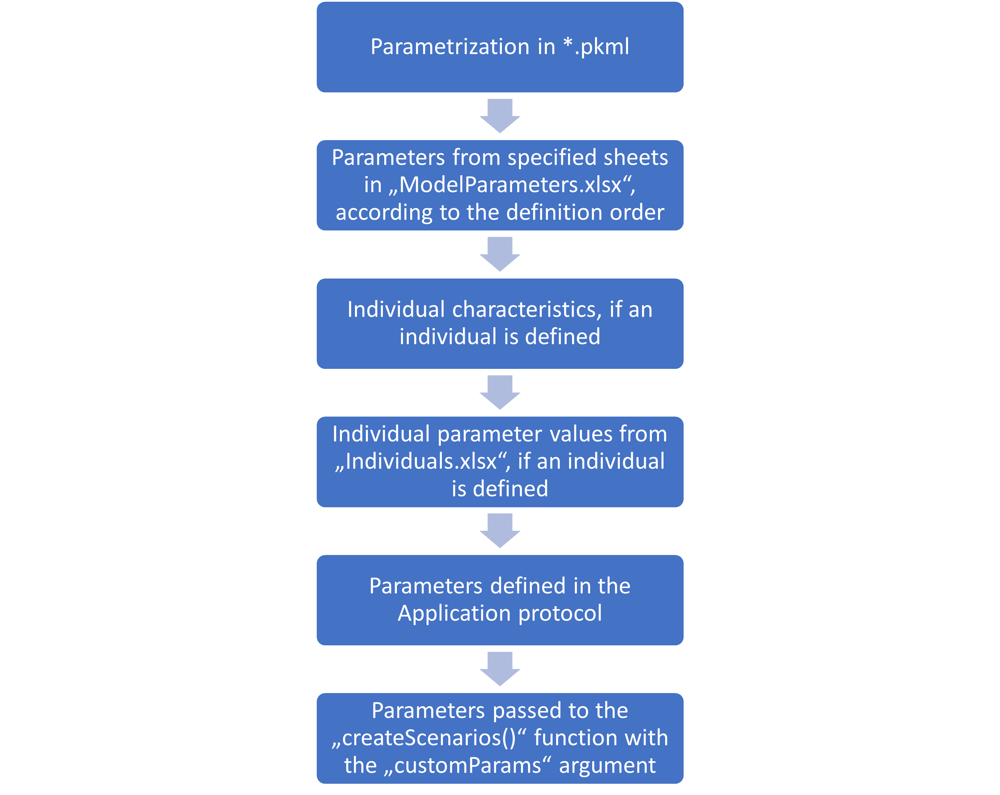

```{r, include = FALSE}
knitr::opts_chunk$set(
  collapse = TRUE,
  comment = "#>"
)
knitr::opts_knit$set(
  root.dir = "../tests/data/TestProject/Code/"
)
```

```{r, echo = FALSE, results = "hide", message = F}
library(esqlabsR)
```

### Simulation workflow

Within the `esqlabsR` framework, the simulations are run by defining and
executing multiple *scenarios*. A scenario is defined by the simulation
file containing the model structure, parametrization of the model,
application protocol, and (optionally) the physiology of the simulated
individual or population. To simplify scenarios set up, all these
information are stored in excel files with defined structure.

The step wise approach of setting up a new simulation scenario is shown
in Figure 1, detailed description of the excel files structures and `R`
code are given in the [defining Scenarios](#defining-scenarios) section.


#### Add a simulation
1. After the model has been developed in PK-Sim and/or MoBi, a 
simulation must be stored as a *.pkml* file in the `Models/Simulations` folder. 

2. To set up a simulation/scenario in `R`, open the file `Scenarios.xlsx` 
    located in the folder `Parameters`.

3.  Start defining a scenario by giving it an *name* in the
    `Scenario_name` column. Scenario name will be used later to retrieve
    simulation results and use them e.g. in figure definitions.

4.  Specify the simulation `*.pkml` file to use in the column `ModelFile`.

5. If you simply want to run the simulation with the settings as it
        has been exported from PK-Sim or MoBi, you can proceed to
     [running Scenarios](#running-scenarios) section.
    Otherwise, `{esqlabsR}` will allow you to 
    [customize](#customize-the-simulation) directly from `R`.

#### Customize the simulation

##### Simulation Parameters
You can define simulation parameters in the `ModelParameters.xlsx` file.
In order to apply to the simulation, you need to specify which sheets to load 
in the `ModelParameterSheets` column of the `Scenarios.xlsx` file.

##### Individuals
If you want to simulate a specific individual with individual
    characteristics (age, weight, etc.) or apply individual model
    parameter values to the simulation, define the individual in the
`IndividualId` column. Then create a new individual entry in the
`Individuals.xlsx` file.
    
a)  To create a new individual with specific biometrics, create a
    new row in the `IndividualBiometrics` sheet.
b)  To define an individual-specific parametrization, create a new
    sheet and name it as the ID of the individual.

##### Population
If you want to run a *population simulation*, specify a population
in the column `PopulationId`. If you want to create a new population
each time you run the scenario, define population demographics in
the `Demographics` sheet of the `PopulationParameters.xlsx` file.
Keep in mind that simulation results might differ each time you run
the scenario, as new population will be generated each time!

If you want to import a population from existing csv file, set the value
of the `ReadPopulationFromCSV` column to `TRUE`. The population csv file
must be located in the `Parameters/Populations` folder.

##### Time
Simulation time can also be changed with the `SimulationTime` and 
`SimulationTimeUnit` columns.

##### OutputPath
You can define the outputs of the simulation in the `OutputPathsIds`
column. For convenience, not the full paths to the outputs must be
listed, but the their acronyms. The full path for each acronym must
be defined in the sheet `OutputPaths`.

##### Administration Protocols
Finally, you can simulate different administration protocols from the same
simulation file by defining an application protocol in the column
`ApplicationProtocol`. See description below.

### Project configuration

Information about location of scenario definition files, simulation
files, output folders etc. is stored in excel file
`ProjectConfiguration.xlsx` located in the folder `Code`. Usually it is
not required to edit the contents of this file.

The first step in the workflow is to create a `ProjectConfiguration`
from this file that will be used by the scripts to know where to find
the required data (for all following examples, we assume that the
current working directory is the `Code` folder):

```{r}
projectConfiguration <- createDefaultProjectConfiguration()
print(projectConfiguration)
```


If required, you can change the location of one of the files or folders:

```{r,eval=FALSE}
#change the location of the output folder 
projectConfiguration$outputFolder <- "../anotherOutputFolder"

#change the location of the model parameters file
projectConfiguration$modelParametersFile <- "../anotherModelParameters.xlsx"
```

### Defining scenarios {#defining-scenarios}

Next, we will define a *scenario* that we want to simulate in the excel
file `Parameters/Scenarios.xlsx` (or other as set in
`projectConfiguration$scenarioDefinitionFile`). The package includes [an
example
scenario](https://github.com/esqLABS/esqlabsR/blob/HEAD/tests/data/TestProject/Parameters/Scenarios.xlsx)
that models the administration of a single dose of 250 mg aciclovir
intravenously to an individual with a 90 ml/min estimated glomerular
filtration rate. To define a scenario, create a new row in the
`Scenarios.xlsx` file with the following content:

-   **Scenario_name**: unique name of the scenario. The name must be a
    [valid R variables
    name](https://cran.r-project.org/doc/FAQ/R-FAQ.html#What-are-valid-names_003f).

-   **IndividualId**: Name (ID) of an individual. This name refers to
    the name of the individual as used in excel files
    `IndividualBiometrics.xlsx` for definition of the biometric
    properties of the simulated individual and
    `IndividualParameters.xlsx` for definition of individual-specific
    model parameters. **IndividualId** may be empty. In this case, the
    individual as defined in the `pkml` simulation without any
    individual-specific model parameters will be simulated. To create an
    individual with specific biometric characteristics, define an entry
    with the same individual id in the file `IndividualBiometrics.xlsx`.
    The same individual can be used in multiple scenarios. Note that
    though it is technically possible to apply a species different from
    the one in the original simulation, the correctness of the results
    is not guaranteed as there exist some structural differences between
    the species.

-   **PopulationId**: Name (ID) of a population. This name refers to the
    name of the population as used in excel file
    `PopulationParameters.xlsx` for definition of the demographic
    properties of the simulated population. If **PopulationId** is
    empty, the scenario is simulated as an individual simulation.
    Otherwise, a population as defined in the sheet `Demographics` of
    the `PopulationParameters.xlsx` file will be created and the
    scenario simulated as a population simulation.

To create a population with specific demographic characteristics, define
an entry with the same population id in the file
`PopulationParameters.xlsx`. The same population can be used in multiple
scenarios. **Note**: You can define both an **IndividualId** and a
**PopulationId**. In this case, individual-specific parameters from the
`IndividualParameters.xlsx` will be applied to the simulation prior to
applying the population parameters. Keep in mind, that any physiological
parameters defined for an individual that are also part of the parameter
set of a population will be overwritten by the population! If e.g. you
specify the GFR of the individual in the `IndividualParameters.xlsx`, it
will be overwritten by the GFR values sampled in the simulation.

-   **ModelParameterSheets**: A list of sheet names from the
    `ModelParameter.xlsx` file, separated by a `,`. Each sheet must have
    the columns `Container Path`, `Parameter Name`, `Value`, and
    `Units`. Parameter values from specified sheets will be applied to
    the model in the order of their definition. E.g., if we define
    `Global, Aciclovir`, then parameters from the `Aciclovir` sheet will
    be applied after the `Global` parameters. **ModelParameterSheets**
    may be empty or specify as many sheets as required. Note that the
    specified sheets must be present in the `ModelParameter.xlsx` file.
    The purpose of this approach is to have *global* parameters that can
    be applied to most scenarios, and separate set of parameters for
    e.g. different *disease states* (parameter sheets `Healthy` and
    `CKD`), or separate parametrization of different *compounds* (sheet
    `Aciclovir`).\
    We can further refine the parametrization of the scenario by
    specifying the individual parameters in the
    `IndividualParameters.xlsx` file. Create a sheet with the name as
    the *IndividualId* specified for the respective scenario with the
    same structure as the `ModelParameters.xlsx` file. This way we can
    define e.g. individual-specific clearance values or, as in our case,
    the glomerular filtration rate. Individual specific parameters are
    applied after the parameters defined in the *ModelParameterSheets*.
    We can use an individual in multiple scenarios. If an individual is
    specified in the scenario definition, but no sheet with this name
    exists in the `IndividualParameters.xlsx` file, this step is simply
    ignored.

-   **ApplicationProtocol**: name of the application protocol that will
    be applied. Applications are defined as a set of parameters that
    will be applied to the model in the file
    `ApplicationParameters.xlsx`. For each application, create a sheet
    with the name as specified in the **ApplicationProtocol** entry and
    populate it with the same structure as the `ModelParameter.xlsx`
    file. Configuring application protocols this way requires that the
    loaded simulation includes all possible applications that can be
    turned on and off by setting parameters, e.g. the `Dose` or
    `Start time` parameters. As it might be cumbersome to manually
    create entries for all administration parameters, we can use the
    `getAllApplicationParameters()` function to get a list of all
    (constant) parameters located in the `Applications` container. In
    the following example, we will extract application parameters for
    the molecule `Aciclovir` from the example simulation:

```{r}
sim <- loadSimulation(system.file("extdata", "Aciclovir.pkml", package = "ospsuite"))
applicationParams <- getAllApplicationParameters(sim)
print(applicationParams)
```

and export the parameters to an excel file using the
`exportParametersToXLS()` function:

```{r, eval=FALSE}
exportParametersToXLS(parameters = applicationParams, paramsXLSpath = "../Applications.xlsx")
```

The created excel file will have the same structure as all
Parameter-files and can be directly loaded in MoBi or R using the
`readParametersFromXLS()` function.

-   **SimulationTime**: Time of the simulation. The [output
    interval](https://www.open-systems-pharmacology.org/OSPSuite-R/reference/setOutputInterval.html)
    of the simulation will be set to the range [0 - `SimulationTime`]
    with the resolution of 1 point per minute.

-   **SimulationTimeUnit**: Unit for `SimulationTime`. For supported
    units, see `ospsuite::ospUnits`.

-   **SteadyState**: If `TRUE`, the model will be simulated for a
    "sufficiently long" time (1000 minutes by default).

-   **SteadyStateTime**: Time for the steady-state.

-   **SteadyStateTimeUnit**: Unit for `SteadyStateTime`. For supported
    units, see `ospsuite::ospUnits`.

-   **ModelFile**: Name of the `pkml` file with the simulation. Must be
    located in the folder defined in `ProjectConfiguration$modelFolder`.

-   **OutputPathsIds**: Paths of model outputs (i.e., paths to the
    molecules/ parameters for which outputs will be simulated) can be
    defined in the sheet `OutputPaths`. Create an entry for each output
    path by entering the full path into the column `OutputPath` and
    defining a unique identifier to this path in the column
    `OutputPathId`. The content of the sheet could look like this:

    | OutputPathId       | OutputPath                                                                   |
    |-----------------------|------------------------------------------------|
    | Aciclovir_PVB      | Organism\|PeripheralVenousBlood\|Aciclovir\|Plasma (Peripheral Venous Blood) |
    | Aciclovir_fat_cell | Organism\|Fat\|Intracellular\|Aciclovir\|Concentration in container          |

In the `Scenarios` sheet, enter the IDs of all paths the outputs should
be generated for, separated by a comma, e.g.
`Aciclovir_PVB, Aciclovir_fat_cell`.

### Code-based specifications

In addition to scenario setups through the excel sheets, further
specifications are made in the `R` files located in the `InputCode`
project folder. Files in this folder must be sourced prior to using.

-   **TestParameters**: During model development/fitting phase, you
    might want to test out parameter values before storing them in the
    `Parameters` excel files. You can define the paths of the
    parameters, their values and the units in the `TestParameters` file.
    Remember to `source` the file each time you change any values. You
    can turn setting test parameters on and off in the
    `ScenarioConfiguration` (see Section [Running
    scenarios](#running-scenarios)).

### Custom functions

Initialization of a scenario creates a `Simulation` object that is fully
parametrized according to the specifications of the scenario. However,
sometimes further modifications to the simulations are required that
cannot be represented by fixed parameter values stored in excel files.
Imagine a scenario where the value of a certain parameter depends on
other parameters not known at the time point of excel file creation.
Another use case is a dose escalation study. Instead of defining every
dose in a separate \*\*ApplicationProtocol" sheet, the set of doses to
simulate could be defined in an `R` list and passed as an argument to a
function that sets the dose parameter for a scenario.

This can be achieved through defining a function that will be applied to
the `Simulation` object created from a `ScenarioConfiguration` at the
very last step of initialization. The function can reference the
`simulation` variable and accept additional arguments. The argument
values are then defined in the field `customFunctionArgs`.

In the following example, we will define a custom function that
multiplies the `Dose` parameter by a certain factor. The path to the
dose parameter and the multiplication factor are defined as arguments.

```{r}
# Create `ScenarioConfiguration` objects from excel files
scenarioConfigurations <- readScenarioConfigurationFromExcel(
  scenarioNames = "TestScenario",
  projectConfiguration = projectConfiguration
)

# Path to the dose parameter
doseParamPath <- "Applications|IV 250mg 10min|Application_1|ProtocolSchemaItem|Dose"

# Initialize the simulation from the scenario without a custom function
sim <- initializeScenario(scenarioConfigurations[[1]])
# get the value of dose parameter
oldVal <- getQuantityValuesByPath(doseParamPath, sim)
print(paste0("Default dose parameter value: ", oldVal))

# Define a custom function
customFunction <- function(doseFactor, doseParamPath) {
  doseParam <- getParameter(
    path = doseParamPath,
    container = simulation
  )
  doseParam$value <- doseParam$value * doseFactor
}

# Add the custom function to the scenario

scenarioConfigurations$TestScenario$customFunction <- customFunction

# Set the values of the arguments
scenarioConfigurations$TestScenario$customFunctionArgs <- list(
  doseFactor = 2,
  doseParamPath = doseParamPath
)

# Initialize the simulation with the scenario with the custom function and get
# the value of the dose parameter.
sim <- initializeScenario(scenarioConfigurations[[1]])

print(paste0("Dose parameter value with custom function: ", getQuantityValuesByPath(doseParamPath, sim)))
```

### Scenario parametrization hierarchy

The final parametrization is a combination of the different parametrization steps 
defined at various levels, as has been described in the section above. The following 
figure summarizes the hierarchy of the parametrization.



If a parameter path is defined in multiple steps, its value will be overwritten 
by the subsequent steps. That means, individual parameter values will overwrite 
the values defined in the "ModelParameters.xlsx" file, and parameters defined  in 
`customParams` argument of the `runScenarios()` function will overwrite everything 
else.

The order of parameter sheets of the "ModelParameters.xlsx" file defined in the 
**ModelParameterSheets**  column define the order how the parameters are applied.

### Running scenarios {#running-scenarios}

Scenarios are executed by creating `ScenarioConfiguration` objects and
calling the `runScenarios()`function. Though it is possible to create an
empty `ScenarioConfiguration` and populate it by hand, we usually want
to create scenario configurations from the excel files by calling the
`readScenarioConfigurationFromExcel()` function. A
`ScenarioConfiguration` is based on the `ProjectConfiguration`, which
has to be provided as an argument to the function. To read the
configuration for the *'TestScenario'* scenario defined in the
`Scenarios.xlsx` file, we call

```{r createScenarioConfigurations}
# Create `ScenarioConfiguration` objects from excel files
scenarioConfigurations <- readScenarioConfigurationFromExcel(
  scenarioNames = "TestScenario",
  projectConfiguration = projectConfiguration
)

print(scenarioConfigurations$TestScenario)
```

Alternatively, we can create configurations for all scenarios defined in
the `Scenarios.xlsx` by calling
`readScenarioConfigurationFromExcel(projectConfiguration = projectConfiguration)`
without specifying scenarios' names.

Before running the scenarios, we can modify `ScenarioConfigurations` by
setting parameters that are currently not accessible through excel
files. In model development/fitting phase, we might want to apply some
test parameter values:

```{r eval = FALSE}
# Set output paths for each scenario
for (scenarioConfiguration in scenarioConfigurations) {
  scenarioConfiguration$setTestParameters <- TRUE
}
```

Make sure that you have sourced the `TestParameters` file in this case.

Once all scenario configurations are set up, we can simulate them by
calling the `runScenarios()` function. We can specify to save the
initialized simulation (i.e. the simulation with individual physiology
and parametrization applied as defined by the scenario configuration).
In such case, a folder with the current date and time will be created in
the folder where the simulation `pkml` files are located.

```{r runScenarios}
simulatedScenarios <- runScenarios(
  scenarioConfigurations = scenarioConfigurations,
  customParams = NULL, saveSimulationsToPKML = FALSE
)

names(simulatedScenarios)
```

It is a good idea to store simulation results as `*.csv` along with
simulations as `.*pkml` and, optionally, the used population as `*.scv` file and load them for further processing to avoid
re-simulating every time e.g. a change to a figure showing the
simulation results is required. The convenient function for saving results of a 
scenario run is `saveScenarioResults()`.

For futher information, check out the documentation of the functions
[`saveScenarioResults()`](https://esqlabs.github.io/esqlabsR/reference/saveScenarioResults)
and
[`loadScenarioResults()`](https://esqlabs.github.io/esqlabsR/reference/loadScenarioResults).

The function returns results of the simulations. For each scenario, a
[`Simulation`](https://www.open-systems-pharmacology.org/OSPSuite-R/reference/Simulation.html)
object, a
[`SimulationResults`](https://www.open-systems-pharmacology.org/OSPSuite-R/reference/SimulationResults.html)
object, and vectors of output values (retrieved by the
[`getOutputValues()`](https://www.open-systems-pharmacology.org/OSPSuite-R/reference/getOutputValues.html)
function) are returned.

### Troubleshooting

More detailed information on function signatures can be found in:

-   `esqlabsR` documentation on:
    -   [ProjectConfiguration
        class](https://esqlabs.github.io/esqlabsR/reference/ProjectConfiguration.html)
    -   [ScenarioConfiguration
        class](https://esqlabs.github.io/esqlabsR/reference/ScenarioConfiguration.html)
    -   [readScenarioConfigurationFromExcel()](https://esqlabs.github.io/esqlabsR/reference/readScenarioConfigurationFromExcel.html)
    -   [runScenarios()](https://esqlabs.github.io/esqlabsR/reference/runScenarios.html)
